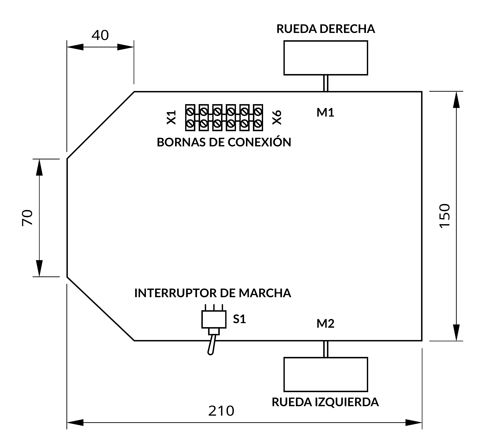
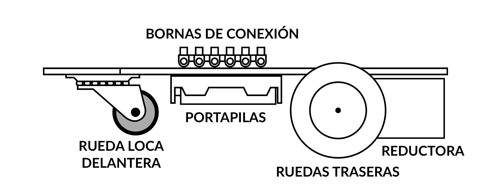
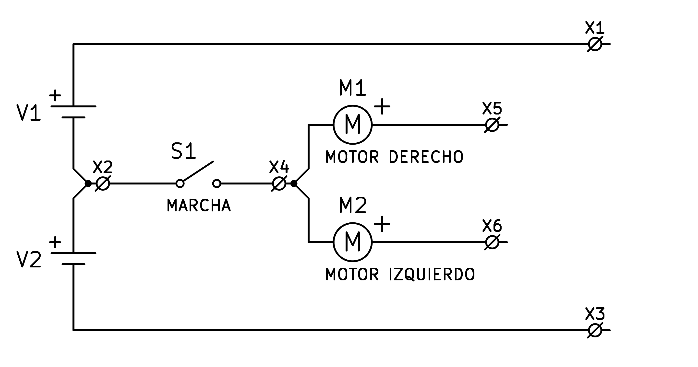
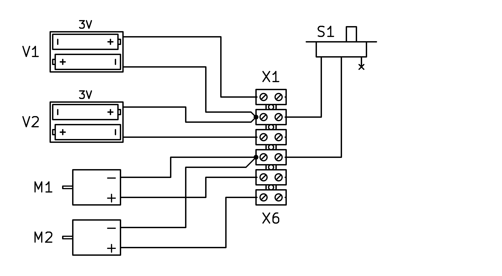

:Date: 21/04/2026
:Author: Carlos Félix Pardo Martín
:License: Creative Commons Attribution-ShareAlike 4.0 International
:tocdepth: 1

.. _cucabot-plataforma:

Plataforma universal
====================
En este apartado se muestra la plataforma universal para poder construir
posteriormente los distintos robots Cucabot sobre ella.

Montaje mecánico
----------------

   
   Planta de la plataforma universal para construir los robots Cucabot.

   
   Perfil de la plataforma universal para construir los robots Cucabot.

#. Primero descargaremos el plano mecánico en PDF de la plataforma
   universal para poder imprimirlo:
   
   :download:`Plano mecánico de la plataforma universal Cucabot.
   Formato PDF. <cucabot/cucabot-plataforma-vistas.pdf>`
   
#. A continuación fabricaremos la tabla sobre la que se monta toda la
   plataforma. Esta tabla tiene el tamaño de una tabla DIN A4 cortada por
   la mitad, con las esquinas de la izquierda recortadas con las
   dimensiones que aparecen en el plano.
   
#. Para continuar pegaremos con cola termofusible los dos motores con
   reductora y rueda debajo de la tabla, en la parte posterior.

#. La rueda loca debe colocarse en el medio de la parte inferior 
   delantera de la tabla y pegarse con cola termofusible.
   
#. Después pegaremos en su lugar los portapilas, en la parte inferior
   de la tabla, y las 6 bornas en la parte superior de la tabla,
   en un lateral.

#. Instalaremos el interruptor de encendido S1 de la plataforma en la
   parte superior de la tabla, en el lateral opuesto a las bornas.

#. Para terminar escribiremos en trozos de papel cada una de las
   referencias de los componentes (M1, M2, S1, V1, V2, X1, X6) y los
   pegaremos cada uno junto al componente correspondiente.

Montaje eléctrico
-----------------
Cuando ya estén colocados y pegados en su sitio todos los elementos
mecánicos de la plataforma, procederemos a cablear los motores y los
portapilas según los planos adjuntos.

#. Primero descargaremos el plano eléctrico en PDF de la plataforma
   universal para poder imprimirlo:
   
   :download:`Plano eléctrico de la plataforma universal Cucabot.
   Formato PDF. <cucabot/cucabot-plataforma-electric.pdf>`

#. A continuación conectaremos los cables de las reductoras y de los
   portapilas a las diferentes bornas, respetando su numeración.
   

   
   Esquema eléctrico de la plataforma universal Cucabot.

   
   Esquema de cableado de la plataforma universal Cucabot.

Puesta en marcha
----------------

Para realizar las pruebas de puesta en marcha, conectaremos
entre sí las bornas 1, 5 y 6 y accionaremos el interruptor de marcha.
   
Los dos motores deben mover las ruedas hacia adelante.
Si algún motor mueve las ruedas hacia atrás, se deben cambiar
de posición entre sí los dos cables del motor, para que se mueva
en el sentido contrario.

Memoria de trabajo
------------------
El siguiente documento servirá para que cada uno de los alumnos y alumnas
del grupo de trabajo de taller dibuje y escriba los elementos necesarios
para realizar el proyecto y enumere los trabajos realizados sobre el
proyecto.

:download:`Memoria de trabajo del alumno.
Formato PDF. <cucabot/cucabot-memoria.pdf>`

:download:`Memoria de trabajo del alumno.
Formato editable ODT. <cucabot/cucabot-memoria.odt>`

Créditos
--------
Instrucciones de la página original de `Cucabot en archive.org 
<https://web.archive.org/web/20100331204307/http://roble.pntic.mec.es/~jsaa0039/cucabot/pu-intro.html>`__