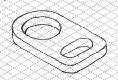

:Date: 10/12/2018
:Author: Carlos Félix Pardo Martín
:License: Creative Commons Attribution-ShareAlike 4.0 International
:tocdepth: 1

.. _dibujo-boceto-croquis:

Bocetos y Croquis
=================

Bocetos en perspectiva
----------------------

.. image:: dibujo/_thumbs/dibujo-boceto-04.png
   :width: 240px

| :download:`Boceto 1 en perspectiva <dibujo/_images/dibujo-boceto-01.png>`
| :download:`Boceto 2 en perspectiva <dibujo/_images/dibujo-boceto-02.png>`
| :download:`Boceto 3 en perspectiva <dibujo/_images/dibujo-boceto-03.png>`
| :download:`Boceto 4 en perspectiva <dibujo/_images/dibujo-boceto-04.png>`
| :download:`Boceto 5 en perspectiva <dibujo/_images/dibujo-boceto-05.png>`
| :download:`Boceto 6 en perspectiva <dibujo/_images/dibujo-boceto-06.png>`
|

| :download:`Todos los bocetos en perspectiva. Formato PDF.
  <dibujo/dibujo-bocetos-isometrica.pdf>`
| :download:`Todos los bocetos en perspectiva. Formato editable ODT.
  <dibujo/dibujo-bocetos-isometrica.odt>`

Plantilla isométrica
--------------------
Plantilla para realizar dibujos y croquis en perspectiva isométrica.

| :download:`Plantilla isométrica. Formato PDF.
  <dibujo/dibujo-plantilla-isometrica.pdf>`
| :download:`Plantilla isométrica. Formato editable SVG.
  <dibujo/dibujo-plantilla-isometrica.svg>`
