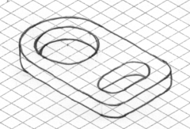

:date: 2018-12-10
:author: Carlos Félix Pardo Martín
:license: Creative Commons Attribution-ShareAlike 4.0 International
:license_url: https://creativecommons.org/licenses/by-sa/4.0/

.. _dibujo-index:

****************
 Dibujo Técnico
****************

Representación gráfica de objetos mediante vistas y perspectivas.
Dibujo a mano alzada y con ordenador.

.. toctree::
   :maxdepth: 1
   :titlesonly:

   dibujo-intro.rst
   dibujo-boceto-croquis.rst
   dibujo-vistas.rst
   dibujo-isometrica.rst
   dibujo-escalas.rst
   dibujo-acotacion.rst
   dibujo-mesilla.rst
   dibujo-por-ordenador.rst
   dibujo-recursos.rst
