:date: 2018-12-10
:modified: 2026-06-13
:author: Carlos Félix Pardo Martín
:license: Creative Commons Attribution-ShareAlike 4.0 International
:license_url: https://creativecommons.org/licenses/by-sa/4.0/
:tocdepth: 1

.. _dibujo-isometrica-ejercicios:

Ejercicios de perspectiva
=========================
A continuación se presentan los ejercicios de obtención de perspectiva
isométrica de figuras ordenados por dificultad, desde ejercicios básicos
hasta ejercicios más complejos, incluidos los que utilizan objetos curvos.

Todos los ejercicios tienen una versión con el sistema de vistas europeo
(alzado a la derecha) y otra versión no convencional en la que el alzado
se ha escogido a la izquierda de la figura y el perfil a la derecha.

.. contents:: Índice de contenidos:
   :local:
   :depth: 2

Ejercicios simples
------------------

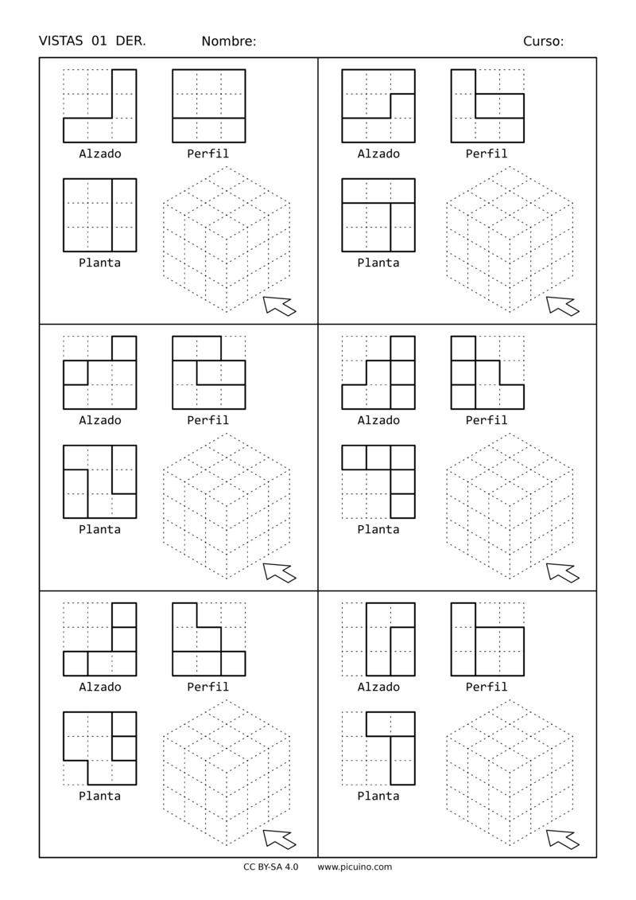

|  :download:`Alzado derecho. Formato PDF.
   <dibujo/dibujo-vistas-der-01.pdf>`
|  :download:`Alzado derecho. Imágenes en formato PNG.
   <dibujo/dibujo-vistas-der-01-images.zip>`
|  :download:`Alzado derecho. Formato editable SVG.
   <dibujo/dibujo-vistas-der-01.svg>`

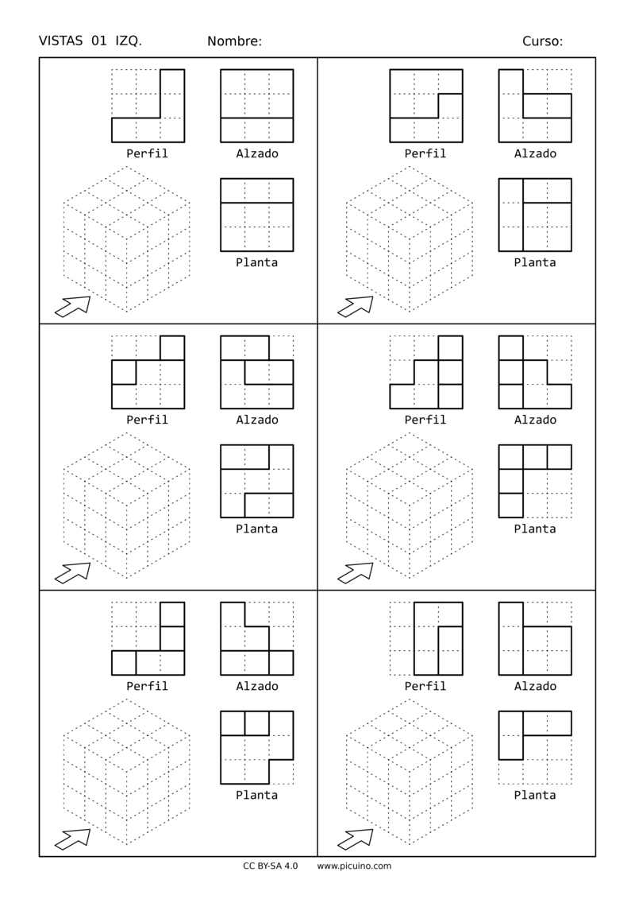

|  :download:`Alzado izquierdo. Formato PDF.
   <dibujo/dibujo-vistas-izq-01.pdf>`
|  :download:`Alzado izquierdo. Imágenes en formato PNG.
   <dibujo/dibujo-vistas-izq-01-images.zip>`
|  :download:`Alzado izquierdo. Formato editable SVG.
   <dibujo/dibujo-vistas-izq-01.svg>`

Ejercicios con vistas ocultas
-----------------------------

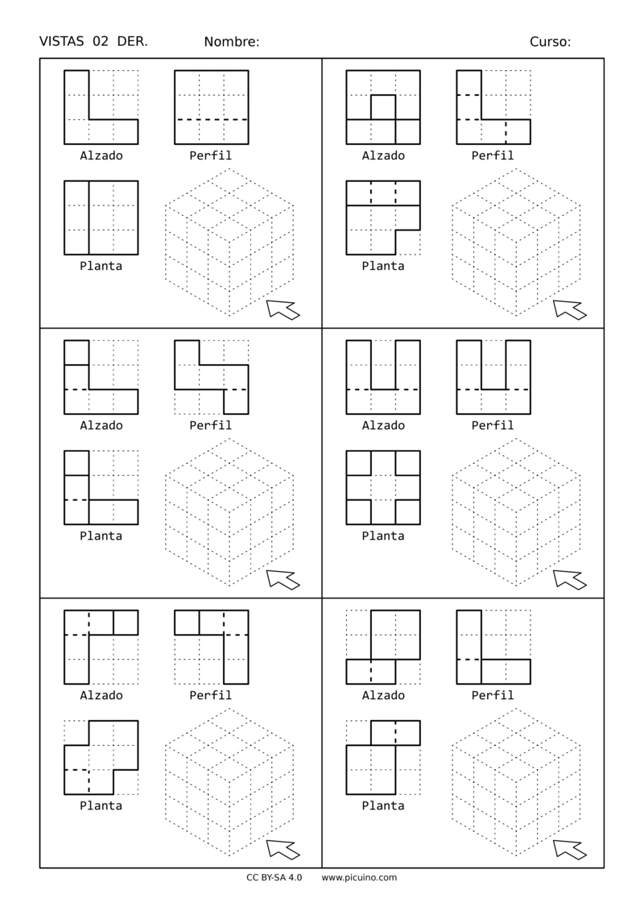

|  :download:`Alzado derecho. Formato PDF.
   <dibujo/dibujo-vistas-der-02.pdf>`
|  :download:`Alzado derecho. Imágenes en formato PNG.
   <dibujo/dibujo-vistas-der-02-images.zip>`
|  :download:`Alzado derecho. Formato editable SVG.
   <dibujo/dibujo-vistas-der-02.svg>`

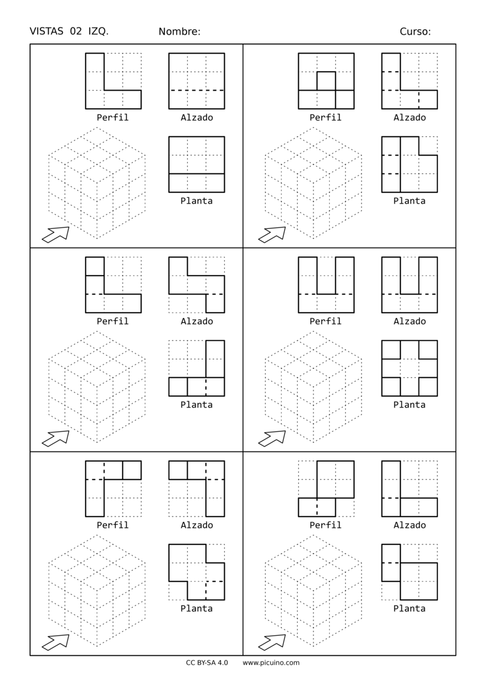

|  :download:`Alzado izquierdo. Formato PDF.
   <dibujo/dibujo-vistas-izq-02.pdf>`
|  :download:`Alzado izquierdo. Imágenes en formato PNG.
   <dibujo/dibujo-vistas-izq-02-images.zip>`
|  :download:`Alzado izquierdo. Formato editable SVG.
   <dibujo/dibujo-vistas-izq-02.svg>`

Ejercicios con rampas
---------------------

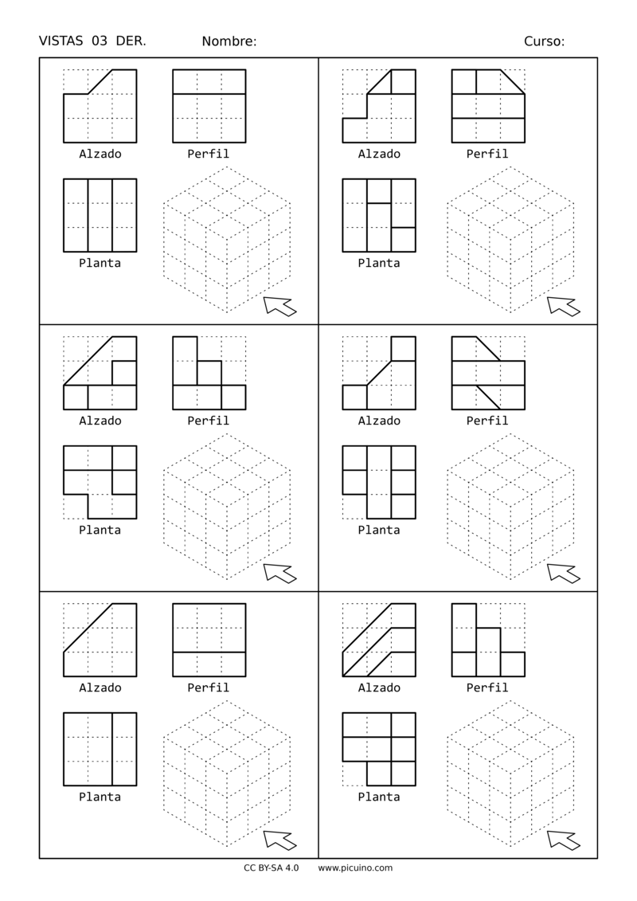

|  :download:`Alzado derecho. Formato PDF.
   <dibujo/dibujo-vistas-der-03.pdf>`
|  :download:`Alzado derecho. Imágenes en formato PNG.
   <dibujo/dibujo-vistas-der-03-images.zip>`
|  :download:`Alzado derecho. Formato editable SVG.
   <dibujo/dibujo-vistas-der-03.svg>`

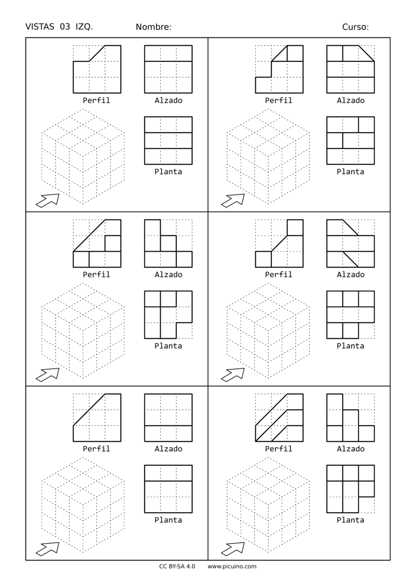

|  :download:`Alzado izquierdo. Formato PDF.
   <dibujo/dibujo-vistas-izq-03.pdf>`
|  :download:`Alzado izquierdo. Imágenes en formato PNG.
   <dibujo/dibujo-vistas-izq-03-images.zip>`
|  :download:`Alzado izquierdo. Formato editable SVG.
   <dibujo/dibujo-vistas-izq-03.svg>`

Ejercicios con vistas ocultas y rampas
--------------------------------------

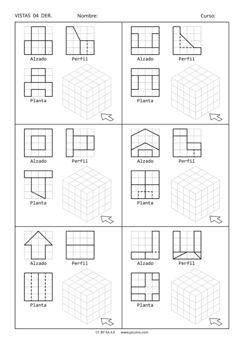

|  :download:`Alzado derecho. Formato PDF.
   <dibujo/dibujo-vistas-der-04.pdf>`
|  :download:`Alzado derecho. Imágenes en formato PNG.
   <dibujo/dibujo-vistas-der-04-images.zip>`
|  :download:`Alzado derecho. Formato editable SVG.
   <dibujo/dibujo-vistas-der-04.svg>`

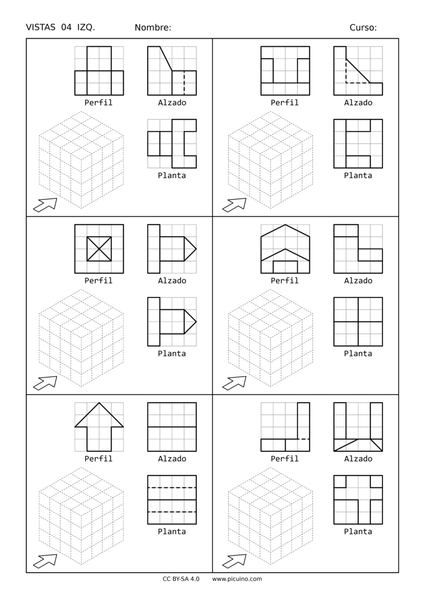

|  :download:`Alzado izquierdo. Formato PDF.
   <dibujo/dibujo-vistas-izq-04.pdf>`
|  :download:`Alzado izquierdo. Imágenes en formato PNG.
   <dibujo/dibujo-vistas-izq-04-images.zip>`
|  :download:`Alzado izquierdo. Formato editable SVG.
   <dibujo/dibujo-vistas-izq-04.svg>`

Ejercicios con curvas
---------------------

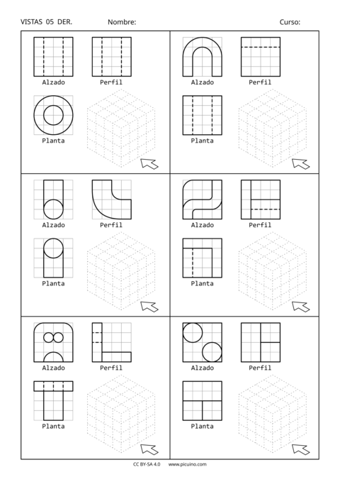

|  :download:`Alzado derecho. Formato PDF.
   <dibujo/dibujo-vistas-der-05.pdf>`
|  :download:`Alzado derecho. Imágenes en formato PNG.
   <dibujo/dibujo-vistas-der-05-images.zip>`
|  :download:`Alzado derecho. Formato editable SVG.
   <dibujo/dibujo-vistas-der-05.svg>`

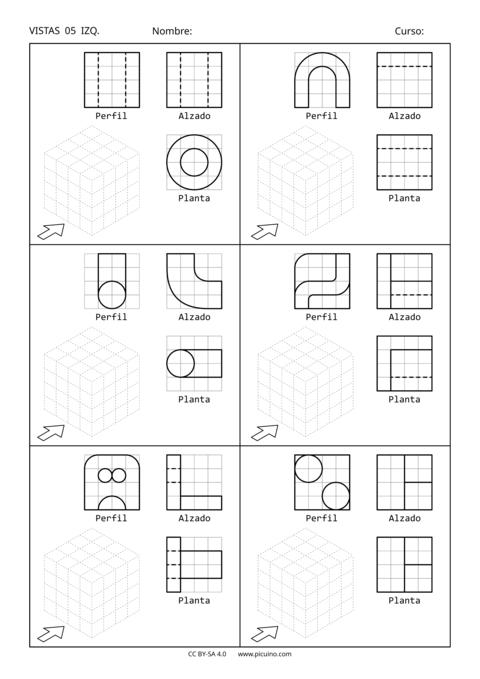

|  :download:`Alzado izquierdo. Formato PDF.
   <dibujo/dibujo-vistas-izq-05.pdf>`
|  :download:`Alzado izquierdo. Imágenes en formato PNG.
   <dibujo/dibujo-vistas-izq-05-images.zip>`
|  :download:`Alzado izquierdo. Formato editable SVG.
   <dibujo/dibujo-vistas-izq-05.svg>`

Plantillas de dibujo
--------------------

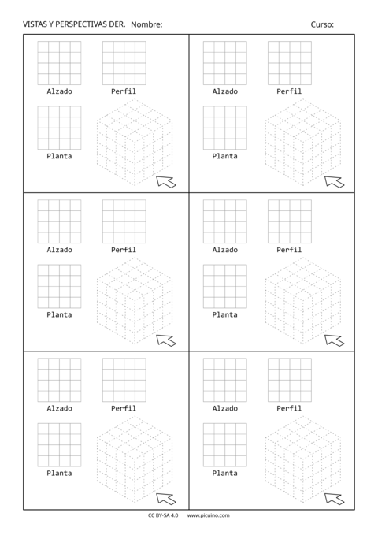

|  :download:`Alzado derecho. Formato PDF.
   <dibujo/dibujo-plantilla-isometric-4-der.pdf>`
|  :download:`Alzado derecho. Formato editable SVG.
   <dibujo/dibujo-plantilla-isometric-4-der.svg>`

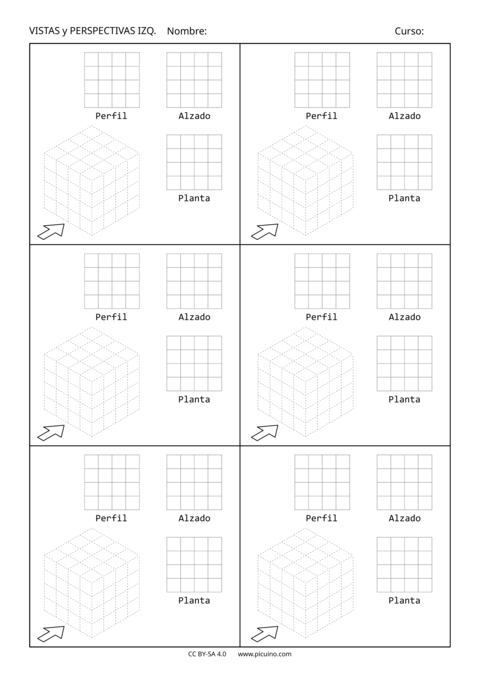

|  :download:`Alzado izquierdo. Formato PDF.
   <dibujo/dibujo-plantilla-isometric-4-izq.pdf>`
|  :download:`Alzado izquierdo. Formato editable SVG.
   <dibujo/dibujo-plantilla-isometric-4-izq.svg>`

Piezas de papel en tres dimensiones
-----------------------------------
Ejercicios para construir piezas en tres dimensiones con papel recortado
(papercraft) en el taller de Tecnología:

   :ref:`taller-papercraft`
