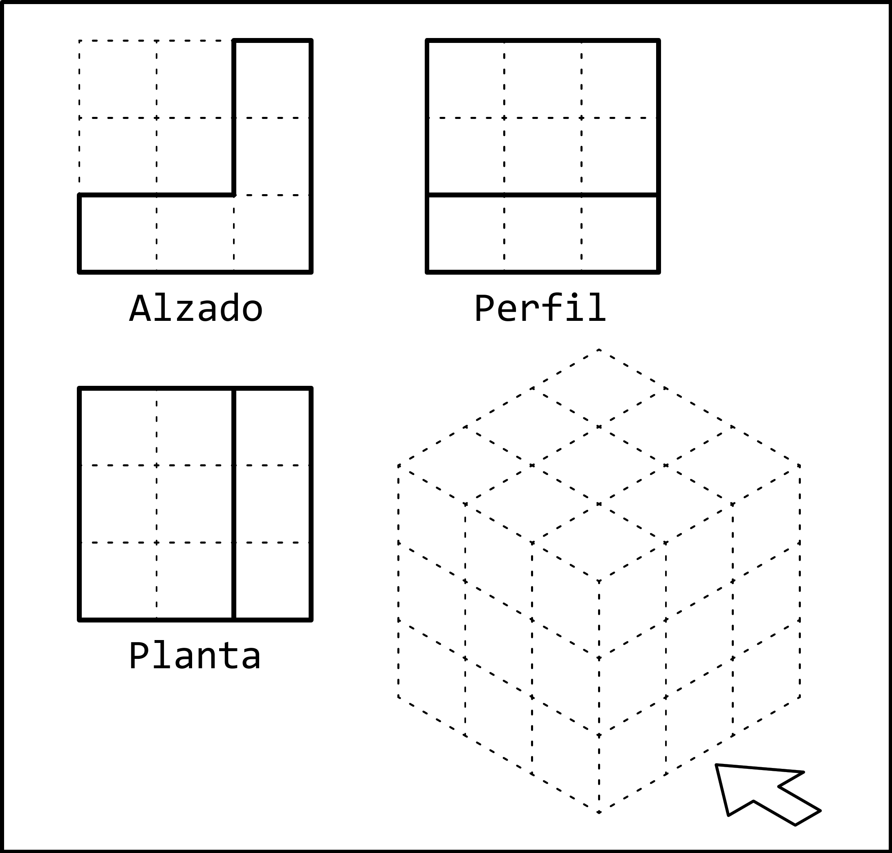
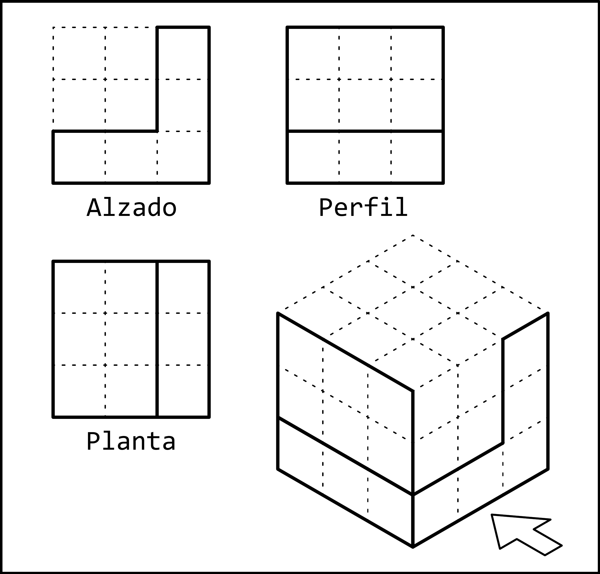
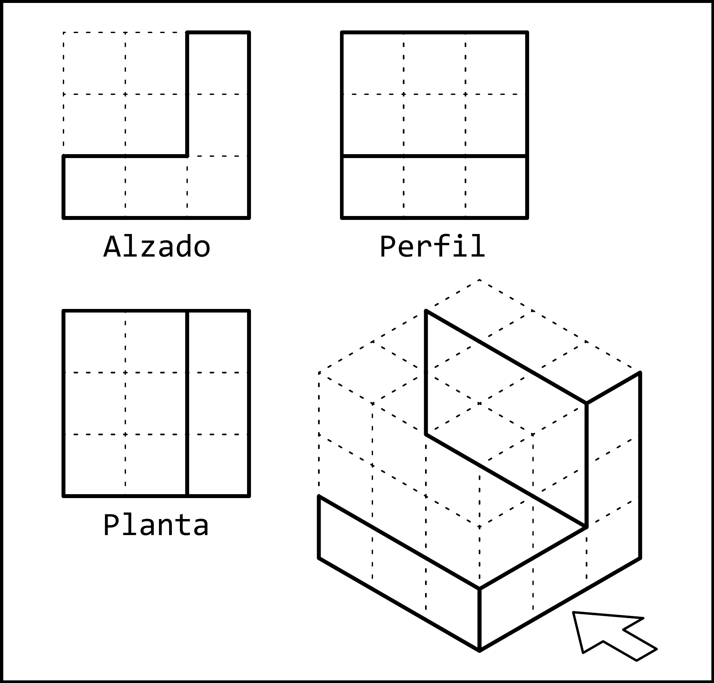
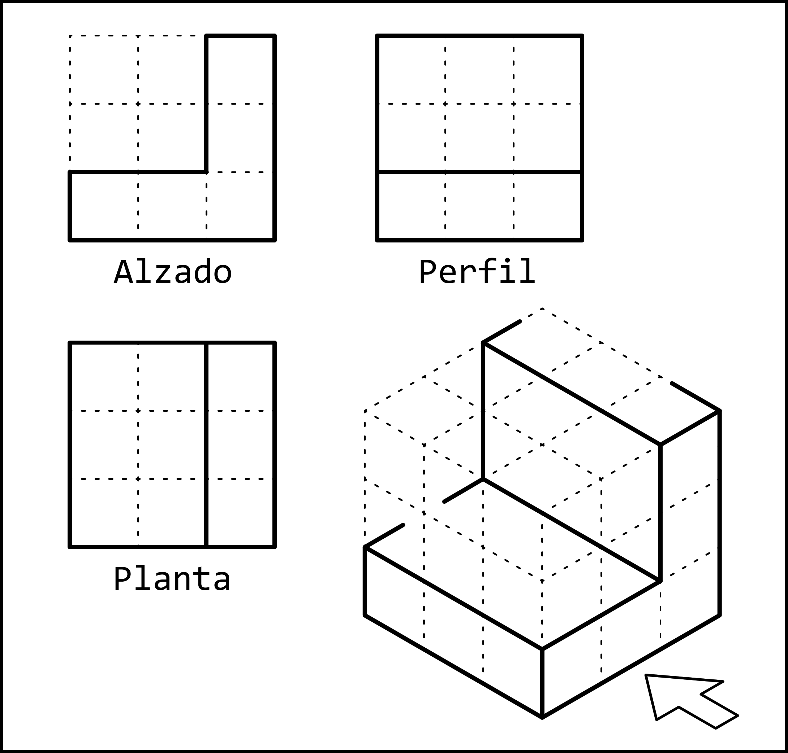
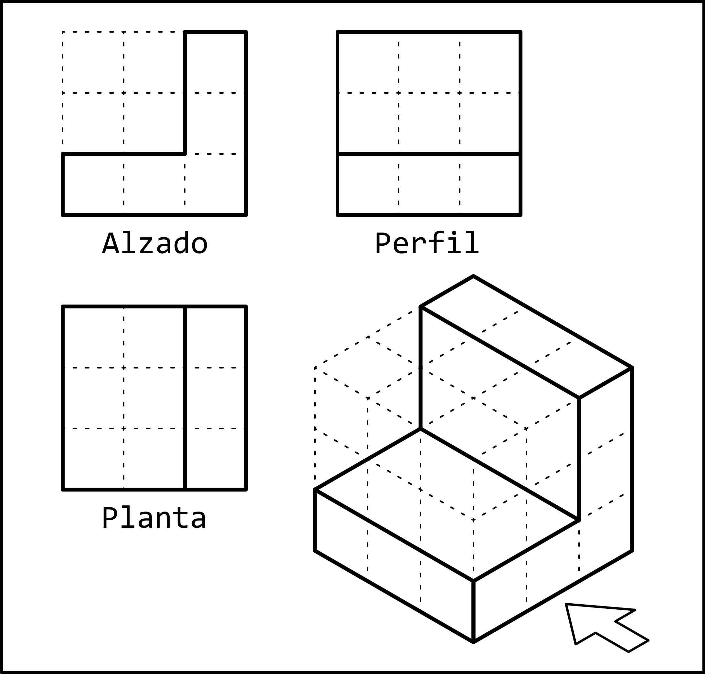

:date: 2026-08-19
:modified: 2026-08-19
:author: Carlos Félix Pardo Martín
:license: Creative Commons Attribution-ShareAlike 4.0 International
:license_url: https://creativecommons.org/licenses/by-sa/4.0/
:tocdepth: 1

.. _dibujo-isometrica-pieza-01:

Pieza 1 en isométrica
=====================
A la hora de dibujar una pieza en perspectiva, partiremos de sus
vistas: alzado, perfil y planta.

También dispondremos de una plantilla isométrica, de tamaño adecuado,
con una flecha que indica la dirección del alzado.
Esto supondrá una gran ayuda a la hora de encuadrar el dibujo en
perspectiva.

Las tres vistas contienen las tres dimensiones de la pieza, pero repartidas entre ellas:

* **Alzado**: anchura y altura.
* **Planta**: anchura y profundidad.
* **Perfil**: profundidad y altura.

Para dibujar la pieza en perspectiva tenemos que combinar la información de las tres vistas.

Dibujar alzado y perfil
-----------------------
Para comenzar, dibujaremos el alzado y el perfil sobre la plantilla
isométrica, adaptando sus líneas a las direcciones de la perspectiva.

En la perspectiva isométrica, las tres dimensiones de la pieza se
representan mediante tres direcciones diferentes.
La altura se dibuja verticalmente y la anchura y la profundidad se dibujan
mediante líneas inclinadas.

Desplazar el perfil
-------------------
Para realizar el siguiente paso debemos fijarnos en las aristas que
todavía no están en su posición correcta y desplazarlas hasta que
coincidan con las aristas correspondientes del alzado.

El perfil solo nos muestra la altura y la profundidad de la pieza.
No podemos obtener de él la anchura, porque estamos mirando la pieza
desde un lado. Por eso debemos utilizar el alzado para colocar el perfil
en su posición correcta.

Debemos mover el rectángulo superior del perfil hacia la derecha dos
unidades, siguiendo la dirección de la plantilla isométrica, hasta que
sus aristas coincidan con las aristas que se pueden ver en el alzado.

Dibujar tres líneas en los vértices
-----------------------------------
A partir de esta figura, que está prácticamente terminada, añadiremos las
líneas que faltan en cada vértice.

De cada vértice de una pieza en perspectiva salen tres líneas con
diferente orientación. En algunos casos, como en los vértices inferiores,
la tercera línea está oculta y no se representa. Sin embargo, en los
vértices superiores sí debemos dibujar las tres líneas.

Estas tres líneas siguen siempre las tres direcciones de la perspectiva
isométrica:

Ahora solo hace falta prolongar las líneas recién trazadas hasta que se
encuentren con otras aristas de la pieza. De esta forma, la pieza en tres
dimensiones estará terminada:

