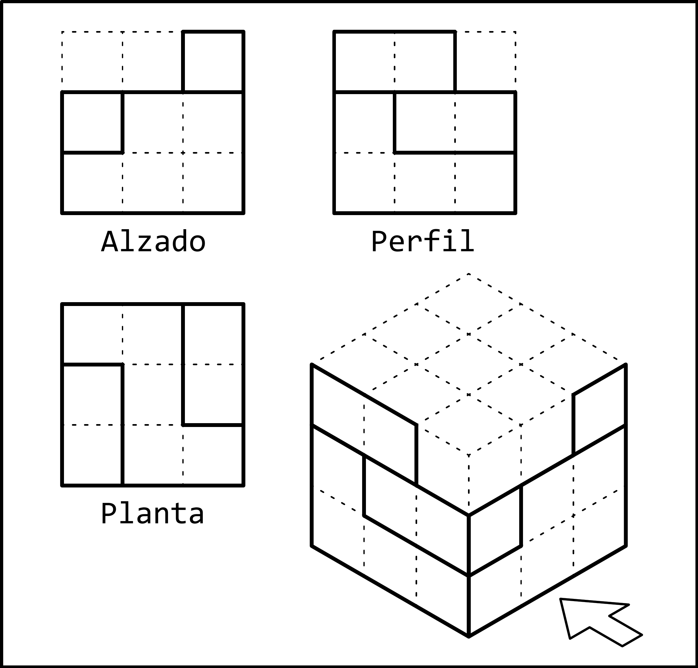
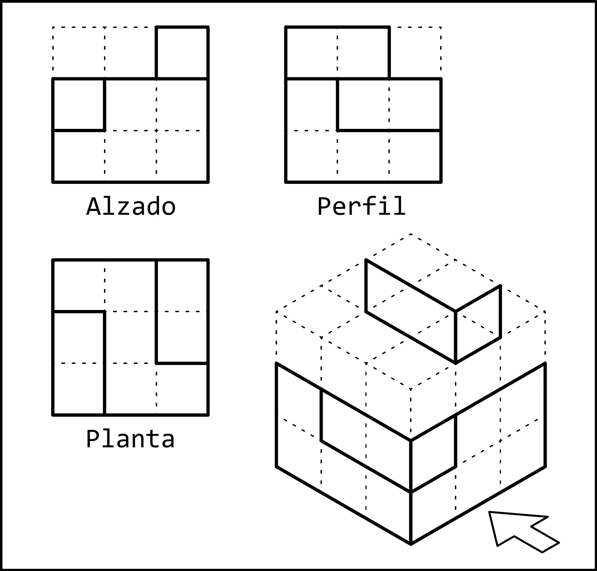
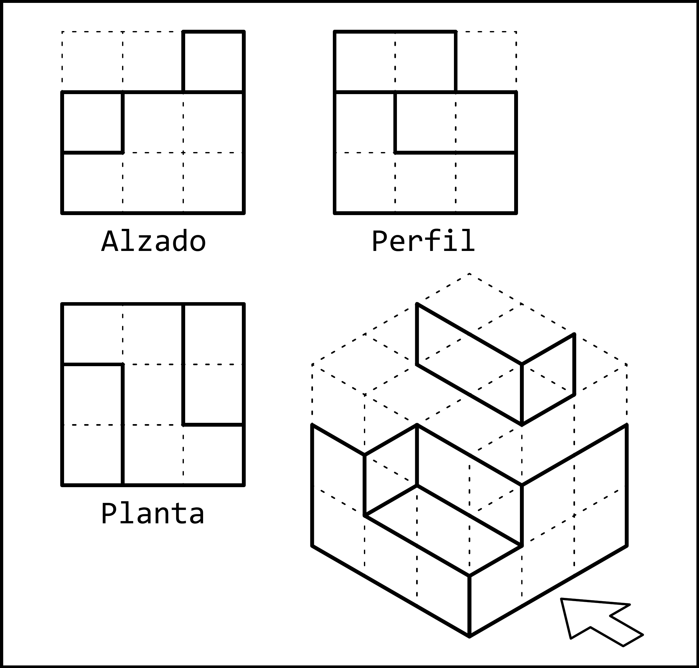
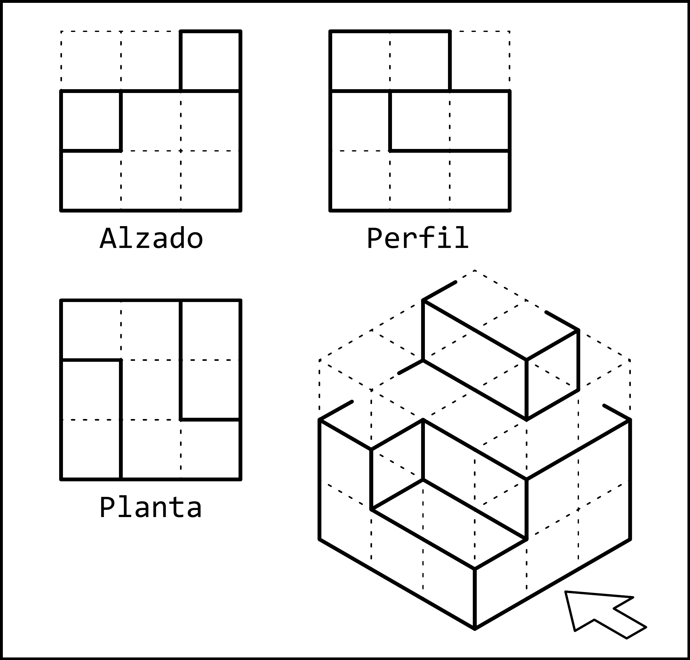
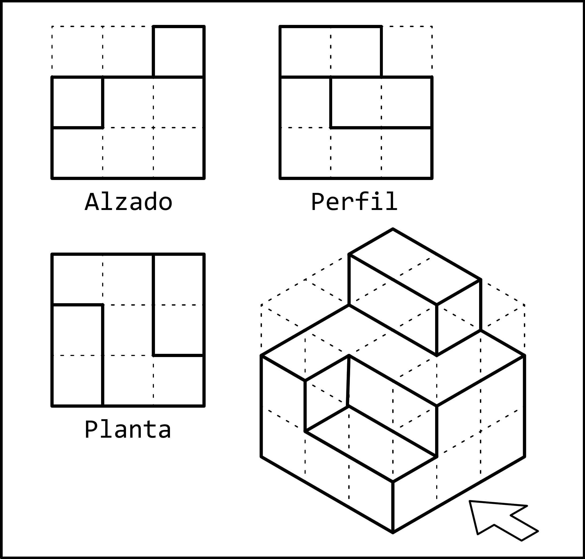

:date: 2026-08-19
:modified: 2026-08-19
:author: Carlos Félix Pardo Martín
:license: Creative Commons Attribution-ShareAlike 4.0 International
:license_url: https://creativecommons.org/licenses/by-sa/4.0/
:tocdepth: 1

.. _dibujo-isometrica-pieza-02:

Pieza 2 en isométrica
=====================
Esta pieza es un poco más compleja que la anterior, pero seguiremos el
mismo procedimiento, combinando la información de las vistas para
dibujar la pieza en perspectiva isométrica.

Dibujar el alzado y el perfil
-----------------------------
Para comenzar, dibujaremos el alzado y el perfil sobre la plantilla
isométrica, haciendo que sus líneas sigan las direcciones de la
perspectiva.

En la perspectiva isométrica, las tres dimensiones de la pieza se
representan mediante tres direcciones diferentes.
La altura se representa mediante líneas verticales, mientras que la
anchura y la profundidad se representan mediante líneas inclinadas.

Desplazar las aristas
---------------------
Para realizar el siguiente paso, debemos fijarnos en las aristas que
todavía no están en su posición correcta y desplazarlas hasta hacer
coincidir las aristas correspondientes del perfil y del alzado.

Primero desplazamos el rectángulo superior del perfil y el cuadrado
superior del alzado hasta que coincidan.

Ahora realizaremos lo mismo con las aristas que se encuentran en la
segunda fila del alzado y del perfil.

Dibujar tres líneas desde los vértices
--------------------------------------
A partir de esta figura, que está prácticamente terminada, añadiremos las
líneas que faltan en cada vértice.

De cada vértice de una pieza en perspectiva salen tres líneas que siguen
las tres direcciones de la perspectiva.
En algunos casos, una de las tres líneas queda oculta y no se representa.
Cuando las tres aristas son visibles, debemos dibujar las tres líneas.

Estas tres líneas siguen siempre las tres direcciones de la perspectiva
isométrica:

Terminar la pieza
-----------------
Ahora solo hace falta prolongar las líneas recién trazadas hasta que se
encuentren con otras aristas de la pieza.
De esta forma, habremos terminado la representación de la pieza en
perspectiva isométrica:

