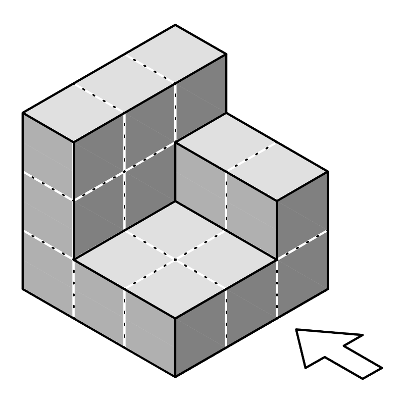

:date: 2018-12-10
:modified: 2026-08-19
:author: Carlos Félix Pardo Martín
:license: Creative Commons Attribution-ShareAlike 4.0 International
:license_url: https://creativecommons.org/licenses/by-sa/4.0/

.. _dibujo-isometrica:

Perspectiva isométrica
======================
La perspectiva es una forma de representar piezas en tres dimensiones
sobre una hoja plana.

En esa representación se pueden ver a la vez la cara frontal, el perfil
y la planta de la pieza.

Nosotros vamos a utilizar la perspectiva isométrica, que utiliza la misma
medida para los tres ejes principales (x, y, z).

.. toctree::
   :numbered: 1
   :maxdepth: 1
   :titlesonly:

   dibujo-isometrica-pieza-01.rst
   dibujo-isometrica-pieza-02.rst
   dibujo-isometrica-ejercicios.rst
   dibujo-isometrica-bocetos.rst
