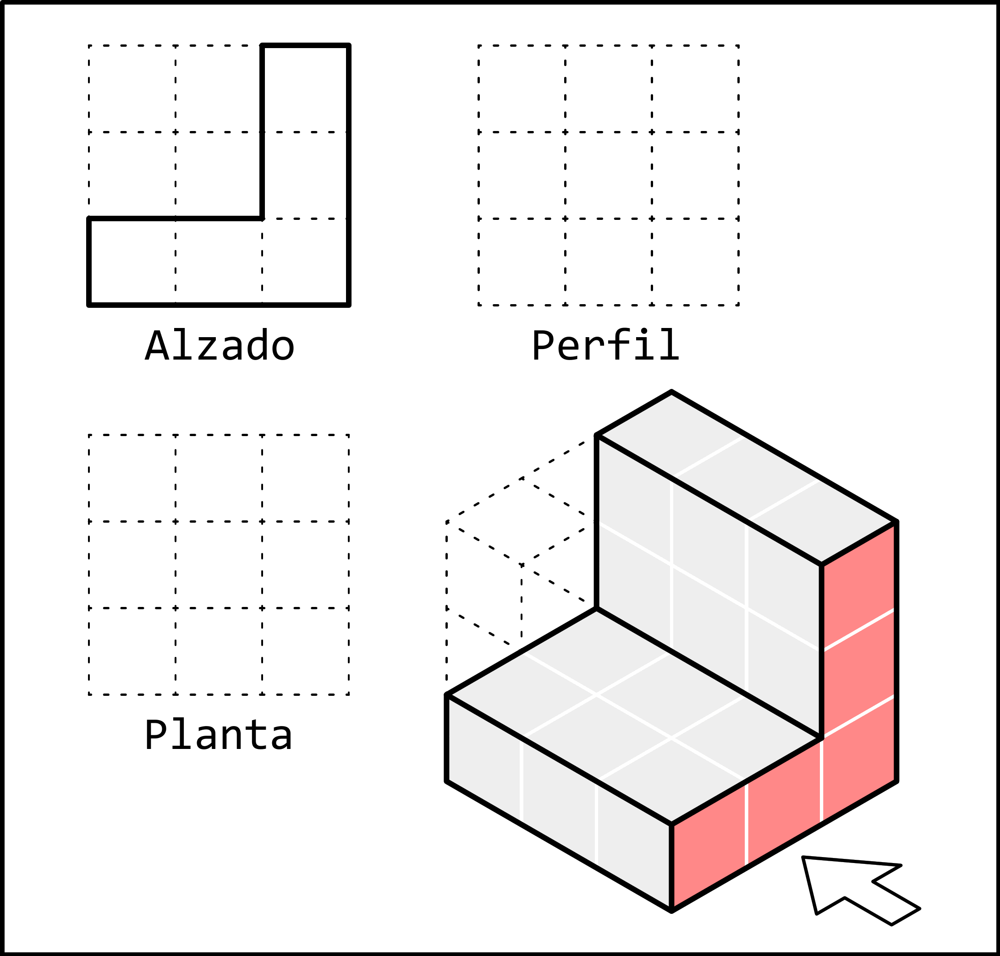
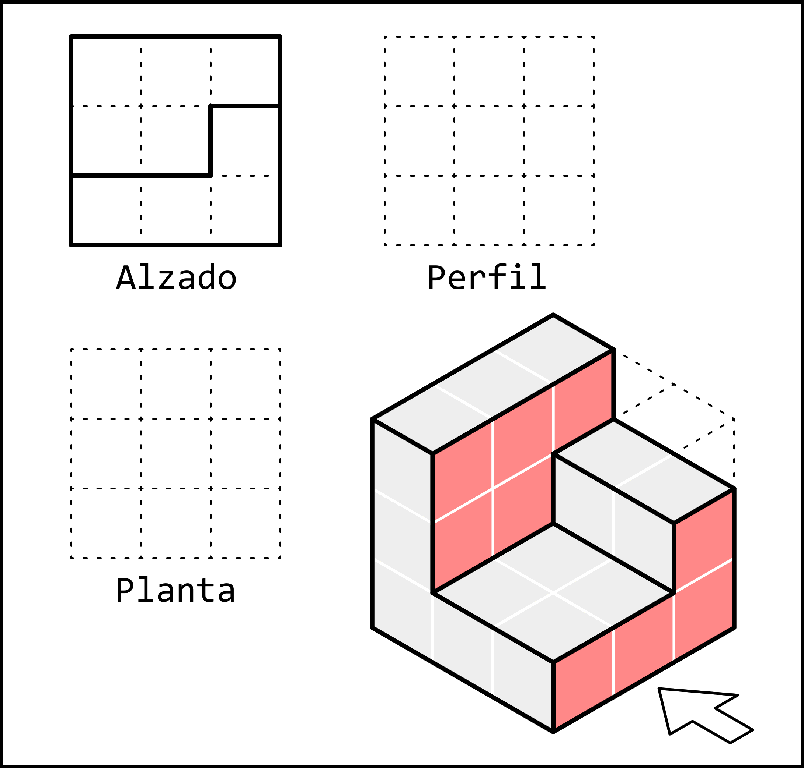
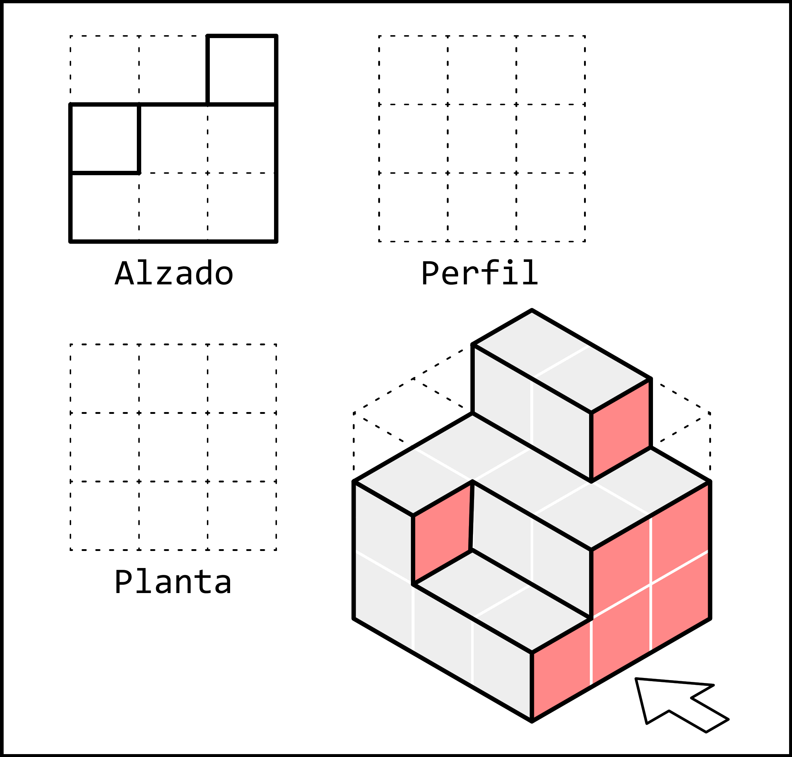
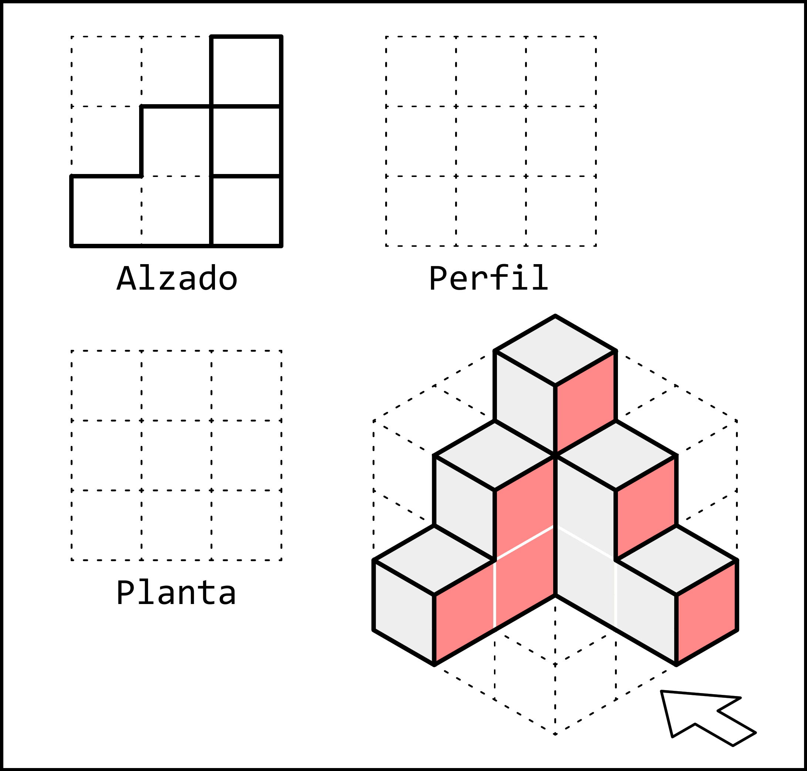

:date: 2026-08-15
:modified: 2026-08-15
:author: Carlos Félix Pardo Martín
:license: Creative Commons Attribution-ShareAlike 4.0 International
:license_url: https://creativecommons.org/licenses/by-sa/4.0/

.. _dibujo-vistas-alzado:

Alzado
======
El **alzado** es la vista que elegimos como principal para representar
una pieza. 
Es la representación de la pieza observada **de frente**.

El alzado muestra principalmente la **altura** y la **anchura** de la
pieza, pero no muestra su profundidad.

En la vista en tres dimensiones el alzado suele indicarse mediante una
**flecha** que señala la dirección desde la que se observa la pieza.

Elegimos como alzado la vista que permite representar mejor la forma
de la pieza, mostrando el mayor número posible de detalles y evitando,
en lo posible, las líneas ocultas.

Ejemplos
--------
En los siguientes ejemplos se pueden ver, en **tono rojo**, las diferentes
caras de la pieza en tres dimensiones que se pueden observar desde la
dirección del alzado.

También están representadas las aristas que forman el alzado.
Estas son las líneas que debemos dibujar en la vista.

En estos ejercicios no se dibujan las superficies ni se rellenan con
color: solo se representan las aristas visibles mediante líneas
continuas gruesas.

----

En la siguiente pieza, el alzado tiene forma de ele hacia la izquierda.
Esa es la figura que representaremos en el alzado.

----

En la siguiente pieza, el alzado muestra una ele hacia la izquierda en
la parte inferior. Encima aparece un cuadrado mediano y, sobre su parte
superior derecha, otro cuadrado más pequeño.
Esas dos figuras las representaremos en el alzado.

Aunque las dos figuras están situadas a diferentes profundidades en la
pieza, el alzado no muestra la profundidad. Por eso, al proyectarlas 
sobre el plano del alzado, aparecen juntas.

----

La siguiente pieza tiene tres figuras. Es importante distinguir en este
caso qué figura está a la izquierda, cuál está a la derecha y a qué altura
se encuentra cada una. La flecha del alzado nos servirá de referencia para
situar cada figura en su posición.

En concreto, hay un pequeño cuadrado a la izquierda, situado en la segunda
fila desde abajo, y otro pequeño cuadrado a la derecha, situado arriba del
todo.

----

Esta última pieza tiene dos escaleras con orientaciones diferentes.
La escalera de la izquierda se ve desde el alzado como una ele,
mientras que la escalera de la derecha muestra tres cuadrados
correspondientes a las caras frontales de los escalones.

