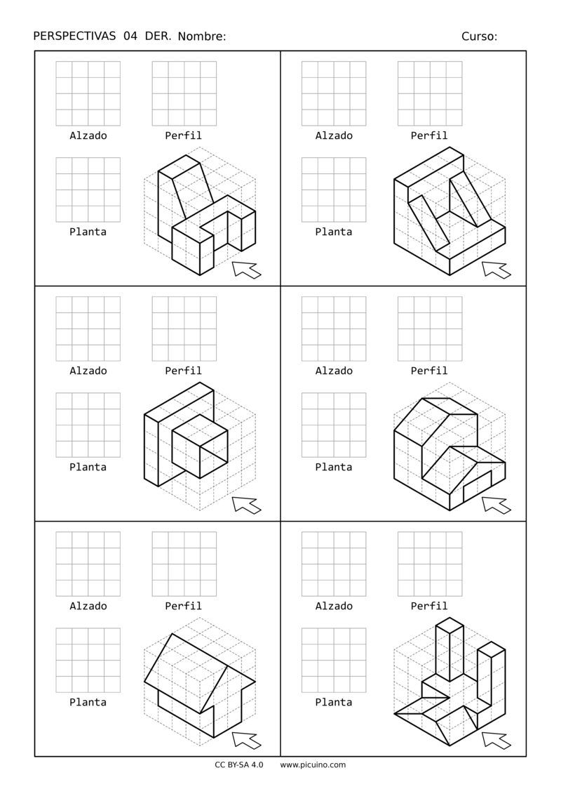
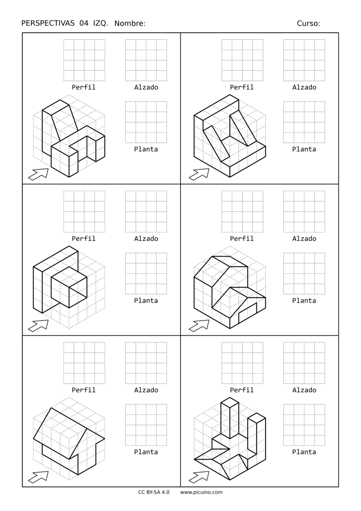

:date: 2018-12-10
:modified: 2026-08-15
:author: Carlos Félix Pardo Martín
:license: Creative Commons Attribution-ShareAlike 4.0 International
:license_url: https://creativecommons.org/licenses/by-sa/4.0/

.. _dibujo-vistas-ocultas-rampas:

Ejercicios con vistas ocultas y rampas
======================================
Ejercicios de obtención de vistas a partir de figuras
en perspectiva isométrica con rampas y con vistas ocultas.

|  :download:`Alzado derecho. Formato PDF.
   <dibujo/dibujo-vistas-der-04.pdf>`
|  :download:`Alzado derecho. Imágenes en formato PNG.
   <dibujo/dibujo-vistas-der-04-images.zip>`
|  :download:`Alzado derecho. Formato editable SVG.
   <dibujo/dibujo-vistas-der-04.svg>`

|  :download:`Alzado izquierdo. Formato PDF.
   <dibujo/dibujo-vistas-izq-04.pdf>`
|  :download:`Alzado izquierdo. Imágenes en formato PNG.
   <dibujo/dibujo-vistas-izq-04-images.zip>`
|  :download:`Alzado izquierdo. Formato editable SVG.
   <dibujo/dibujo-vistas-izq-04.svg>`
