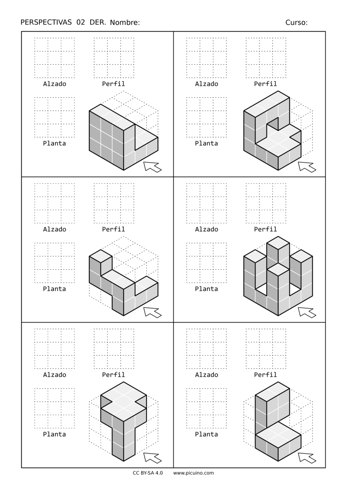
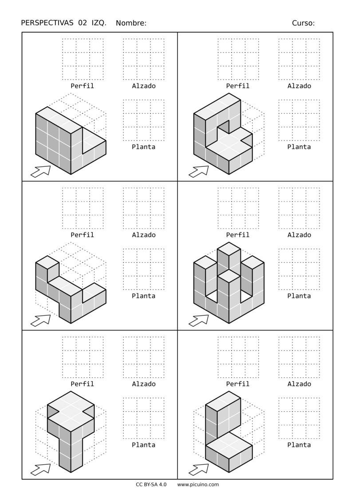

:date: 2018-12-10
:modified: 2026-08-15
:author: Carlos Félix Pardo Martín
:license: Creative Commons Attribution-ShareAlike 4.0 International
:license_url: https://creativecommons.org/licenses/by-sa/4.0/

.. _dibujo-vistas-ocultas:

Ejercicios con vistas ocultas
=============================
Ejercicios de obtención de vistas, con vistas ocultas, a partir de figuras
en perspectiva isométrica.

Todos los ejercicios tienen una versión con el sistema de vistas
europeo (alzado a la derecha) y otra versión no convencional en la
que el alzado se ha escogido a la izquierda de la figura y el
perfil a la derecha.

|  :download:`Alzado derecho. Formato PDF.
   <dibujo/dibujo-vistas-der-02.pdf>`
|  :download:`Alzado derecho. Imágenes en formato PNG.
   <dibujo/dibujo-vistas-der-02-images.zip>`
|  :download:`Alzado derecho. Formato editable SVG.
   <dibujo/dibujo-vistas-der-02.svg>`

|  :download:`Alzado izquierdo. Formato PDF.
   <dibujo/dibujo-vistas-izq-02.pdf>`
|  :download:`Alzado izquierdo. Imágenes en formato PNG.
   <dibujo/dibujo-vistas-izq-02-images.zip>`
|  :download:`Alzado izquierdo. Formato editable SVG.
   <dibujo/dibujo-vistas-izq-02.svg>`

