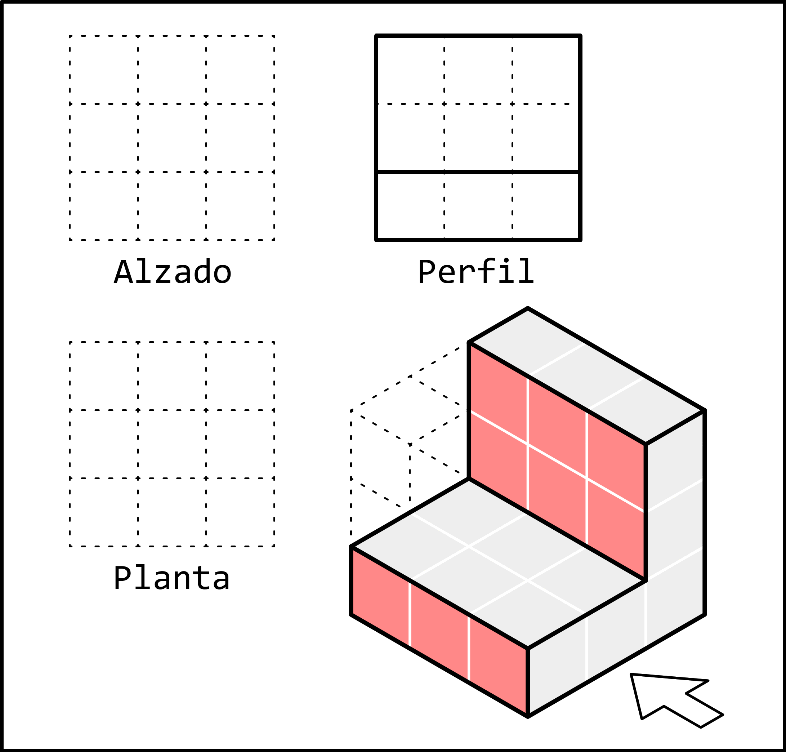
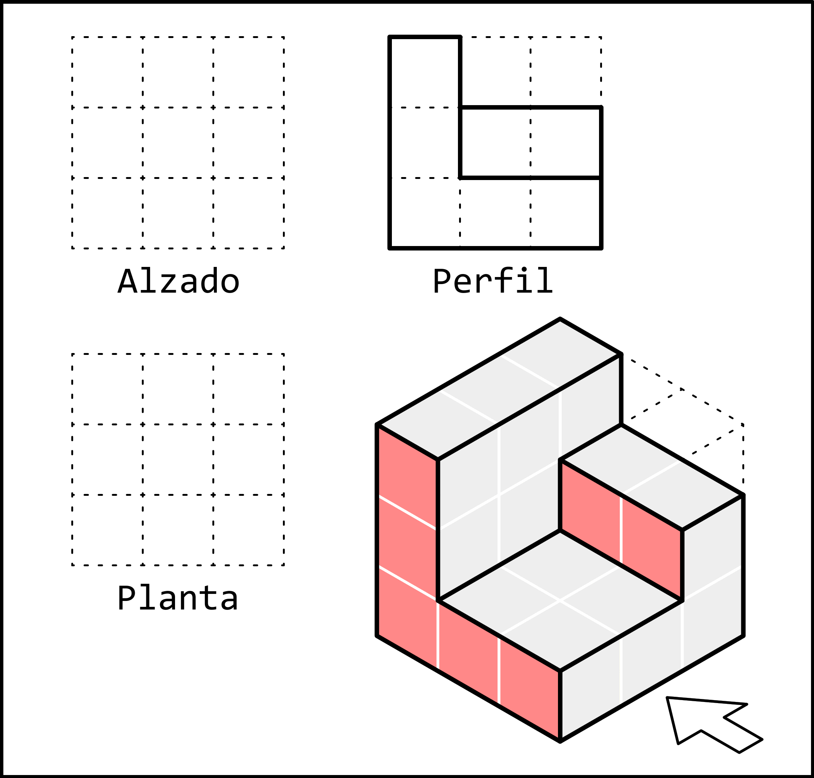
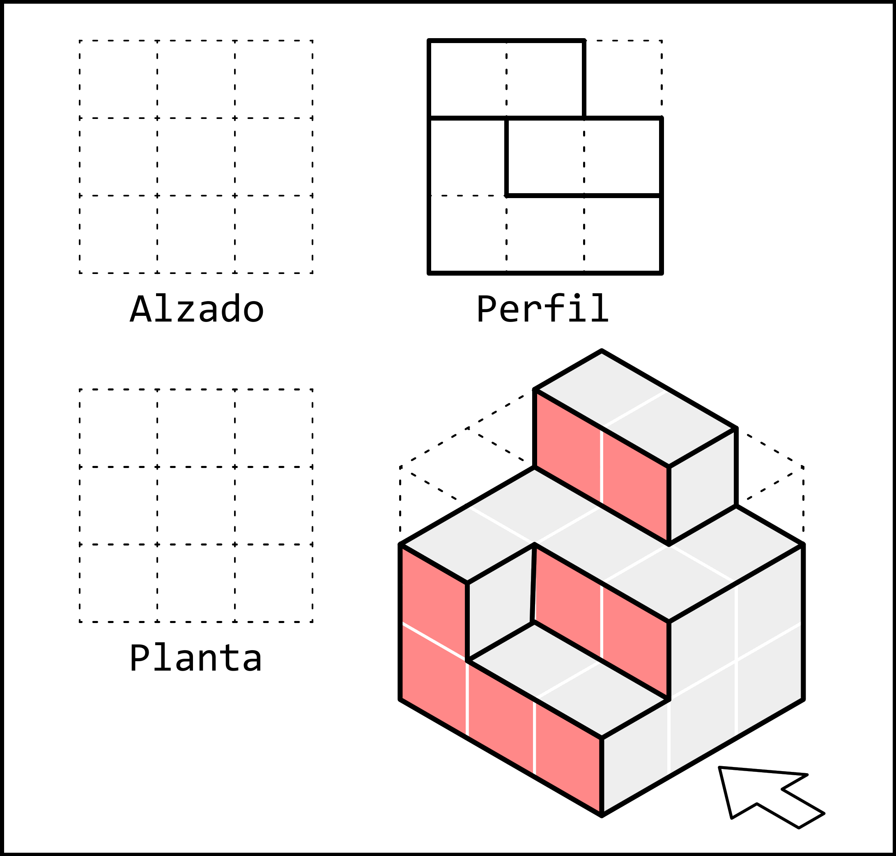
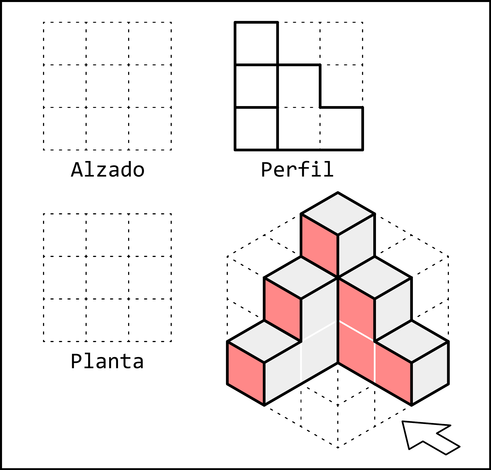

:date: 2026-08-15
:modified: 2026-08-15
:author: Carlos Félix Pardo Martín
:license: Creative Commons Attribution-ShareAlike 4.0 International
:license_url: https://creativecommons.org/licenses/by-sa/4.0/

.. _dibujo-vistas-perfil:

Perfil
======
El **perfil** es la vista de una pieza **desde uno de sus lados**,
normalmente desde la izquierda.

El perfil muestra principalmente la **altura** y la **profundidad** de la
pieza, pero no muestra su anchura.

El perfil puede ser izquierdo o derecho, dependiendo del lado desde el
que observemos la pieza.

Ejemplos
--------
En los siguientes ejemplos se pueden ver, en **tono rojo**, las diferentes
caras de la pieza en tres dimensiones que se observan desde la dirección
del perfil.

También están representadas las aristas que forman el perfil.
Estas son las líneas que debemos dibujar en la vista.

El perfil no se debe colorear ni rellenar con color gris, solo se
representan las aristas visibles mediante líneas continuas gruesas.

----

En esta pieza se pueden ver **dos rectángulos desde la dirección del
perfil**.
Ambos tienen una profundidad de **3 unidades**: el rectángulo inferior
tiene una altura de **1 unidad** y el superior, de **2 unidades**.
Con estas medidas es sencillo dibujar el perfil.

Aunque las dos figuras están separadas en la dirección de la anchura,
esta dimensión no se representa en el perfil.
Por eso, en esta vista aparecen **una encima de la otra**, sin mostrar
la distancia que las separa en la dirección de la anchura.

----

En esta pieza podemos ver desde el perfil una ele hacia la derecha y 
un rectángulo de 2 unidades de profundidad situado encima de la ele.

Al igual que antes, ambas **aparecen juntas**, sin mostrar la distancia
que las separa.

----

En esta pieza podemos ver tres figuras diferentes. Para dibujarlas
correctamente debemos fijarnos tanto en su tamaño (altura y profundidad)
como en su posición (altura y profundidad).

----

Esta pieza está formada por dos escaleras. Las zonas sombreadas en gris
representan las partes de la pieza que se observan desde el perfil.
En el perfil, las figuras aparecen sin separación en la dirección de la
anchura, como ya hemos visto en otras figuras.

