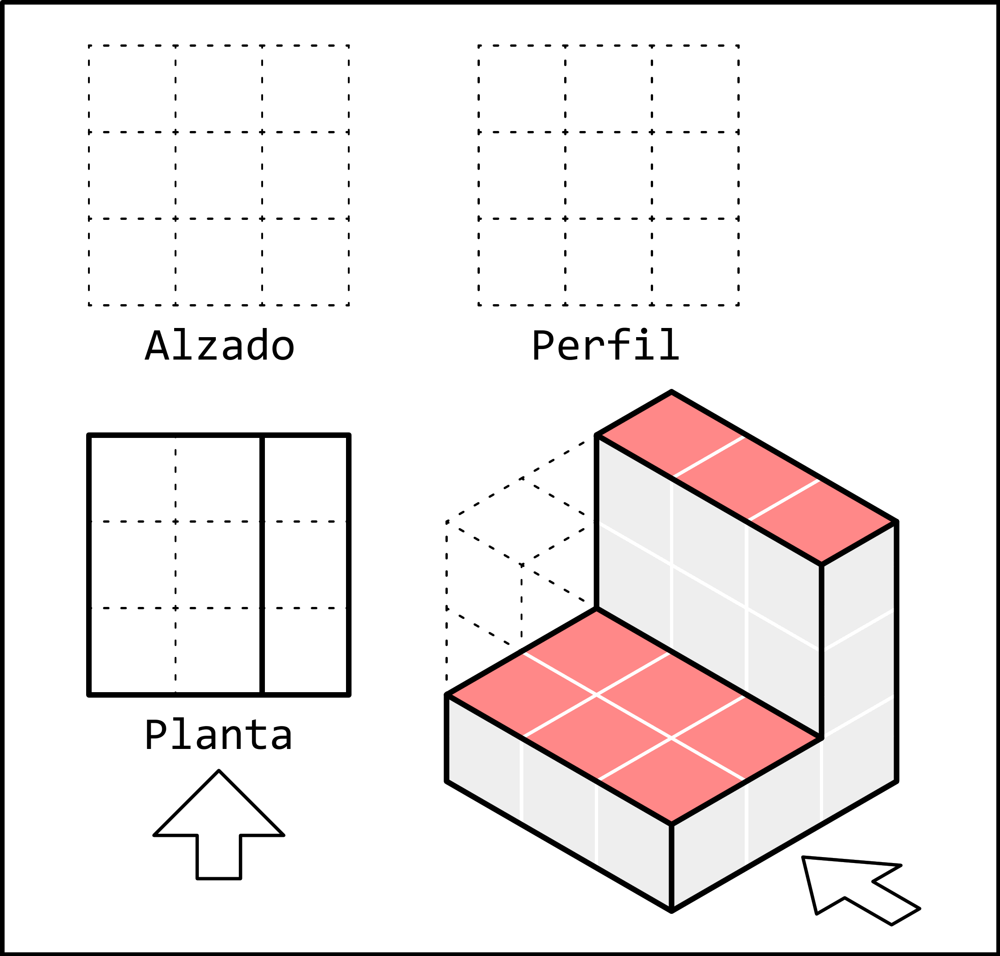
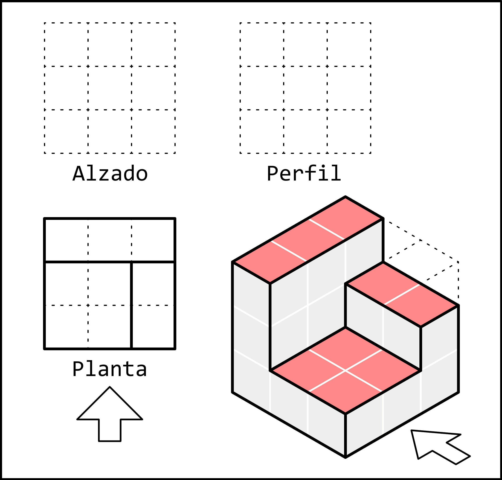
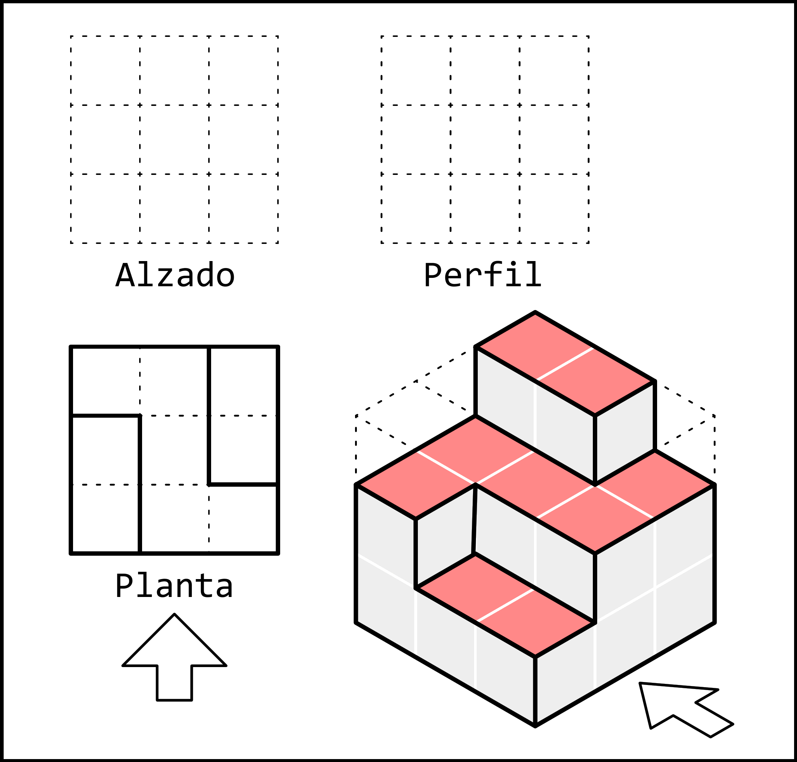
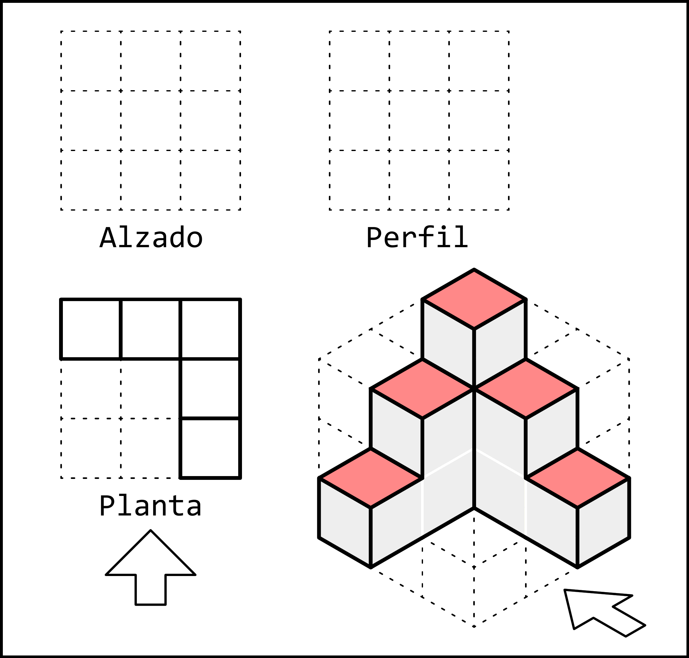

:date: 2026-08-15
:modified: 2026-08-15
:author: Carlos Félix Pardo Martín
:license: Creative Commons Attribution-ShareAlike 4.0 International
:license_url: https://creativecommons.org/licenses/by-sa/4.0/

.. _dibujo-vistas-planta:

Planta
======
La **planta** es la vista de una pieza observada **desde arriba**.

La planta muestra principalmente la **anchura** y la **profundidad**
de la pieza, pero no muestra la altura.

En los siguientes ejemplos se ha representado, además de la planta, la 
flecha que indica el alzado. Esa flecha no se representa normalmente.
Servirá para orientarnos y saber qué parte de la planta está en la
zona inferior, cercana al alzado, y qué parte está en la zona superior,
alejada del alzado.

Ejemplos
--------
En los siguientes ejemplos se pueden ver, en **tono rojo**, las diferentes
caras de la pieza en tres dimensiones que se observan desde la dirección
de la planta.

También están representadas las aristas que forman la planta.
Estas son las líneas que debemos dibujar en la vista.

La planta no se debe colorear ni rellenar con color gris, solo se
representan las aristas visibles mediante líneas continuas gruesas.

----

En la vista en planta es importante no confundir la orientación de las
diferentes figuras.
Para ayudarnos podemos dibujar debajo de la planta una flecha que
indique la dirección del alzado.

Las zonas sombreadas que se ven desde arriba nos indican que tenemos que
representar dos rectángulos, uno estrecho y otro más ancho.
El rectángulo estrecho está a la derecha de la flecha y su lado más
largo sigue la misma dirección que la flecha.
Con esta ayuda es sencillo representar esa misma figura en la planta con
la orientación correcta.

Debemos tener en cuenta que la altura no se representa en la planta,
porque esta vista solo muestra la anchura y la profundidad.
Por eso, los dos rectángulos se dibujarán juntos a pesar de tener
alturas diferentes.

----

En esta pieza podemos ver un cuadrado a la izquierda de la flecha y cerca
de ella. Una vez representado el cuadrado, los dos rectángulos se
dibujan con facilidad. Uno tiene 3 unidades de anchura y está alejado
de la flecha.
El otro tiene 2 unidades de profundidad y está a la derecha de la flecha.

----

En esta pieza podemos ver tres figuras. La mayor dificultad la podemos
encontrar en la figura de altura media, que forma una especie de letra
zeta.
Por esa razón dibujaremos primero los dos rectángulos sencillos.
Ambos tienen su lado más largo orientado en la dirección de la flecha.
Uno se encuentra a la izquierda de la flecha y cerca de ella, y el otro
está a la derecha de la flecha y más alejado.

Una vez dibujados los rectángulos, la figura de la zeta es fácil de 
dibujar porque ocupa todo el hueco restante.

----

En esta última figura podemos ver un total de cinco cuadrados situados a
diferentes posiciones y alturas. Como ya sabemos, la altura no se
representa en la planta, por lo que solo tendremos que fijarnos en la
posición de cada cuadrado.

Con ayuda de las flechas podemos colocar cada uno de los cuadrados en su
sitio, teniendo en cuenta que la esquina cercana a la flecha y a su
izquierda debe quedar libre.

