:Date: 10/12/2018
:Author: Carlos Félix Pardo Martín
:License: Creative Commons Attribution-ShareAlike 4.0 International
:tocdepth: 1

.. _dibujo-vistas:

Vistas
======

Las vistas son dibujos de una figura desde distintas perspectivas.
Las vistas son el alzado (vista de frente), el perfil (vista de lado) y
la planta (vista desde arriba). En concreto vamos a utilizar el sistema
europeo, que ordena la posición de las tres vistas de manera diferente
al sistema americano.

Este método de representar una figura tridimensional en varios dibujos
se denomina `sistema diédrico <https://es.wikipedia.org/wiki/Sistema_di%C3%A9drico>`__.

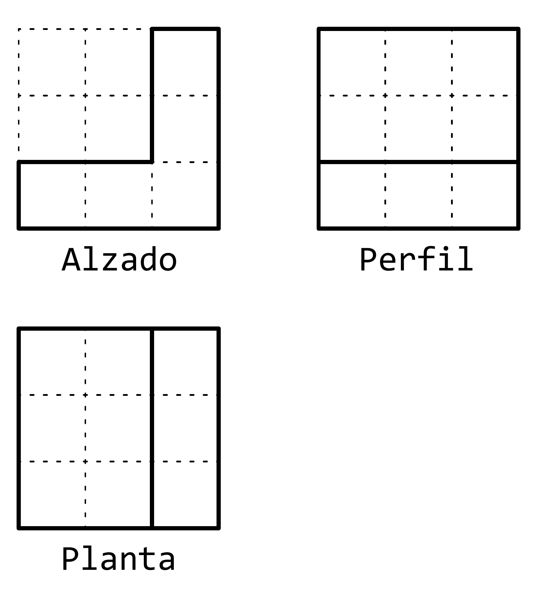

A continuación aparecen ejercicios de obtención de vistas de una
figura, graduados en dificultad desde el nivel básico hasta el
nivel más complejo con objetos curvos.

Todos los ejercicios tienen una versión con el sistema de vistas
europeo (alzado a la derecha) y otra versión no convencional en la
que el alzado se ha escogido a la izquierda de la figura y el
perfil a la derecha.

.. contents:: Índice de contenidos:
   :local:
   :depth: 2

.. _dibujo-vistas-simples:

Ejercicios simples
------------------

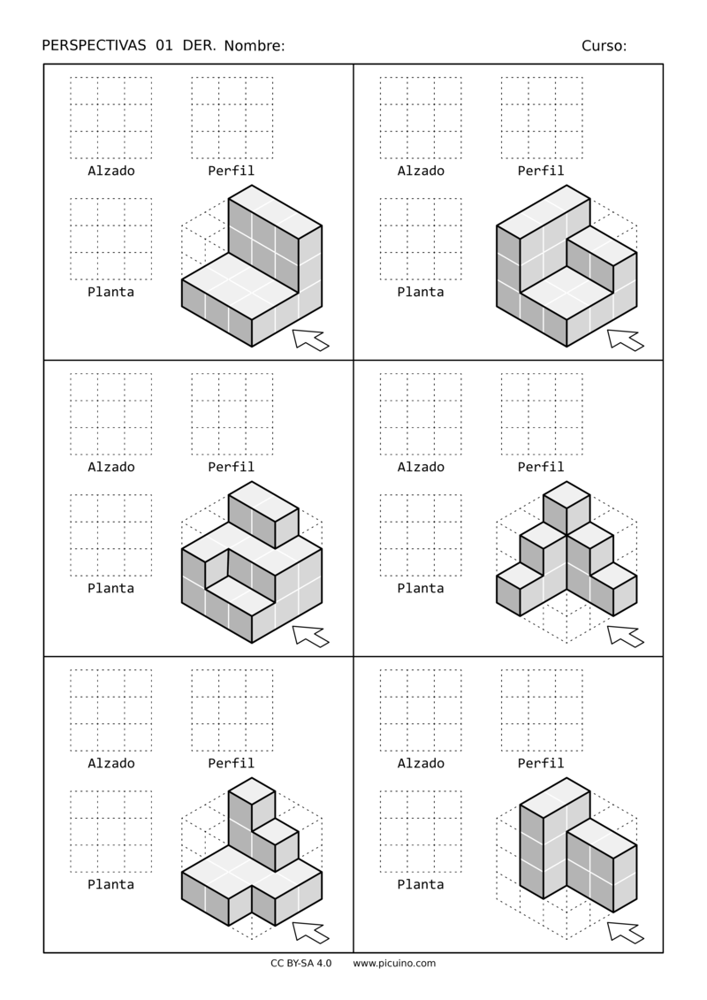

|  :download:`Alzado derecho. Formato PDF.
   <dibujo/dibujo-vistas-der-01.pdf>`
|  :download:`Alzado derecho. Imágenes en formato PNG.
   <dibujo/dibujo-vistas-der-01-images.zip>`
|  :download:`Alzado derecho. Formato editable SVG.
   <dibujo/dibujo-vistas-der-01.svg>`

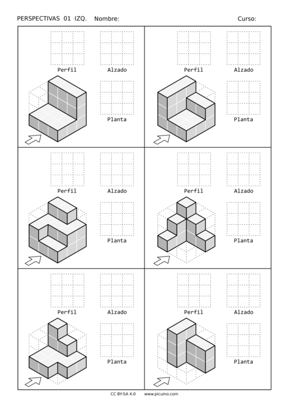

|  :download:`Alzado izquierdo. Formato PDF.
   <dibujo/dibujo-vistas-izq-01.pdf>`
|  :download:`Alzado izquierdo. Imágenes en formato PNG.
   <dibujo/dibujo-vistas-izq-01-images.zip>`
|  :download:`Alzado izquierdo. Formato editable SVG.
   <dibujo/dibujo-vistas-izq-01.svg>`

.. _dibujo-vistas-ocultas:

Ejercicios con vistas ocultas
-----------------------------

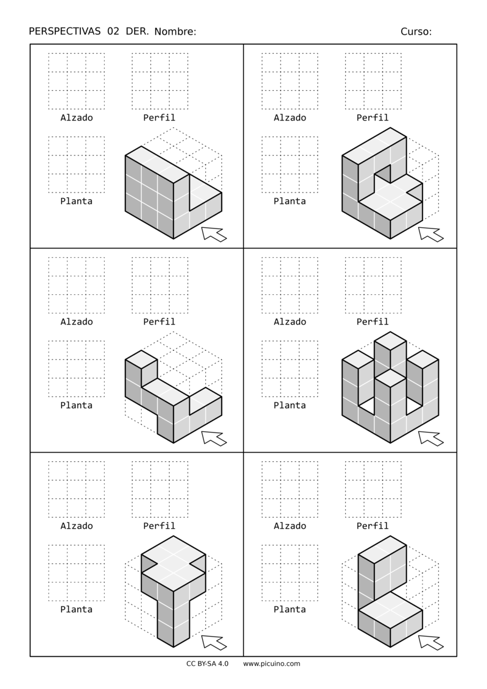

|  :download:`Alzado derecho. Formato PDF.
   <dibujo/dibujo-vistas-der-02.pdf>`
|  :download:`Alzado derecho. Imágenes en formato PNG.
   <dibujo/dibujo-vistas-der-02-images.zip>`
|  :download:`Alzado derecho. Formato editable SVG.
   <dibujo/dibujo-vistas-der-02.svg>`

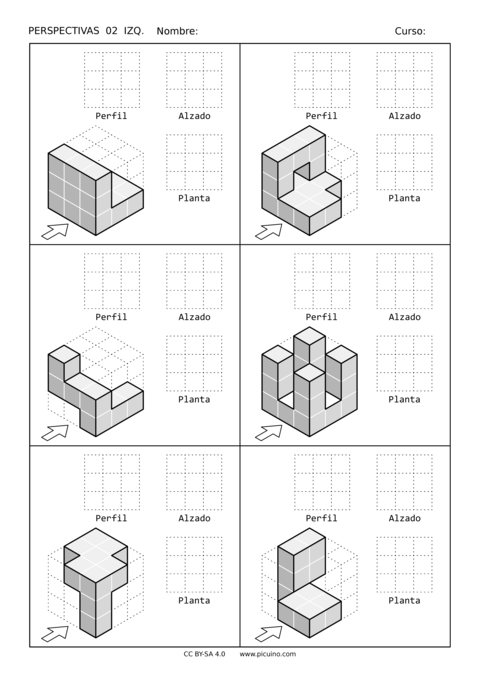

|  :download:`Alzado izquierdo. Formato PDF.
   <dibujo/dibujo-vistas-izq-02.pdf>`
|  :download:`Alzado izquierdo. Imágenes en formato PNG.
   <dibujo/dibujo-vistas-izq-02-images.zip>`
|  :download:`Alzado izquierdo. Formato editable SVG.
   <dibujo/dibujo-vistas-izq-02.svg>`

.. _dibujo-vistas-rampas:

Ejercicios con rampas
---------------------

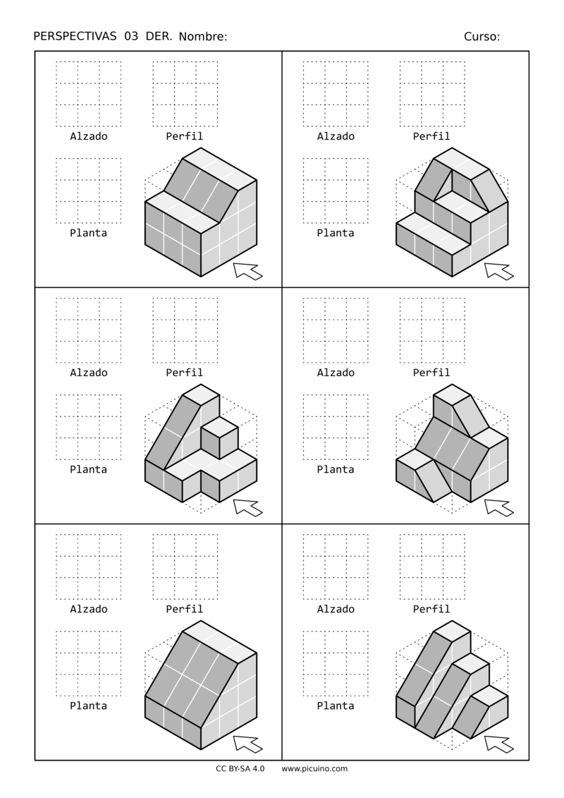

|  :download:`Alzado derecho. Formato PDF.
   <dibujo/dibujo-vistas-der-03.pdf>`
|  :download:`Alzado derecho. Imágenes en formato PNG.
   <dibujo/dibujo-vistas-der-03-images.zip>`
|  :download:`Alzado derecho. Formato editable SVG.
   <dibujo/dibujo-vistas-der-03.svg>`

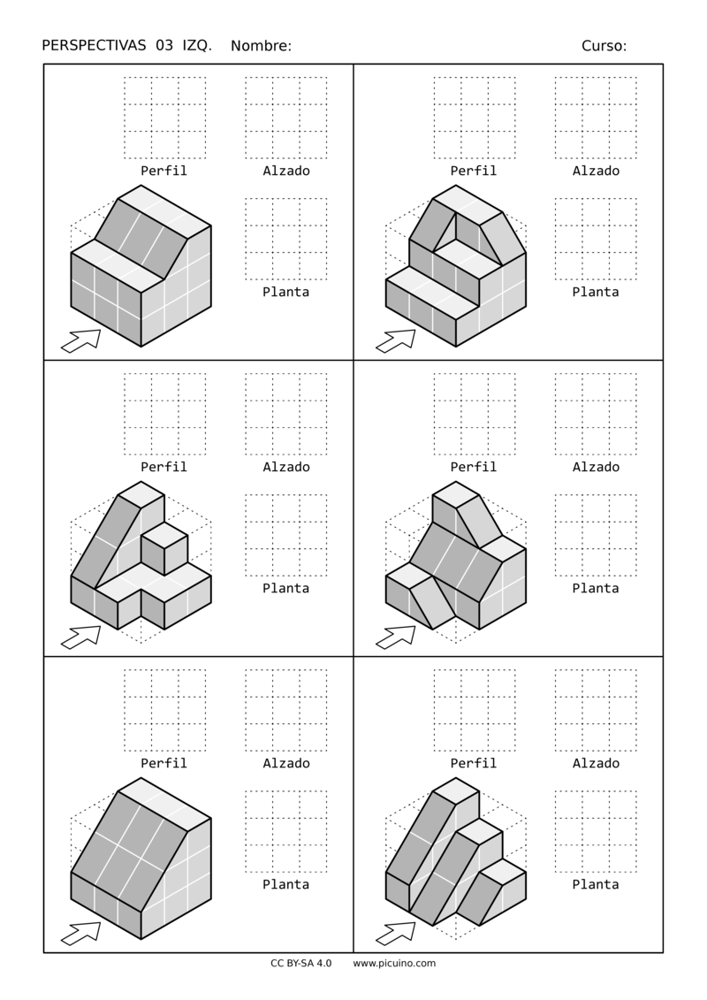

|  :download:`Alzado izquierdo. Formato PDF.
   <dibujo/dibujo-vistas-izq-03.pdf>`
|  :download:`Alzado izquierdo. Imágenes en formato PNG.
   <dibujo/dibujo-vistas-izq-03-images.zip>`
|  :download:`Alzado izquierdo. Formato editable SVG.
   <dibujo/dibujo-vistas-izq-03.svg>`

.. _dibujo-vistas-ocultasrampas:

Ejercicios con vistas ocultas y rampas
--------------------------------------

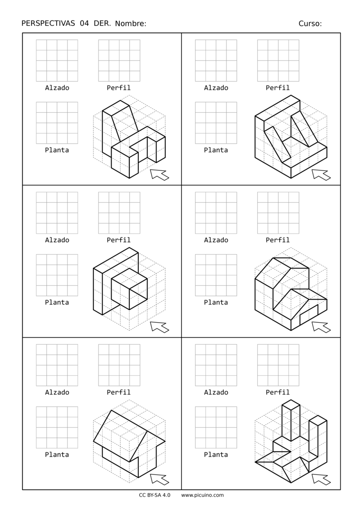

|  :download:`Alzado derecho. Formato PDF.
   <dibujo/dibujo-vistas-der-04.pdf>`
|  :download:`Alzado derecho. Imágenes en formato PNG.
   <dibujo/dibujo-vistas-der-04-images.zip>`
|  :download:`Alzado derecho. Formato editable SVG.
   <dibujo/dibujo-vistas-der-04.svg>`

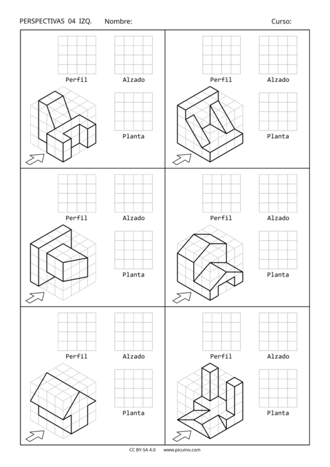

|  :download:`Alzado izquierdo. Formato PDF.
   <dibujo/dibujo-vistas-izq-04.pdf>`
|  :download:`Alzado izquierdo. Imágenes en formato PNG.
   <dibujo/dibujo-vistas-izq-04-images.zip>`
|  :download:`Alzado izquierdo. Formato editable SVG.
   <dibujo/dibujo-vistas-izq-04.svg>`

.. _dibujo-vistas-curvas:

Ejercicios con curvas
---------------------

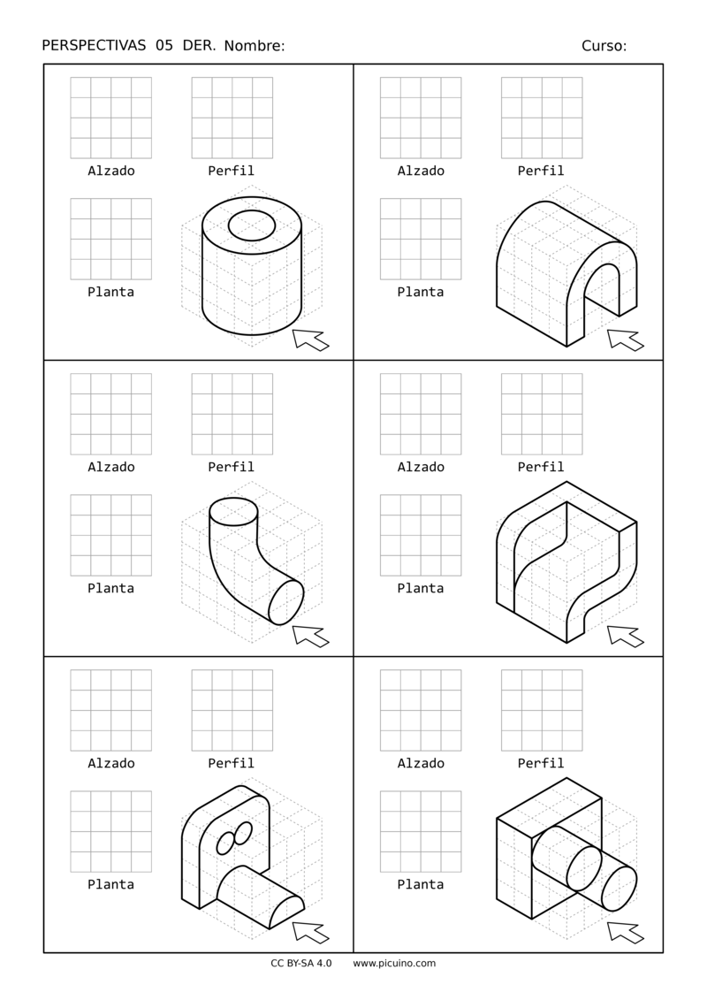

|  :download:`Alzado derecho. Formato PDF.
   <dibujo/dibujo-vistas-der-05.pdf>`
|  :download:`Alzado derecho. Imágenes en formato PNG.
   <dibujo/dibujo-vistas-der-05-images.zip>`
|  :download:`Alzado derecho. Formato editable SVG.
   <dibujo/dibujo-vistas-der-05.svg>`

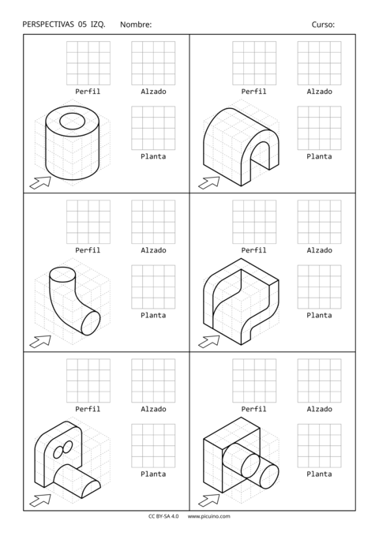

|  :download:`Alzado izquierdo. Formato PDF.
   <dibujo/dibujo-vistas-izq-05.pdf>`
|  :download:`Alzado izquierdo. Imágenes en formato PNG.
   <dibujo/dibujo-vistas-izq-05-images.zip>`
|  :download:`Alzado izquierdo. Formato editable SVG.
   <dibujo/dibujo-vistas-izq-05.svg>`

.. _dibujo-vistas-templates:

Plantillas de dibujo
--------------------

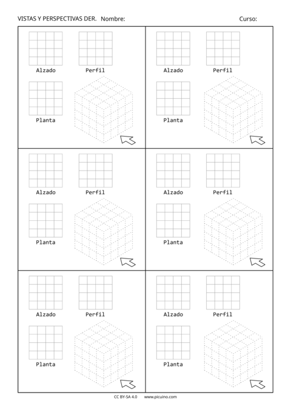

|  :download:`Alzado derecho. Formato PDF.
   <dibujo/dibujo-plantilla-isometric-4-der.pdf>`
|  :download:`Alzado derecho. Formato editable SVG.
   <dibujo/dibujo-plantilla-isometric-4-der.svg>`

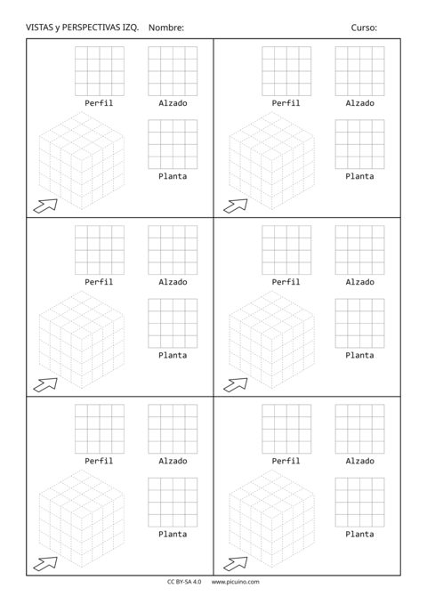

|  :download:`Alzado izquierdo. Formato PDF.
   <dibujo/dibujo-plantilla-isometric-4-izq.pdf>`
|  :download:`Alzado izquierdo. Formato editable SVG.
   <dibujo/dibujo-plantilla-isometric-4-izq.svg>`

Piezas de papel en tres dimensiones
-----------------------------------
Ejercicios para construir piezas en tres dimensiones con papel recortado
(papercraft) en el taller de Tecnología:

   :ref:`taller-papercraft`
