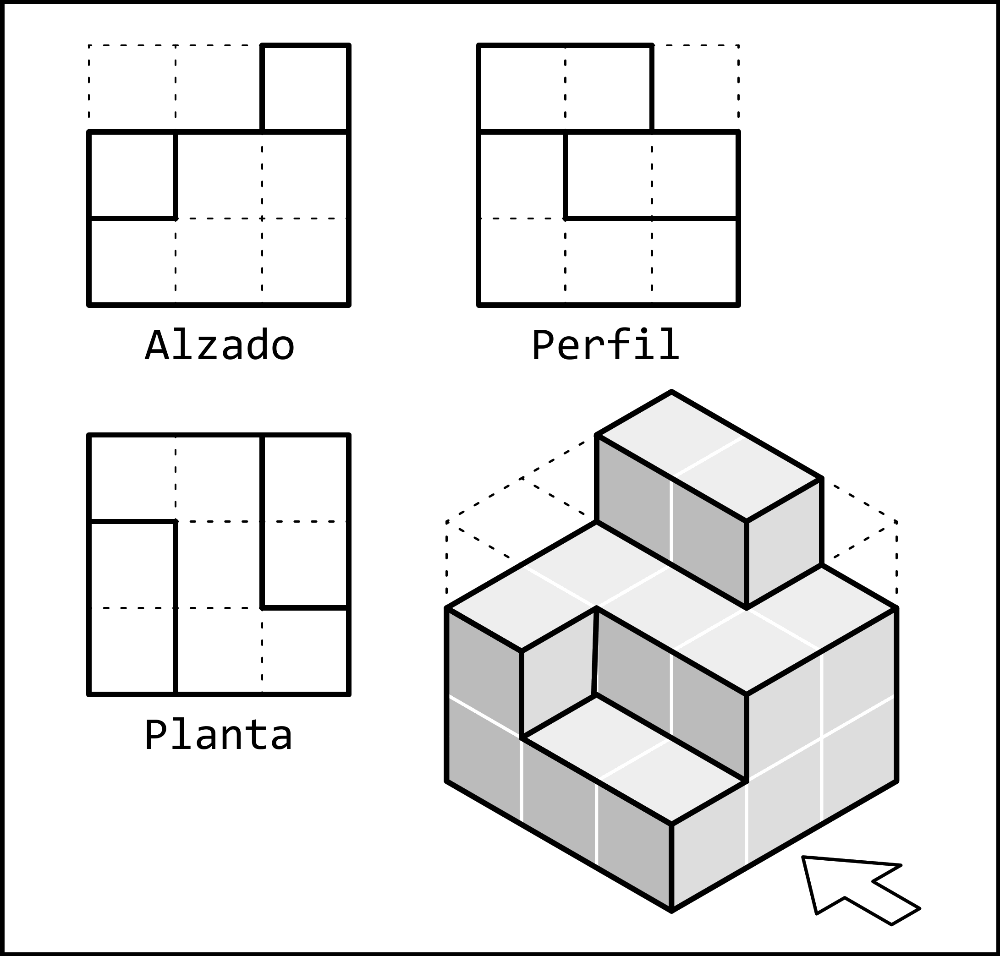

:date: 2018-12-10
:modified: 2026-08-15
:author: Carlos Félix Pardo Martín
:license: Creative Commons Attribution-ShareAlike 4.0 International
:license_url: https://creativecommons.org/licenses/by-sa/4.0/

.. _dibujo-vistas:

Vistas
======
Las vistas son dibujos de una figura tridimensional obtenidas desde
distintas direcciones.
Las tres vistas principales que vamos a utilizar son 
el **alzado** (vista de frente), el **perfil** (vista lateral) y
la **planta** (vista desde arriba).

En concreto, vamos a utilizar el sistema europeo, que determina 
una disposición de las tres vistas diferente de la utilizada en el
sistema americano.

Este tipo de representación mediante proyecciones ortogonales se
denomina `sistema diédrico
<https://es.wikipedia.org/wiki/Sistema_di%C3%A9drico>`__.

En las siguientes páginas se explican cada una de las tres vistas con
ejercicios de obtención de vistas de una figura ordenados por dificultad,
desde ejercicios básicos hasta ejercicios más complejos, incluidos los
que utilizan objetos curvos.

.. toctree::
   :numbered: 1
   :maxdepth: 1
   :titlesonly:

   dibujo-vistas-alzado.rst
   dibujo-vistas-perfil.rst
   dibujo-vistas-planta.rst
   dibujo-vistas-simples.rst
   dibujo-vistas-ocultas.rst
   dibujo-vistas-rampas.rst
   dibujo-vistas-ocultas-rampas.rst
   dibujo-vistas-curvas.rst
   dibujo-vistas-templates.rst

Piezas de papel en tres dimensiones
-----------------------------------
Ejercicios para construir piezas en tres dimensiones con papel recortado
(papercraft) en el taller de Tecnología:

   :ref:`taller-papercraft`
