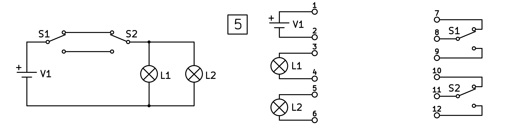

:date: 2018-12-10
:author: Carlos Félix Pardo Martín
:license: Creative Commons Attribution-ShareAlike 4.0 International

.. _electric-cableado:

Cableado de circuitos eléctricos
================================
Fichas con ejercicios para realizar el cableado de circuitos eléctricos
y electrónicos.

|  :download:`Cablear circuitos eléctricos. Formato PDF.
   <electric/electric-cableado.pdf>`
|  :download:`Esquemas eléctricos. Formato KiCad.
   <electric/electric-cableado.zip>`

Cuestionarios
-------------
Cuestionarios sobre cableado de circuitos.

* `Cuestionario de cableado de circuitos I.
  <../test/es-electric-cableado-1.html>`__

* `Cuestionario de cableado de circuitos II.
  <../test/es-electric-cableado-2.html>`__
