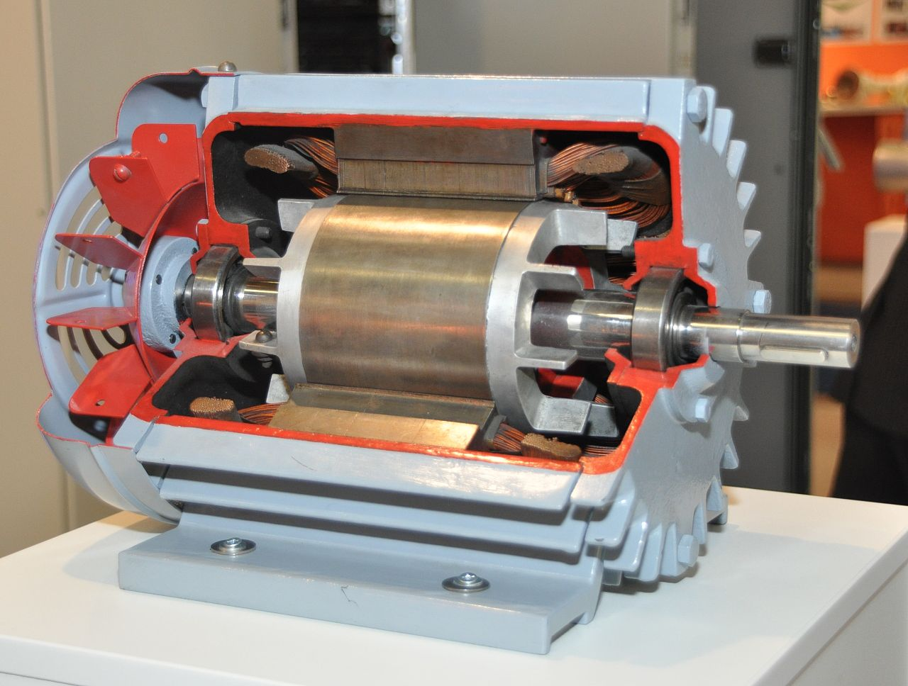

:Date: 22/05/2021
:Author: Carlos Félix Pardo Martín
:License: Creative Commons Attribution-ShareAlike 4.0 International

.. _electric-componentes-index:

*************************
 Componentes eléctricos
*************************

Componentes eléctricos.

   `Sebastian Stabinger
   <https://commons.wikimedia.org/wiki/File:Kommutator_universalmotor_stab.jpg>`__,
   `CC BY-SA 3.0 <https://creativecommons.org/licenses/by-sa/3.0/>`__,
   via Wikimedia Commons.

.. toctree::
   :numbered: 1
   :maxdepth: 1
   :titlesonly:

   electric-motor.rst
   electric-rele.rst
