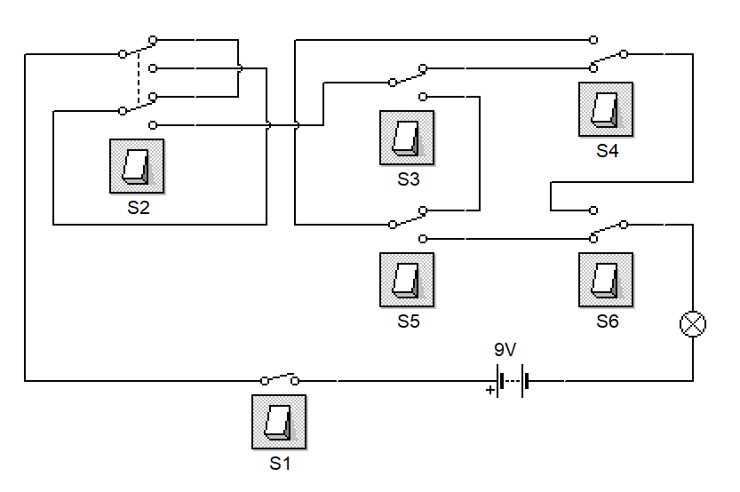
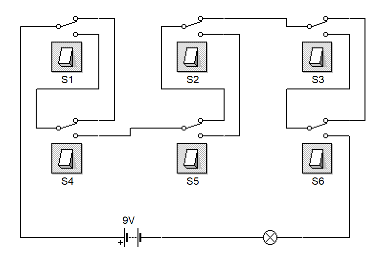
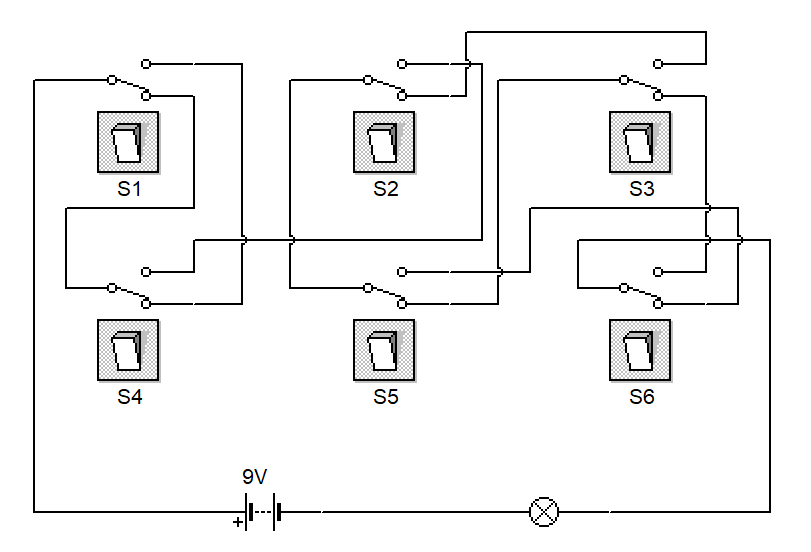

:date: 2022-05-19
:modified: 2026-06-13
:author: Carlos Félix Pardo Martín
:license: Creative Commons Attribution-ShareAlike 4.0 International
:license_url: https://creativecommons.org/licenses/by-sa/4.0/

.. include:: electric-crocodile-subs.rst

Circuitos laberinto
===================

1. Copia en el programa Crocodile los siguientes circuitos y pulsa
   los interruptores y conmutadores necesarios para que se enciendan
   las lámparas.

|br|
