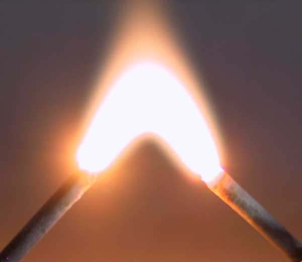

:Date: 28/02/2023
:Author: Carlos Félix Pardo Martín
:License: Creative Commons Attribution-ShareAlike 4.0 International
:tocdepth: 1

.. _electric-energia:

:index:`Energía`
================
La energía es muy importante en nuestra sociedad porque nos permite
satisfacer necesidades básicas diarias, como disponer
de luz, cocinar nuestros alimentos, calentar nuestras casas y
transportarnos a diferentes lugares.

El uso excesivo de las energías fósiles (petróleo, gas natural y carbón)
está generando una crisis climática que nos obliga a cambiar nuestras
fuentes tradicionales de energía por otras menos contaminantes y más
sostenibles, como pueden ser la energía solar o la eólica.

Comenzaremos estudiando las diferentes formas o manifestaciones de la
energía y cuáles son las fuentes de energía primaria que utilizamos,
para terminar estudiando en detalle la energía eléctrica.

.. contents:: Índice de contenidos:
   :local:
   :depth: 2

Formas de energía
-----------------
La energía es la capacidad de realizar trabajo o de producir cambios.

Existen muchas formas o manifestaciones de la energía.
Cada una tiene características diferentes, pero todas ellas pueden
convertirse en trabajo o movimiento, luz, calor, sonido u otros efectos
útiles para nosotros.

A continuación veremos las formas más comunes de la energía y las que
más se utilizan usualmente.

.. glossary::

   Energía potencial
      Es la energía que tiene un objeto debido a su **posición** en un
      campo gravitatorio [#f1]_.

      Por ejemplo, un objeto que se encuentre en una posición elevada
      tiene energía potencial gracias a la gravedad de la Tierra.
      Si dejamos caer el objeto, esa energía potencial se transforma
      en energía cinética, con la que podría arrastrar otro objeto y
      realizar trabajo.

      Las presas hidráulicas acumulan energía potencial en el agua
      cuando esta se almacena en una posición elevada.
      Al caer desde la presa, el agua transforma su energía potencial
      en cinética, que mueve una turbina. Finalmente la turbina mueve
      un alternador que produce energía eléctrica.

      .. figure:: electric/_images/electric-energia-presa-aldeadavila.jpg
         :align: center
         :width: 320px

         Presa de arco de Aldeadávila desembalsando debido a una crecida
         del río.

         `Raiden32
         <https://commons.wikimedia.org/wiki/File:Presa_Aldead%C3%A1vila_desembalsando.JPG>`__,
         `CC BY-SA 4.0 International <https://creativecommons.org/licenses/by-sa/4.0/deed.en>`__,
         via Wikimedia Commons.

   Energía cinética
      Es la energía que tiene un objeto debido a su **movimiento**.

      Por ejemplo, una pelota lanzada a gran velocidad tendrá energía
      cinética y podrá desplazar otros objetos.
      La energía eólica es la energía cinética del aire en movimiento.
      Cuando un automóvil acelera, se transforma la energía química de la
      gasolina en energía cinética.

      La Luna tiene energía cinética al moverse alrededor de la Tierra.
      En las mareas de los océanos podemos observar cómo la energía 
      cinética de la Luna se transfiere a la Tierra.

      .. figure:: electric/_images/electric-energia-aerogeneradores.jpg
         :align: center
         :width: 320px

         Aerogeneradores en Thornton Bank a 28km de la costa (off shore),
         en la parte belga del mar del norte.

         `Hans Hillewaert
         <https://commons.wikimedia.org/wiki/File:Windmills_D1-D4_(Thornton_Bank).jpg>`__,
         `CC BY-SA 4.0 International <https://creativecommons.org/licenses/by-sa/4.0/deed.en>`__,
         via Wikimedia Commons.

   Energía mecánica
      Es la energía que se transmite mediante el **desplazamiento lineal**
      o el **giro** de una pieza mecánica de una máquina.

      Por ejemplo, el eje de una batidora transmite la energía mecánica
      del motor a las cuchillas.
      La biela de un motor, que sube y baja, transmite energía mecánica
      desde el pistón hasta el cigüeñal para que este gire y mueva el
      automóvil.

      .. figure:: electric/_images/electric-energia-cardan.gif
         :align: center
         :width: 320px

         Junta de cardan giratoria, utilizada para transmitir energía.

         `Silberwolf
         <https://commons.wikimedia.org/wiki/File:Cardan-joint_intermediate-shaft_topview_animated.gif>`__,
         `CC BY-SA 2.5 Generic <https://creativecommons.org/licenses/by-sa/2.5/deed.en>`__,
         via Wikimedia Commons.

   Energía térmica
      Es una forma de energía asociada a la **temperatura** de un objeto.
      Se basa en el movimiento interno de los átomos y moléculas del
      objeto. Cuanto mayor es la temperatura de un objeto, más rápido se
      mueven sus partículas.

      Es la forma de energía más degradada y más difícil de transformar,
      sobre todo si se encuentra a bajas temperaturas.

      En todas las transformaciones de energía se producen pérdidas que se
      terminan convirtiendo en energía térmica.

      Un ejemplo de energía térmica es la transformación que se
      produce en una caldera de calefacción. 
      La energía química del gas natural se transforma en calor a alta
      temperatura durante la combustión, lo que sirve para calentar
      los edificios.

      .. figure:: electric/_images/electric-energia-fuego-gas.jpg
         :align: center
         :width: 320px

         Fuego de cocina a gas.

         `Ivan Radic
         <https://commons.wikimedia.org/wiki/File:Gas_stove_flame.jpg>`__,
         `CC BY-SA 2.0 Generic <https://creativecommons.org/licenses/by-sa/2.0/deed.en>`__,
         via Wikimedia Commons.

   Energía química
      Es la energía que se encuentra en los **enlaces químicos** de los
      combustibles, de los alimentos o de las baterías.

      Para liberar esta energía es necesario provocar reacciones
      químicas, que en la mayoría de los casos consisten en combinar
      combustibles con oxígeno.
      Eso es lo que hacemos los animales cuando convertimos la
      grasa y los carbohidratos de los alimentos en movimiento y calor
      para seguir con vida.
      Los combustibles fósiles son sustancias que producen
      energía al combinarse con el oxígeno del aire. Por ejemplo, al
      quemar carbón o gasolina se produce energía térmica.

      También encontramos este tipo de energía química en las baterías
      recargables y en las de un solo uso. En este caso, en las reacciones
      no interviene el oxígeno.

      .. figure:: electric/_images/electric-energia-gasolina.jpg
         :align: center
         :width: 320px

         Surtidor de gasolina cargando el depósito de un automóvil.

         `Rama
         <https://commons.wikimedia.org/wiki/File:Petrol_pump_mp3h0355.jpg>`__,
         `CC BY-SA 2.0 France <https://creativecommons.org/licenses/by-sa/2.0/fr/deed.en>`__,
         via Wikimedia Commons.

   Energía nuclear
      Es la energía interna de los átomos que se libera en las 
      reacciones de **fusión** y de **fisión** nuclear.

      Ejemplos de esta energía son la energía del Sol, que se
      produce por la fusión de sus átomos de hidrógeno, y la energía de
      una central nuclear, que fisiona los átomos de uranio.
      La energía geotérmica de la Tierra también proviene de la energía
      nuclear del uranio que se encuentra en su interior.

      .. figure:: electric/_images/electric-energia-nuclear-zorita.jpg
         :align: center
         :width: 320px

         Central nuclear de José Cabrera en Guadalajara.

         `Mr. Tickle
         <https://commons.wikimedia.org/wiki/File:Nuclear_power_station_in_Almonacid_de_Zorita_(Spain).jpg>`__,
         `CC BY-SA 3.0 Unported <https://creativecommons.org/licenses/by-sa/3.0/deed.en>`__,
         via Wikimedia Commons.

   Energía radiante
      Es la energía que está presente en la **luz** o en las
      **microondas** de radio.

      Es fundamental, porque es la mayor parte de la energía que 
      llega a la Tierra gracias al Sol y que podemos aprovechar con
      paneles solares.

      Los microondas de las cocinas convierten la energía eléctrica en
      microondas de radio que calientan el agua de los alimentos.

      .. figure:: electric/_images/electric-energia-panel-solar.jpg
         :align: center
         :width: 320px

         Paneles solares en el tejado de una casa.

         `David Hawgood
         <https://commons.wikimedia.org/wiki/File:Installation_of_solar_PV_panels_-_panels_in_place_-_geograph.org.uk_-_2624288.jpg>`__,
         `CC BY-SA 2.0 Generic <https://creativecommons.org/licenses/by-sa/2.0/deed.en>`__,
         via Wikimedia Commons.

   Energía eléctrica
      Es la energía asociada al movimiento de los **electrones** a través
      de los cables conductores. Es muy  sencillo convertir otros tipos de
      energía en energía eléctrica y viceversa.
      Por esa razón la energía eléctrica se utiliza mucho para
      transportar otras formas de energía de un lugar a otro.

      Por ejemplo, la energía mecánica de un aerogenerador moviéndose con
      el viento puede transportarse fácilmente y de forma casi instantánea
      en forma de energía eléctrica a una casa que se encuentre a cientos
      de kilómetros.
      Esa energía eléctrica puede transformarse de nuevo en la energía
      mecánica, por ejemplo, en la de batidora o en cualquier otra forma 
      aprovechable.

      Los rayos de las tormentas y las descargas eléctricas que
      experimentamos al quitarnos un jersey son manifestaciones naturales
      de la energía eléctrica, pero no podemos aprovecharlas de forma útil.

      .. figure:: electric/_images/electric-energia-rayo.jpg
         :align: center
         :width: 320px

         Rayo cayendo en Toronto.

         `John R. Southern
         <https://commons.wikimedia.org/wiki/File:Krunkwerke_-_IMG_4515_(by-sa).jpg>`__,
         `CC BY-SA 2.0 Generic <https://creativecommons.org/licenses/by-sa/2.0/deed.en>`__,
         via Wikimedia Commons.

      Una desventaja de la energía eléctrica consiste en que
      **no se puede almacenar con facilidad**,
      por lo que hay que consumirla en el momento en el que se genera.
      Para poder almacenar energía eléctrica, esta debe transformarse en
      en energía química mediante baterías o en energía potencial
      mediante centrales hidroeléctricas reversibles [#f2]_.

Transformación de la energía
----------------------------
Según el primer principio de la termodinámica, la energía
`no se crea ni se destruye
<https://es.wikipedia.org/wiki/Primer_principio_de_la_termodin%C3%A1mica>`__,
solo se transforma de una forma a otra.

En estos procesos, a menudo se necesitan varios pasos intermedios para
llegar a producir la forma de energía deseada.

Estos son algunos ejemplos de conversiones comunes entre formas de energía:

Energía potencial del agua de una presa en energía eléctrica.
  La **energía potencial** del agua de una presa
  se transforma en energía cinética cuando se deja caer el agua.
  A continuación, una turbina convierte esta energía cinética en giro
  de un eje. El giro del eje mueve un alternador, que convierte la energía
  mecánica transmitida por el eje en **energía eléctrica**.

Energía química del gas natural en energía eléctrica.
  La **energía química** del gas natural
  se convierte en energía térmica dentro del quemador de una turbina,
  que a su vez la convierte en giro de la turbina.
  Un alternador convierte la energía mecánica del eje giratorio 
  en **energía eléctrica**.

Energía nuclear del uranio en energía eléctrica.
  La **energía nuclear** del uranio
  se convierte en energía térmica dentro del reactor nuclear,
  que a su vez se convierte en vapor de agua sobrecalentado.
  Una turbina de vapor convierte la energía térmica del vapor de
  agua en energía mecánica de giro de un eje, 
  que un alternador convierte en **energía eléctrica**.

Energía química de la gasolina en energía cinética de un automóvil.
  La **energía química** de la gasolina
  se convierte en energía térmica dentro de la cámara de combustión,
  lo que aumenta la presión del gas y mueve un pistón,
  produciendo energía mecánica.
  Esta energía mecánica se transmite a las ruedas,
  que giran y mueven el automóvil, aportando **energía cinética**.

Energía eólica en calor para cocinar.
  La **energía cinética** del viento
  mueve las palas de un aerogenerador y produce energía mecánica de giro
  que se aplica a un alternador para convertirla en energía eléctrica.
  La energía eléctrica se transporta hasta nuestras casas donde,
  al pasar por la resistencia de la vitrocerámica,
  se convierte en **energía térmica** para cocinar.

Fuentes de energía
------------------
Una fuente de energía es un recurso natural del que se puede obtener
energía. Según su disponibilidad, podemos distinguir entre
fuentes de energía renovables y fuentes de energía no renovables.

Fuentes de energía no renovables
   Estas fuentes de energía se agotan a medida que las consumimos
   porque solo existen unas reservas limitadas.

   La mayoría de estas fuentes de energía se basan en la
   **energía química** que las plantas y los animales captaron 
   del Sol hace millones de años.

   Un problema importante que genera este tipo de fuentes de energía
   es la contaminación, el calentamiento global y la crisis climática.

   * **Carbón**. Es la fuente de energía que produce mayor contaminación
     medioambiental y emisiones de gases de efecto invernadero.
   * **Petróleo**. Es la más utilizada en la actualidad para todo tipo
     de usos, desde el transporte hasta la calefacción de viviendas.
     También es muy contaminante.
   * **Gas natural**. Es el menos contaminante de los tres tipos de
     fuentes de energía fósiles cuando se quema, pero también emite
     CO2 de efecto invernadero. Está compuesto de metano y, cuando se
     pierde en la atmósfera, produce un efecto invernadero mucho mayor
     que el del CO2.
   * **Nuclear**. Esta energía produce pocos gases de efecto invernadero,
     pero sí genera importantes cantidades de residuos radioactivos
     contaminantes.

Fuentes de energía renovables
   Estas fuentes de energía se las considera inagotables y,
   con las técnicas adecuadas, se pueden aprovechar sin límite.

   El problema de la mayoría de las energías renovables consiste en
   que son intermitentes, por lo que es necesario almacenar los
   excedentes de energía para poder utilizarlos más adelante.

   * **Solar**. Es energía radiante que proviene de las reacciones
     nucleares de fusión que tienen lugar en el interior del Sol.
   * **Eólica**. La energía del viento proviene del calentamiento por
     parte del Sol de las masas de aire en la atmósfera.
   * **Hidráulica**. Proviene de la energía potencial del agua de los
     ríos acumulada en las presas. Tiene la ventaja de que se puede
     almacenar con facilidad.
   * **Geotérmica**. Proviene del calor interno de la Tierra producido
     por las reacciones nucleares de su interior.
     Tiene la ventaja de estar siempre disponible, aunque solo se puede
     aprovechar en algunas zonas volcánicas la Tierra.
   * **Biomasa**. Es la energía química que podemos obtener de los árboles
     o de los residuos biológicos que se pueden convertir en biogás.
   * **Mareomotriz**. Es la energía que se puede extraer del agua del mar
     gracias al movimiento que producen las mareas.

Energía eléctrica
-----------------
La energía eléctrica no es una fuente de energía primaria,
sino que se debe generar a partir de fuentes de energía primarias.
La razón por la que se genera energía eléctrica es que se trata
de una energía muy fácil de transportar, fácil de controlar y 
de convertir en otras formas de energía de manera eficiente.

   Arco eléctrico de 3000 voltios.

   `Achim Grochowski
   <https://commons.wikimedia.org/wiki/File:Lichtbogen_3000_Volt.jpg>`__,
   `CC BY-SA 3.0 Unported <https://creativecommons.org/licenses/by-sa/3.0/deed.en>`__,
   via Wikimedia Commons.

Ventajas de la energía eléctrica
   * Puede obtenerse con facilidad a partir de otras formas de energía
     (mecánica, química, calorífica, radiante, etc.).
   * Se puede transportar con facilidad a grandes distancias.
   * El transporte es eficiente y consume poca energía.
   * Se puede convertir fácilmente en otras formas de energía.
   * Se puede controlar de forma muy sencilla.
   * Es muy limpia y no contamina en el lugar donde se usa.
     Aunque sí puede producir contaminación en el lugar de generación.
   * Es más segura que otras formas de energía.

Desventajas de la energía eléctrica
   * No existe una fuente primaria de energía eléctrica,
     hay que generarla a partir de otras fuentes primarias.
   * La mayor parte de la electricidad que se genera en la actualidad
     procede de energías primarias no renovables y contaminantes,
     como las energías fósiles o la nuclear.
   * No se puede almacenar con facilidad.
     En la red eléctrica hay que generar en cada momento la misma cantidad
     de electricidad que la que se está consumiendo.
   * Para su transporte se necesitan cables, por lo que es difícil de
     utilizar en el transporte marítimo y aéreo.
   * Puede ser peligrosa y provocar incendios y descargas eléctricas
     si no se toman las medidas de precaución necesarias.

Cálculos con energía eléctrica
------------------------------
La fórmula de la energía eléctrica es la siguiente:

.. math::

   E = P \cdot t

Siendo las magnitudes y unidades las siguientes:

   E = Energía en kilovatios-hora [kWh]

   P = Potencia en kilovatios [kW]

   t = Tiempo en horas [h]

Despejando, tenemos las otras formas de la fórmula de la energía eléctrica:

.. math::

   P = \cfrac{E}{t}

.. math::

   t = \cfrac{E}{P}

Esta fórmula nos permite realizar cálculos relativos a la factura
eléctrica, que es uno de los gastos más importantes de los hogares.

Según esta fórmula, la energía que consumimos depende de la potencia
del aparato que conectemos y del tiempo que el aparato esté en
funcionamiento.

Así, el frigorífico es uno de los electrodomésticos con menor potencia,
ya que consume alrededor de 150 vatios.
Sin embargo, es el electrodoméstico que más energía consume en
el hogar, aproximadamente un tercio del total, ya que está en
funcionamiento casi todo el día todos los días del año.

Los electrodomésticos de mayor potencia suelen ser los que generan
grandes cantidades de calor. En este grupo se encuentran el horno
eléctrico, la vitrocerámica, el secador de pelo, el calefactor de aire,
etc.
La potencia de estos electrodomésticos oscila entre 1000 y 3000
vatios, por lo que gastan mucha energía eléctrica aunque estén poco
tiempo encendidos.

Ejercicios
----------

Calefactor de aire
   ¿Qué energía consume al mes un calefactor de aire de 2000 vatios
   si funciona durante 5 horas al día?

   Comenzamos por recoger los datos del problema:

   P = 2000W = 2kW

   t = 5h/día · 30días = 150h

   Escribimos la fórmula de la energía y sustituimos los valores:

   E = P · t

   E = 2kW · 150h = 300kWh

Linterna a pilas
   ¿Qué potencia tiene una linterna sabiendo que su pila almacena
   4 vatios-hora de energía eléctrica y que dura 10 horas en
   funcionamiento?

   Comenzamos por recoger los datos del problema:

   E = 4Wh

   t = 10h

   Escribimos la fórmula de la energía y sustituimos los valores:

   P = E / t

   P = 4Wh / 10h = 0.4W

Automóvil eléctrico
   Un automóvil eléctrico tiene una batería de 100 kilovatios-hora de
   capacidad.
   ¿Cuántas horas necesita para cargar la batería completa en un
   punto de carga de 25 kilovatios de potencia?

   Comenzamos por recoger los datos del problema:

   E = 100kWh

   P = 25kW

   Escribimos la fórmula de la energía y sustituimos los valores:

   t = E / P

   t = 100kWh / 25kW = 4 horas

Cuestionarios
-------------
Cuestionarios sobre la energía eléctrica.

* `Cuestionario. Energía eléctrica I.
  <../test/es-electric-energy-1.html>`__
* `Cuestionario. Energía eléctrica II.
  <../test/es-electric-energy-2.html>`__
* `Cuestionario. Cálculos con energía eléctrica.
  <../test/es-electric-energy-calc.html>`__

-------------

.. rubric:: Notas

.. [#f1] También existen otras formas de energía potencial, como
         la energía potencial eléctrica, que no se van a desarrollar
         en esta unidad.

.. [#f2] Una `central hidroeléctrica reversible
         <https://es.wikipedia.org/wiki/Central_hidroel%C3%A9ctrica_reversible>`__
         funciona como una batería gigante.
         Absorbe energía eléctrica de la red para bombear agua desde un
         embalse inferior hasta otro situado a mayor altura.
         Así se acumula energía en forma de agua elevada que se puede
         volver a convertir en electricidad cuando sea necesario.
