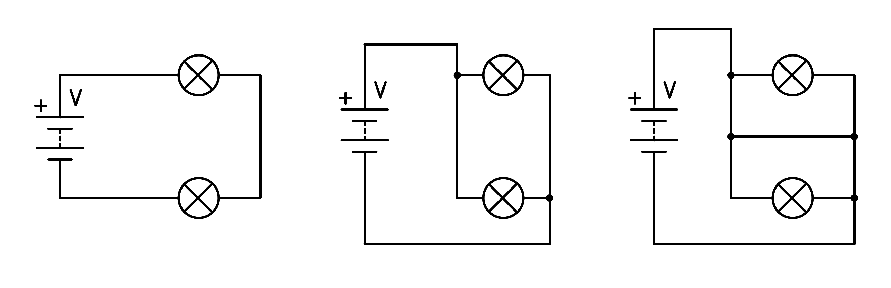

:Date: 10/12/2018
:Author: Carlos Félix Pardo Martín
:License: Creative Commons Attribution-ShareAlike 4.0 International

.. _electric-index:

**************
 Electricidad
**************

Representación, cableado, medida y simulación de circuitos eléctricos.

.. toctree::
   :maxdepth: 2
   :titlesonly:

   electric-teoria-index.rst

   electric-componentes-index.rst

   electric-simulador-index.rst

   bornas-lamparas-index.rst

   electric-recursos.rst
