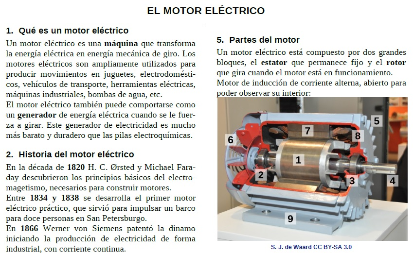
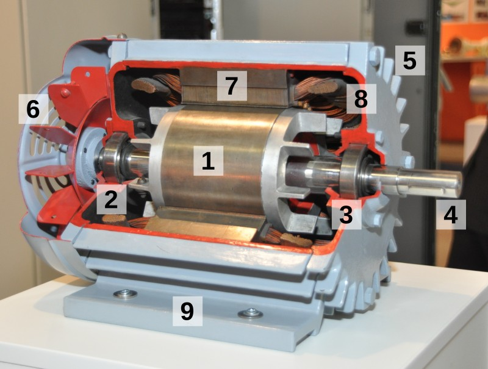

:Date: 29/05/2021
:Author: Carlos Félix Pardo Martín
:License: Creative Commons Attribution-ShareAlike 4.0 International

.. _electric-motor:

El motor eléctrico
==================
Un motor eléctrico es una **máquina** que transforma la energía eléctrica
en energía mecánica de giro.
Los motores eléctricos son ampliamente utilizados para producir
movimientos en juguetes, electrodomésticos, vehículos de transporte,
herramientas eléctricas, máquinas industriales, bombas de agua, etc.

El motor eléctrico también puede comportarse como un generador de
energía eléctrica cuando se le fuerza a girar.
Este generador de electricidad es mucho más barato y duradero que
las pilas electroquímicas.

:download:`El motor eléctrico. Formato PDF
<electric/componentes-motor/electric-motor.pdf>`

:download:`El motor eléctrico. Formato editable DOC
<electric/componentes-motor/electric-motor.doc>`

Historia del motor eléctrico
----------------------------
En la década de **1820** H. C. Ørsted y Michael Faraday descubrieron
los principios básicos del electromagnetismo, necesarios para construir
motores.

Entre **1834** y **1838** se desarrolla el primer motor eléctrico
práctico, que sirvió para impulsar un barco para doce personas en
San Petersburgo.

En **1866** Werner von Siemens patentó la dinamo iniciando la producción
de electricidad de forma industrial, con corriente continua.

A partir de **1880** comenzaron a construirse redes y centrales
eléctricas de corriente continua en muchos países, entre ellos España.

En **1888** Nikola Tesla fabricó el primer motor de corriente alterna.
Esta forma de corriente es la que terminó por utilizarse en las redes
de distribución eléctrica gracias a sus ventajas sobre la corriente
continua y gracias a las patentes cedidas gratuitamente por Tesla
a Westinhouse.

Historia de la electrificación de España
----------------------------------------
En España la primera empresa que produjo y comercializó electricidad
(Sociedad Española de Electricidad) se creó en 1881 en Barcelona.
Sin embargo no fue hasta muchos años después cuando la electricidad
llegó de forma masiva a todos los hogares.

.. list-table::
   :widths: auto
   :header-rows: 1

   * - Año
     - Energía generada
     - Hogares con electricidad
   * - 1940
     - 2 TWh
     - 30%
   * - 1950
     - 5 TWh
     - 45%
   * - 1960
     - 12 TWh
     - 65%
   * - 1970
     - 20 TWh
     - 85%
   * - 1980
     - 50 TWh
     - 95%
   * - 1990
     - 90 TWh
     - 100%

Clasificación de los motores
-------------------------------
Motores con escobillas
   * Motores de corriente continua
   * Motores universales de corriente alterna
   * Motores de inducción de corriente alterna con rotor bobinado

Motores sin escobillas
   * Motores síncronos de inducción
   * Motores brushless de imanes permanentes
   * Motores de reluctancia (motores paso a paso)

**Motores lineales**

Partes del motor
----------------
Un motor eléctrico está compuesto por dos grandes bloques.
El estator, que permanece fijo, y el rotor, que gira cuando el motor
está en funcionamiento.

   Partes de un motor de inducción de corriente alterna, abierto para
   poder observar su interior.

   `S. J. de Waard
   <https://commons.wikimedia.org/wiki/File:Rotterdam_Ahoy_Europort_2011_(14).JPG>`__,
   `CC BY-SA 3.0 <https://creativecommons.org/licenses/by-sa/3.0/>`__,
   via Wikimedia Commons.

1. Rotor de jaula de ardilla (inducido).

2. y 3. Rodamientos que sujetan el eje del rotor.

4. Eje giratorio que transporta la energía mecánica.

5. Carcasa con aletas de enfriamiento.

6. Ventilador con aspas que enfría la carcasa.

7. Estator que genera un campo magnético giratorio.

8. Bobinas del estator alimentadas con corriente alterna.

9. Pie de sujeción del estator para fijar al motor.

.. figure:: electric/componentes-motor/electric-motor-dc-num.jpg
   :align: center
   :width: 480px

   Rotor de un motor de corriente continua.

   `Sebastian Stabinger
   <https://commons.wikimedia.org/wiki/File:Kommutator_universalmotor_stab.jpg>`__,
   `CC BY-SA 3.0 <https://creativecommons.org/licenses/by-sa/3.0/>`__,
   via Wikimedia Commons.

10. Colector con delgas de conexión.

11. Devanado de hilo de cobre (bobinas del rotor).

12. Polos magnéticos del rotor.

13. Eje de giro del rotor.

Funcionamiento del motor eléctrico
----------------------------------
El funcionamiento del motor eléctrico se basa en  la fuerza que ejerce
un campo magnético sobre una corriente eléctrica (fuerza de Lorentz).

Los motores de corriente continua tienen devanados con muchos cables
de cobre aislados (11) por los que pasa corriente proveniente del
colector de delgas (10).
El campo magnético del estator es fijo, producido por imanes
permanentes o por un electroimán.
El campo magnético genera una fuerza en la corriente que circula por
los hilos de cobre que tiende a girar el rotor. Si invertimos el
sentido de la corriente, la fuerza también cambia de sentido y el
motor girará en sentido contrario.

Cuando el rotor gira, también gira el colector de delgas y alimenta
con corriente nuevos cables del rotor. De esta forma siempre están
alimentados los cables horizontales que producen fuerza de giro.

Explicación del motor de corriente continua o de corriente directa (CD).

* Vídeo: `¿Cómo funciona un motor eléctrico? Motor de CD Explicado.
  <https://www.youtube-nocookie.com/embed/A_VGpRxFzXQ>`__

En los **motores de inducción** los cables del rotor se sustituyen
por barras conductoras. El campo magnético del estator es giratorio
y arrastra consigo en su giro a las barras del rotor.

Fabricación de un motor eléctrico
---------------------------------
Experimento para construir un pequeño motor eléctrico de corriente
continua.

* Vídeo: `experimento: Motor eléctrico.
  <https://www.youtube-nocookie.com/embed/q35IjXC54H8>`__

El variador de frecuencia
-------------------------
Un variador de frecuencia es un dispositivo electrónico que controla
la tensión y la corriente de alimentación del motor.

La corriente de alimentación del motor es proporcional a la fuerza
de giro (par motor). La tensión de alimentación, y su frecuencia, es
proporcional a la velocidad de giro del motor.
Controlando la corriente y la tensión se controla con precisión el
funcionamiento del motor.

Una aplicación del variador de frecuencia es mover de forma suave
los motores de los vehículos para que tengan una aceleración constante.
También pueden controlar la velocidad del medio de transporte.
Cuando el variador está funcionando produce un zumbido audible que
es característico de los motores de tren y de los automóviles
eléctricos.

Ejercicios
----------

1. ¿Qué es un motor eléctrico y para qué sirve?

#. ¿Qué es un generador eléctrico y qué relación tiene con los motores?

#. Dibuja una línea de tiempo en la que aparezcan los principales hitos
   de la historia del motor eléctrico.

#. Dibuja un gráfico de la historia de la electrificación en España.
   Debe aparecer una línea con la potencia instalada con los valores
   en el eje vertical izquierdo en tramos de 15 TWh y otra línea con
   el porcentaje de hogares con electricidad con los valores en el eje
   vertical derecho en tramos de 10%.

#. ¿Aproximadamente en qué año tuvieron instalada
   electricidad el 60% de los hogares en España?

#. Nombra 5 tipos diferentes de motores eléctricos.

#. Dibuja un motor de inducción y nombra sus partes principales.

#. Dibuja el rotor de un motor de corriente continua y nombra sus partes
   principales.

#. Explica el funcionamiento de un motor de corriente continua.

#. ¿Qué es y para qué sirve un variador de frecuencia para motor?
   Escribe un ejemplo de aplicación.

#. ¿Cómo se puede controlar la velocidad de giro de un motor?
   ¿Y su par de giro?

