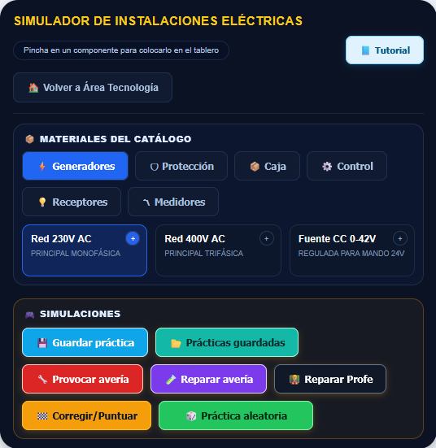

:date: 2018-12-12
:modified: 2026-06-13
:author: Carlos Félix Pardo Martín
:license: Creative Commons Attribution-ShareAlike 4.0 International
:license_url: https://creativecommons.org/licenses/by-sa/4.0/
:tocdepth: 1

.. _electric-recursos:

Recursos para electricidad
==========================

.. contents:: Índice de contenidos:
   :local:
   :depth: 2

Cuestionarios de electricidad
-----------------------------

`Test de electricidad.
<../test/index.html#electricidad>`__

Simulador de instalaciones eléctricas
-------------------------------------
Simulador de la web Área Tecnología, sobre 
`Instalaciones eléctricas de baja tensión
<https://www.areatecnologia.com/simulador-instalaciones-electricas.html>`__.

   

Fritzing
--------
Fritzing es un programa libre (open-source) para Windows, Mac y Linux
que permite realizar esquemas eléctricos y cableados con imágenes
realistas para Arduino y protoboard.

`Página oficial de Fritzing. <https://fritzing.org/home/>`__

KiCad
-----
Kicad es un programa libre (open-source) para Windows, Mac y Linux
que permite diseñar esquemas eléctricos y placas de circuito impreso.
Es el programa utilizado en esta página web para realizar la mayoría
de los esquemas eléctricos que aparecen en las fichas de ejercicios.

`Página oficial de KiCad <https://www.kicad.org/>`__

