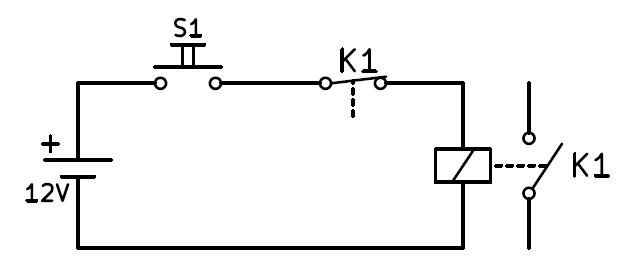
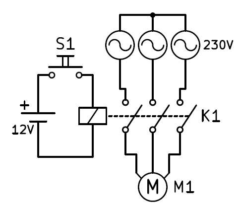

:Date: 25/02/2021
:Author: Carlos Félix Pardo Martín
:License: Creative Commons Attribution-ShareAlike 4.0 International

.. _electric-rele:

Los relés
=========
Los relés son los primeros aparatos eléctricos utilizados
en la automatización eléctrica.

En esta unidad estudiaremos la historia del relé, su funcionamiento,
los esquemas eléctricos más usuales y diversos tipos de relés.

:download:`El relé. Formato PDF <electric/componentes-rele/electric-reles.pdf>`

:download:`El relé. Formato editable DOC <electric/componentes-rele/electric-reles.doc>`

Qué es un relé
--------------
Es un aparato electromecánico con dos componentes: la bobina y los
contactos. La bobina recibe una pequeña corriente eléctrica a baja
tensión en el circuito de mando y mueve los contactos que hacen de
interruptores de mayor corriente y tensión en el circuito de potencia.

.. figure:: electric/componentes-rele/electric-relay-principle.gif
   :align: center

   Esquema de un relé

   `Digigalos <https://commons.wikimedia.org/wiki/File:Relay_principle_horizontal_new.gif>`__,
   `CC BY-SA 3.0 <https://creativecommons.org/licenses/by/3.0/deed.en>`__,
   via Wikimedia Commons.

De esta forma conseguimos que una pequeña corriente eléctrica sea capaz
de mover circuitos de mucha potencia.

Funcionamiento del relé
-----------------------
En el siguiente esquema podemos ver el circuito de un relé en
funcionamiento.

El **circuito de mando** se encuentra a la izquierda y se compone de una
pila de 12 voltios, un pulsador y la bobina del relé. Cuando se presiona
el pulsador, la corriente llega a la bobina y esta activa el contacto
(interruptor) de potencia.

El **circuito de potencia** se compone de un contacto del relé, un generador
de corriente alterna de 230 voltios y un motor. Cuando el contacto se
cierra, llega la tensión al motor y se pone en marcha.

   Circuito de un relé alimentado a 12 voltios que acciona
   un motor de 230 voltios.

Una ventaja de este diseño consiste en que el pulsador tiene una tensión
segura para las personas, separada de la alta tensión del motor que es
más apropiada para suministrar grandes potencias.

Relé realimentado
-----------------
Un relé tiene varios contactos, algunos normalmente abiertos y otros
normalmente cerrados. Estos contactos se pueden utilizar para realimentar
el circuito de mando de manera que permanezca funcionando una vez que se
ha activado el relé.

En el siguiente esquema podemos ver un relé con
funcionamiento de marcha y parada. El pulsador de marcha activa la bobina
y una vez activada, los dos contactos K1 asociados al relé mantienen a la
bobina con tensión y al motor en marcha aunque se deje de presionar el
pulsador de marcha.

   Esquema de un relé con pulsadores de marcha y de parada
   que acciona un motor de 230 voltios.

Para que el circuito pare, habrá que presionar el pulsador de parada.
La bobina dejará de tener corriente y los dos contactos K1 se abren
parando el circuito.

Relé oscilador
--------------
En este caso la realimentación se hará con un contacto normalmente
cerrado del relé K1. Cuando se presione el pulsador S1, la corriente
circulará por la bobina. La bobina actuará moviendo los contactos y el
contacto K1 normalmente cerrado se abrirá. Al abrirse este contacto,
dejará de circular corriente por la bobina. La bobina dejará de actuar,
con lo que el contacto K1 volverá a cerrarse permitiendo otra vez
que circule la corriente por la bobina.

   Relé oscilador con un contacto normalmente cerrado.

El resultado será una oscilación en la que el relé vibrará una y otra vez
abriendo y cerrando sus contactos a toda la velocidad que le permita su
diseño.

Historia del relé
-----------------
El relé se inventó en 1835 y comenzó a utilizarse en telegrafía para
amplificar las señales de larga distancia. Como el relé es capaz de
controlar una potencia de salida mayor que la de entrada puede
considerarse un amplificador que permitía aumentar la calidad de las
señales telegráficas.

En 1941 Konrad Zuse construyo la primera computadora a base de relés.
Los relés se sustituyeron posteriormente por válvulas de vacío, mucho
más rápidas. A partir del año 1954 se comenzaron a usar los
transistores, más rápidos aún y mucho más fiables. Actualmente se siguen
utilizando los transistores en los ordenadores y en multitud de aparatos
electrónicos.

Si bien los relés ya no se utilizan como base de los ordenadores,
todavía hoy en día se usan con frecuencia en automatismos para
controlar motores y otros elementos de gran potencia.
Ejemplos se pueden encontrar en las casas para mover los ascensores,
las bombas de agua o el temporizador de luz de la escalera.

Contactores
-----------
Los contactores son relés especiales de gran potencia que sirven
para mover motores trifásicos, es decir, que tienen tres líneas de
alimentación de corriente.

En el siguiente dibujo se puede ver el esquema de un contactor
alimentando un motor trifásico. En este circuito se puede apreciar
el valor de los relés para manejar grandes potencias y conmutar muchos
circuitos con una pequeña señal de baja tensión.

-----

Ejercicios
----------

1. ¿Qué es un relé y para qué sirve?

#. Dibuja el esquema de un relé que encienda una bombilla de 125 Voltios
   desde un pulsador alimentado a 24V.

#. Dibuja el esquema de un relé que encienda una resistencia de 23 Ohmios
   alimentada a 220V con dos pulsadores, uno de marcha y otro de parada.
   Explica cómo funciona el circuito.

#. Dibuja los dos estados de un relé oscilador mientras se presiona
   el pulsador.

#. ¿Qué usos ha tenido el relé a lo largo de la historia?
   ¿Para qué se utiliza en la actualidad?

#. ¿Qué componentes electrónicos sustituyeron al relé?

#. ¿Qué es un contactor y por qué se utiliza?

#. Dibuja el esquema de un contactor que haga funcionar siempre un
   motor hasta que se pulse un contacto normalmente cerrado.
