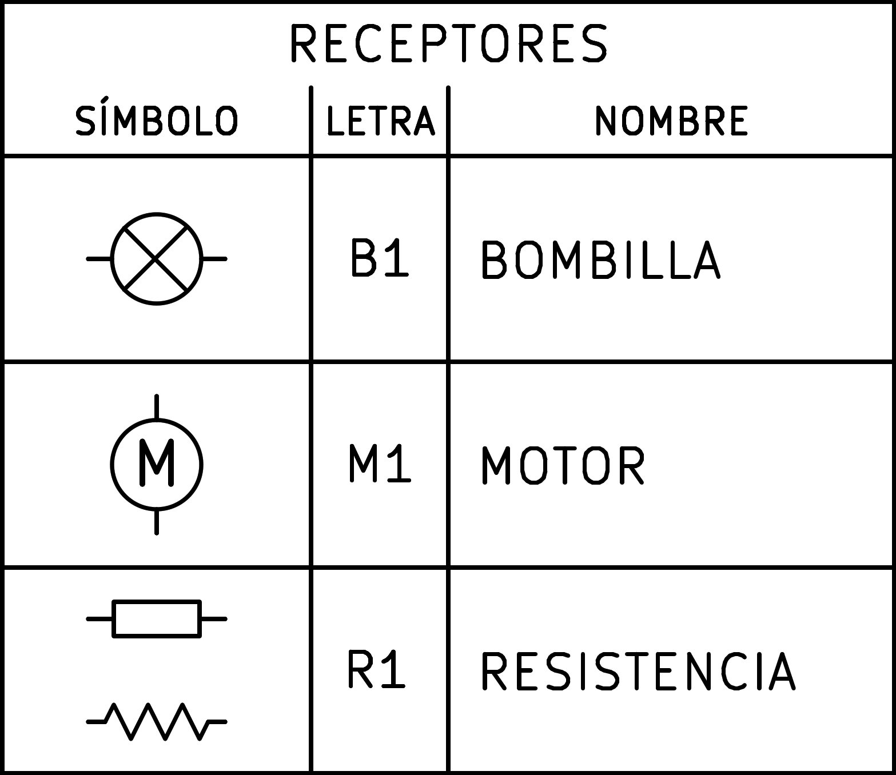

:Date: 10/12/2018
:Author: Carlos Félix Pardo Martín
:License: Creative Commons Attribution-ShareAlike 4.0 International
:tocdepth: 1

.. _electric-simbolos:

Símbolos eléctricos
===================
Tabla con símbolos eléctricos y electrónicos más usuales.
Ejercicios para dibujar y para nombrar e identificar los símbolos.

|  :download:`Ejercicio para dibujar y nombrar símbolos eléctricos. Formato PDF.
   <electric/electric-simbolos-nombres.pdf>`
|  :download:`Imágenes de símbolos. Formato PNG.
   <electric/electric-simbolo-images.zip>`
|  :download:`Proyecto editable. Formato KiCad.
   <electric/electric-simbolos-nombres.zip>`

Cuestionarios
-------------
Cuestionarios de tipo test para identificar y nombrar símbolos
de componentes eléctricos.

  * `Cuestionario. Tipos de componentes. <../test/es-electric-components-type.html>`__
  * `Cuestionario. Nombre de componentes. <../test/es-electric-components-name.html>`__

