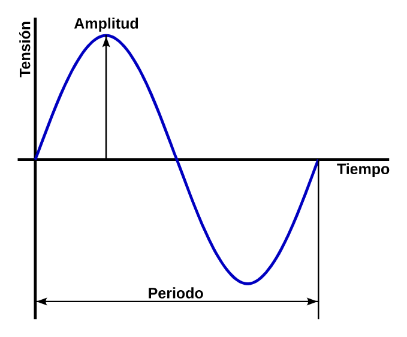

:Date: 13/07/2025
:Author: Carlos Félix Pardo Martín
:License: Creative Commons Attribution-ShareAlike 4.0 International

.. _electric-simulador-alterna:

:index:`Tensión alterna`
========================
Una fuente de **tensión alterna** también llamada de **corriente alterna**
es un generador que produce entre sus bornes tensiones positivas y 
tensiones negativas alternativamente, varias veces por segundo.

La forma de onda más común de la tensión es la **sinusoidal**, que puede 
verse en la siguiente imagen:

   Forma de onda de una tensión alterna y sus parámetros.

La tensión no varía bruscamente, sino que va cambiando desde un valor cero
hasta un pico de amplitud positivo, desciende de nuevo hasta valer cero,
cambia a un valor de pico de amplitud negativo y vuelve a ascender hasta 
valer cero otra vez.

En la siguiente simulación podemos ver un generador de tensión alterna
que alimenta una resistencia.
Los electrones se desplazan hacia adelante y hacia atrás alternativamente.
La tensión superior del generador cambia de positivo (verde) a negativo
(rojo) también alternativamente.
Por último, en el osciloscopio inferior podemos ver la forma de onda
**sinusoidal** de la tensión:

.. raw:: html

   

   <iframe src="/circuits/index.html?startCircuit=electric-simulador-alterna-1.txt"></iframe>
   

Amplitud de pico y :index:`amplitud eficaz`
-------------------------------------------
La amplitud de una tensión alterna es el valor de pico o valor máximo que
llega a tener esa tensión.

Pero normalmente no se define la amplitud de una señal alterna por su
valor de pico, sino por su valor eficaz.
El valor **eficaz** de una tensión alterna es aquel valor de tensión
continua que produce el mismo efecto sobre una resistencia que la tensión
alterna.

Esto significa que la tensión de la red eléctrica de una casa, que es de
230 voltios eficaces, calienta una resistencia igual que lo haría una
tensión continua de 230 voltios.

La relación entre el valor de pico y el valor eficaz es la siguiente:

.. math::

   V_{eficaz} = \cfrac{V_{pico}}{\sqrt{2}}

De manera que decir que la tensión de casa tiene 230 voltios eficaces
es igual que decir que tiene 230 * 1,4142 = 325,26 voltios de pico.

En la siguiente simulación podemos ver un generador de tensión alterna
de 7,071 voltios de pico que produce el mismo efecto sobre una lámpara
que el generador de corriente continua de 5 voltios:

.. raw:: html

   

   <iframe src="/circuits/index.html?startCircuit=electric-simulador-alterna-2.txt"></iframe>
   

:index:`Periodo y frecuencia`
-----------------------------
El periodo es el tiempo que tarda la onda alterna en completar un ciclo
completo. Este tiempo suele ser pequeño, del orden de milisegundos, por
lo que se suele hablar normalmente de su valor inverso, que es la
frecuencia.

La frecuencia se define como el número de ciclos que completa la onda
alterna en un segundo. La red eléctrica europea es de 50 hercios
(ciclos por segundo). La red eléctrica de la mayoría de América es
de 60 hercios.

La fórmula que relaciona el periodo y la frecuencia es la siguiente:

.. math::

   F = \cfrac{1}{P}

Siendo las magnitudes y unidades las siguientes:
   
   F = Frecuencia en Hercios [Hz]

   P = Periodo en Segundos [s]

Ejercicios
----------
#. ¿Qué es una fuente de tensión alterna? ¿Cómo se la denomina también?
#. Dibuja una señal alterna de tensión y dibuja sobre ella sus principales
   parámetros.
#. Dibuja una fuente de tensión alterna conectada a una resistencia.
#. ¿Qué es la tensión eficaz de un generador de tensión alterna y cómo
   se calcula a partir de la tensión de pico?
#. Completa la siguiente tabla con los valores de pico y los valores
   eficaces de tensión alterna que faltan.
   
   .. list-table::
      :header-rows: 1

      * - Tensión eficaz [V]
        - Tensión de pico [V]
      * - 230 voltios 
        - 
      * - 
        - 17 voltios
      * - 125 voltios 
        - 
      * - 
        - 29 voltios
      * - 5 voltios
        - 

#. Completa la siguiente tabla con los valores de frecuencia y de periodo
   de tiempo que que faltan.
   
   .. list-table::
      :header-rows: 1

      * - Frecuencia [Hz]
        - Periodo [s]
      * - 50 hercios
        - 0,020 segundos
      * - 60 hercios
        - 
      * - 400 hercios
        - 
      * - 
        - 0,100 segundos
      * - 
        - 0,012 segundos
      * - 
        - 0,001 segundos
