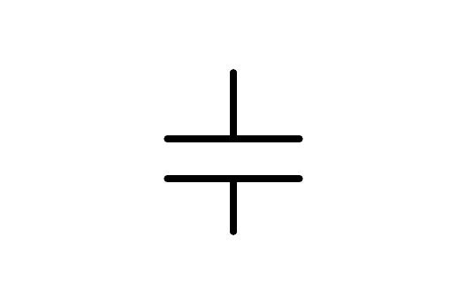

:Date: 15/09/2025
:Author: Carlos Félix Pardo Martín
:License: Creative Commons Attribution-ShareAlike 4.0 International

.. _electric-simulador-condensador:

El :index:`Condensador`
=======================
Un condensador es un componente que puede almacenar energía eléctrica
igual que lo hace una pila recargable, pero con dos diferencias.
La energía almacenada es mucho menor que la de una pila y los ciclos de
carga y descarga que soporta un condensador son de muchos miles de
millones, mientras que una pila recargable solo soporta pocos cientos
de ciclos.

El símbolo de un condensador es el siguiente:

   Símbolo del condensador.

Las aplicaciones prácticas de los condensadores son muy variadas:

1. Mantener constante la tensión de salida de una fuente de alimentación.
2. Medir tiempos gracias a su tiempo de carga y descarga.
3. Filtrado de señales de sonido en los ecualizadores.
 

Filtro de alimentación
----------------------
Los transformadores de tensión utilizados en las fuentes de alimentación
siempre suministran tensión alterna a su salida.
Cuando queremos transformar esta tensión alterna en tensión
continua es necesario añadir un rectificador (un diodo, un componente que
estudiaremos en detalle más adelante) y también es necesario añadir 
**un condensador** para suavizar la tensión de salida.

En el siguiente circuito podemos ver dos transformadores con sus 
tensiones de entrada y sus tensiones de salida ya rectificadas.
El primer transformador muestra a la salida picos de tensión positivos que 
no están suavizados al no tener condensador.
El segundo transformador tiene, además, un condensador que "suaviza" los
picos de tensión, por lo que la tensión de salida apenas muestra variaciones.

.. raw:: html

   

   <iframe src="/circuits/index.html?startCircuit=electric-simulador-condensador-1.txt"></iframe>
   

La función del condensador es almacenar energía eléctrica durante los
picos positivos de tensión del transformador y suministrar energía
eléctrica durante los momentos en los que el transformador no lo hace,
manteniendo así la tensión de salida constante.

Oscilador con condensador
-------------------------
En este circuito temporizador, el condensador tarda un tiempo en cargarse
y en descargarse de energía eléctrica a través de la resistencia.
Ese tiempo de carga y descarga es el que determina el tiempo de oscilación
de una puerta electrónica.
Estos osciladores tienen muchas aplicaciones prácticas en todo tipo de
circuitos digitales.

.. raw:: html

   

   <iframe src="/circuits/index.html?startCircuit=electric-simulador-condensador-2.txt"></iframe>
   

A la izquierda se puede ver un osciloscopio con la tensión del condensador.
Tan pronto como la tensión sube hasta los 3,33 voltios, la salida cambia
a tensión de 0 voltios, obligando al condensador a descargarse.
Tan pronto como la tensión del condensador baja de 1,66 voltios, la salida
cambia a tensión positiva de 5 voltios, obligando al condensador a
cargarse.

Ejercicios
----------
#. ¿Qué es un condensador?
   ¿En qué se parece y en qué se diferencia de una pila recargable?
#. Escribe tres aplicaciones prácticas de los condensadores.
#. Dibuja un circuito con un condensador que suavice los picos de tensión
   de salida de un transformador.
#. ¿Qué función tiene un condensador de filtro de alimentación?
#. Dibuja un circuito con un condensador oscilador.
#. Cambia el valor del condensador para que la oscilación sea
   cinco veces más rápida. ¿Cuál es su valor ahora?
#. Cambia el valor del condensador para que la oscilación sea
   dos veces más lenta. ¿Cuál es su valor ahora?
