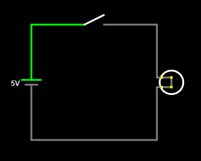

:Date: 26/06/2025
:Author: Carlos Félix Pardo Martín
:License: Creative Commons Attribution-ShareAlike 4.0 International

.. _electric-simulador-interruptor:

Interruptor y pulsador
======================
En esta práctica simularemos un circuito que enciende una lámpara
con un **interruptor** y otro circuito que enciende una lámpara con un 
**pulsador**.
Los interruptores mantienen todo el tiempo el circuito encendido o
apagado una vez que se accionan. Sin embargo los pulsadores
solo mantienen el circuito encendido mientras se accionan.

Las aplicaciones típicas de los interruptores son encender una luz de 
una habitación, encender una regleta de conexión eléctrica o encender
un equipo eléctrico.

Las aplicaciones típicas de los pulsadores son accionar el timbre
de una casa, el motor de una batidora eléctrica o accionar la apertura
de una puerta de portal.

Interruptor
-----------
Diseñar con el simulador online el siguiente circuito con interruptor:

Para obtener cada uno de los elementos del circuito se debe buscar
en el menú ``Dibujar`` o pulsar la tecla correspondiente y clicar con 
el ratón en la pantalla arrastrando:

.. list-table::
   :widths: 20 60 20
   :header-rows: 1

   * - Elemento
     - Menú
     - Tecla
   * - Pila
     - Dibujar... Fuentes... Añadir Fuente de Tensión (2 terminales)
     
       (Arrastrar el ratón desde abajo hacia arriba)
     - v
   * - Interruptor
     - Dibujar... Componentes de Control... Añadir Interruptor
     - s
   * - Lámpara
     - Dibujar... Salidas... Añadir Lámpara
     - 
   * - Cable
     - Dibujar... Añadir Conexión Eléctrica 
     - w

.. raw:: html

   

   <iframe src="/circuits/index.html?startCircuit=empty.txt"></iframe>
   

Pulsador
--------
Diseñar con el simulador online el siguiente circuito con pulsador:

   
.. list-table::
   :widths: 20 60 20
   :header-rows: 1

   * - Elemento
     - Menú
     - Tecla
   * - Pulsador
     - Dibujar... Componentes de Control... Añadir Pulsador
     - 

.. raw:: html

   

   <iframe src="/circuits/index.html?startCircuit=empty.txt"></iframe>
   

Ejercicios
----------

#. ¿Cómo funciona un interruptor?
#. ¿Cómo funciona un pulsador?
#. Enumera dos aplicaciones típicas de un interruptor y dos aplicaciones
   típicas de un pulsador.
#. En los circuitos anteriores nombra los siguientes elementos utilizados:
   
   Elemento generador de tensión:
   
   Elemento de control eléctrico:
   
   Elemento receptor eléctrico:
   
   Elemento conductor eléctrico: