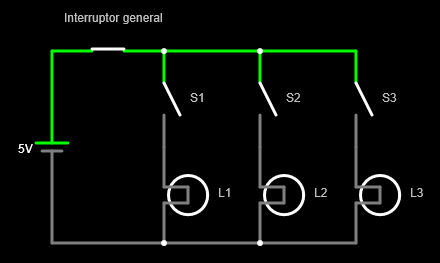
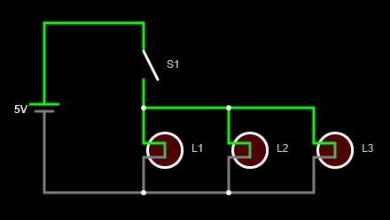

:Date: 27/06/2025
:Author: Carlos Félix Pardo Martín
:License: Creative Commons Attribution-ShareAlike 4.0 International

.. _electric-simulador-mixto:

Conexión en circuito mixto
==========================
Un circuito mixto combina conexiones en serie y conexiones en paralelo.

En el siguiente circuito hay un **interruptor general** que está en
**serie** con el resto de los elementos.
Esto significa que puede cortar el paso de corriente o dejar pasar
corriente a todo el resto del circuito:

Los interruptores S1, S2 y S3 están en serie cada uno de ellos con
su lámpara correspondiente L1, L2 y L3. Eso significa que cada uno
de los interruptores puede encender o apagar cada una de sus lámparas
en serie.

Como las tres ramas interruptor-lámpara están conectadas en paralelo,
cada una funciona de manera independiente de las otras, por lo que 
se pueden encender o apagar sin afectar a las demás.

Simula en el simulador online el circuito anterior para comprobar su
funcionamiento:

.. raw:: html

   

   <iframe src="/circuits/index.html?startCircuit=empty.txt"></iframe>
   

Interruptor con lámparas en paralelo
------------------------------------
En el siguiente circuito mixto, un solo interruptor permite el encendido
o apagado de múltiples lámparas en paralelo. Este circuito es muy usado
para encender muchos puntos de luz de una habitación o pasillo desde un
solo interruptor:

Simula en el simulador online el circuito anterior para comprobar su
funcionamiento:

.. raw:: html

   

   <iframe src="/circuits/index.html?startCircuit=empty.txt"></iframe>
   

Ejercicios
----------

#. ¿Qué es un circuito mixto?
#. ¿Cuándo es conveniente utilizar una conexión en serie en un
   circuito mixto?
#. ¿Cuándo es conveniente utilizar una conexión en paralelo en un
   circuito mixto?
#. En el primer circuito ¿qué posiciones deben tener los interruptores
   para que se encienda solo la lámpara L2?
#. En el segundo circuito ¿qué ocurriría si se retira la lámpara L3?

