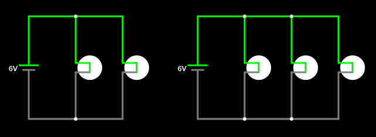
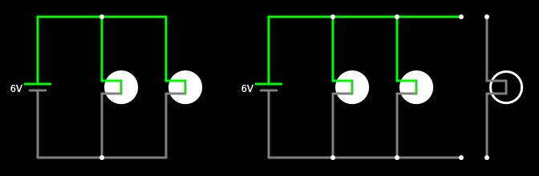

:Date: 26/06/2025
:Author: Carlos Félix Pardo Martín
:License: Creative Commons Attribution-ShareAlike 4.0 International

.. _electric-simulador-paralelo:

Conexión en paralelo
====================
La conexión en paralelo tiene la propiedad de mantener la misma tensión
en todos sus componentes. Estos además son independientes, si retiramos 
uno de los componentes en paralelo, los demás seguirán funcionando igual
que antes.

Generadores en paralelo
-----------------------
Los generadores en paralelo suman sus corrientes para poder entregar más
corriente que uno solo.

Las pilas y baterías no se suelen conectar en paralelo porque apenas
aporta ventajas y sí que puede presentar problemas si las tensiones de
las pilas no son exactamente idénticas, al descargarse unas sobre otras.
Para conseguir más corriente se utilizan pilas o baterías más grandes,
en vez de utilizar pilas en paralelo.

Los generadores de las centrales eléctricas sí que se conectan en
paralelo para poder generar mucha más corriente eléctrica de la que
podría entregar un solo generador. Esta conexión es bastante
delicada porque todos los generadores tienen que tener la misma tensión
y funcionar al unísono. En caso contrario se producirán variaciones en
la red eléctrica que podrían acabar en un apagón eléctrico.

Receptores en paralelo
----------------------
Los receptores suelen conectarse en paralelo para que funcionen de manera
independiente unos de otros. Así, las diferentes bombillas de una lámpara
se conectarán en paralelo de manera que si una de ellas se funde o se
retira, las demás bombillas seguirán funcionando igualmente.

Simula en el simulador online los siguientes circuitos con lámparas
en paralelo para ver cómo afecta a la tensión de cada lámpara:

.. raw:: html

   

   <iframe src="/circuits/index.html?startCircuit=empty.txt"></iframe>
   

.. note::

   Los cables en una conexión en paralelo deben dibujarse poco a poco
   uniendo entre sí cada uno de los puntos de conexión:
   
   .. image:: electric/_images/electric-simulador-paralelo-03.png
      :align: center

   .. image:: electric/_images/electric-simulador-paralelo-04.png
      :align: center

   .. image:: electric/_images/electric-simulador-paralelo-05.png
      :align: center

Si ahora desconectamos una de las lámparas en paralelo, podemos
comprobar cómo todo el resto del circuito sigue funcionando:

Ejercicios
----------
#. ¿Es común conectar las pilas en paralelo? Explica la respuesta.
#. ¿Por qué se conectan los generadores de las centrales eléctricas
   en paralelo?
#. Dibuja tres bombillas conectadas en paralelo a una pila.
#. ¿Qué propiedades tiene la conexión en paralelo?
#. ¿Qué ocurre si se funde una lámpara que está conectada en paralelo
   con otras lámparas?