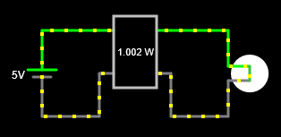

:Date: 07/07/2025
:Author: Carlos Félix Pardo Martín
:License: Creative Commons Attribution-ShareAlike 4.0 International

.. _electric-simulador-potencia:

:index:`Potencia eléctrica`
===========================
La **potencia eléctrica** es la cantidad de energía que entrega o 
que consume un componente o circuito eléctrico cada segundo.

La potencia es directamente proporcional a la tensión y a la corriente
de un circuito, de manera que cuanta más tensión tenga el circuito más
potencia consumirá. Asimismo cuanta más corriente consuma un circuito
más potencia consumirá.

:index:`Vatios`
---------------
La potencia eléctrica se mide en **vatios**, abreviado con la letra [W].

En la siguiente tabla aparecen las potencias típicas que consumen
varios componentes comunes en nuestro entorno:

.. list-table::
   :widths: 60 30
   :header-rows: 1

   * - Componente
     - Potencia [W]
   * - Led indicador de encendido.
     - 20 milivatios
   * - Bombilla led de techo.
     - 10 vatios
   * - Batidora de cocina.
     - 400 vatios
   * - Calentador eléctrico de aire.
     - 2000 vatios

:index:`Vatímetro`
------------------
Un **vatímetro** es un aparato eléctrico que permite medir la potencia 
consumida por un componente o circuito eléctrico.
El vatímetro se conecta siempre entre el generador y el elemento que se
desea medir, por lo que es necesario cortar el circuito para poder 
insertarlo. Al tener cuatro cables, el vatímetro corta tanto el cable de 
ida como el cable de vuelta de la corriente:

Para simular un vatímetro debemos escogerlo desde el menú ``Dibujar``...
``Medidores y Etiquetas``... ``Añadir Vatímetro``.

En el siguiente circuito simulado, añade un **vatímetro** que mida
la potencia consumida por la lámpara del circuito.

A continuación dibuja otra fuente de tensión conectada a dos lámparas en
paralelo e inserta otro vatímetro para comprobar que la potencia consumida
es el doble que la anterior:

.. raw:: html

   

   <iframe src="/circuits/index.html?startCircuit=electric-simulador-potencia-1.txt"></iframe>
   

Ejercicios
----------
#. ¿Qué es la potencia eléctrica?
#. ¿Cómo se relaciona la potencia eléctrica con la tensión y con la 
   corriente eléctrica?
#. ¿En qué unidades se mide la potencia eléctrica?
   Nombra al menos tres elementos comunes de nuestro entorno y escribe
   la potencia eléctrica que consumen.
#. ¿Qué es un vatímetro? ¿Cómo se debe conectar para medir potencia?