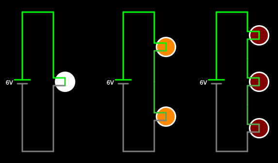

:Date: 26/06/2025
:Author: Carlos Félix Pardo Martín
:License: Creative Commons Attribution-ShareAlike 4.0 International

.. _electric-simulador-serie:

Conexión en serie
=================
La conexión en serie tiene la propiedad de sumar la tensión de los
generadores y de repartir la tensión entre los receptores.
Cuando se retira (o se estropea) uno de los elementos de una conexión
en serie, la corriente deja de circular y el circuito se apaga.

Generadores en serie
--------------------
Los generadores en serie suman sus tensiones para poder conseguir
tensiones mayores. La mayoría de las pilas eléctricas tienen una tensión
inferior a 4 voltios, de manera que se juntan en serie para conseguir
tensiones mayores.

Por ejemplo la batería tradicional de un automóvil de gasolina tiene
6 pilas de plomo de 2 voltios cada una, consiguiendo así los 12 voltios
totales típicos de estas baterías.

Las pilas que forman la batería de un automóvil eléctrico tienen 3.6
voltios cada una y se colocan en serie para conseguir cientos de voltios,
necesarios para mover el motor eléctrico.

Simula en el simulador online los siguientes circuitos con generadores
en serie para ver cómo afecta la suma de tensiones a la lámpara:

Cuantas más pilas colocamos en serie, más tensión tiene el circuito
y más se enciende la lámpara.

.. raw:: html

   

   <iframe src="/circuits/index.html?startCircuit=empty.txt"></iframe>
   

.. note::
   Para conseguir que las pilas tengan sólo 1.5 voltios (la tensión típica
   de una pila alcalina), es necesario clicar doble sobre la pila o clicar
   con el botón derecho del ratón sobre la pila y escoger ``Editar``:

   .. image:: electric/_images/electric-simulador-serie-01.png
      :align: center

   En el cuadro de diálogo Tensión cambiaremos el valor a 1.5 (con punto
   en vez de coma) y terminaremos clicando en el botón **OK**.

Receptores en serie
-------------------
Los receptores en serie se reparten la tensión total del generador de
manera que cuantos más elementos se coloquen en serie, menos tensión
tendrá cada uno.

Simula en el simulador online los siguientes circuitos con lámparas
en serie para ver cómo afecta a la tensión de cada lámpara:

.. raw:: html

   

   <iframe src="/circuits/index.html?startCircuit=empty.txt"></iframe>
   

Cuando el circuito tiene solamente **una lámpara**, esta recibe toda la
tensión del generador y por lo tanto luce al máximo.

Cuando el circuito tiene **dos lámparas** en serie, cada una recibe
la mitad de la tensión del generador, por lo que se iluminan menos.

Por último cuando el circuito tiene **tres lámparas** en serie, cada una
recibe una tercera parte de la tensión del generador, por lo que apenas
se iluminan.

Si ahora eliminamos una de las lámparas en serie, podemos comprobar
cómo todo el circuito deja de funcionar. Para que un circuito en serie
funcione, todos sus elementos deben permitir el paso de la corriente:

Interruptores en serie
----------------------
Los interruptores sirven para controlar el paso de corriente a través
de los receptores. Por esa razón, los interruptores se conectan siempre
en serie con los receptores que se quiere controlar.
Al estar en serie, cuando el interruptor esté abierto no pasará tampoco
corriente por el receptor y cuando el interruptor esté cerrado también
pasará corriente por el receptor.

Cuando queremos controlar una lámpara desde dos puntos distintos, la
conexión es un poco distinta a la serie y hay que utilizar el siguiente
circuito.

Simula en el simulador online los siguientes circuitos con interruptores
y con conmutador en serie (se debe pulsar **S** mayúscula para dibujar
el conmutador):

.. raw:: html

   

   <iframe src="/circuits/index.html?startCircuit=empty.txt"></iframe>
   

Al pulsar el interruptor en serie, la lámpara se iluminará.

En el circuito de la derecha la lámpara se iluminará siempre que los dos
conmutadores se coloquen en la misma dirección. Este es el circuito típico
que se utiliza para encender la lámpara de un pasillo desde dos posiciones
distintas.

Ejercicios
----------

#. Dibuja un circuito con generadores en serie.
   ¿Qué le ocurre al circuito cuando los generadores están en serie?
#. Dibuja un circuito con receptores en serie.
   ¿Qué le ocurre al circuito cuando los receptores están en serie?
#. ¿Por qué los interruptores siempre se conectan en serie con los
   receptores que queremos controlar?
#. ¿Qué pasaría si conectamos tres pilas de 6 voltios en serie con tres
   lámparas en serie? ¿Cuánto crees que se iluminarían?

   Simula el circuito en el `simulador de circuitos online
   <../circuits/?startCircuit=empty.txt>`__ para comprobarlo.

