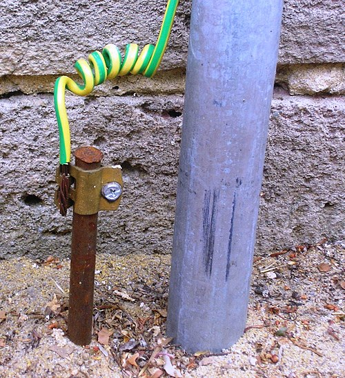

:Date: 29/06/2025
:Author: Carlos Félix Pardo Martín
:License: Creative Commons Attribution-ShareAlike 4.0 International

.. _electric-simulador-tension:

:index:`Tensión eléctrica`
==========================
La tensión eléctrica de un generador, también llamado voltaje eléctrico,
es la energía con la que el generador impulsa a los electrones en un
circuito eléctrico.

Todos los circuitos eléctricos necesitan al menos un generador que
impulse a los electrones a través del circuito. El generador actúa como
una bomba de agua con los electrones, obligándolos a moverse a través
del circuito eléctrico.

:index:`Voltios`
----------------
La tensión eléctrica se mide en **voltios**, acortado como [V].
En la siguiente tabla aparecen las tensiones típicas de varios generadores
comunes en nuestro entorno:

.. list-table::
   :widths: 60 30
   :header-rows: 1

   * - Generador
     - Tensión [V]
   * - Pila alcalina tipo AA.
     - 1,5 Voltios
   * - Pila botón de litio.
     - 3 Voltios
   * - Batería de un teléfono inteligente.
     - 3,6 Voltios
   * - Conector USB
     - 5 Voltios
   * - Cargador de ordenador portátil.
     - 20 Voltios
   * - Enchufe de pared.
     - 230 Voltios
   * - Línea de transporte de media tensión.
     - 22 000 Voltios

:index:`Tensión de tierra`
--------------------------
La tensión de la tierra (del terreno sobre el que andamos) se considera
que vale cero voltios y es la referencia absoluta de cualquier circuito
eléctrico. Se consigue normalmente clavando en el terreno una barra de
cobre de un metro de longitud, al que se conecta un cable con colores
amarillo y verde.

   Toma de tierra con su cable amarillo-verde conectado.

   `Ali K <https://en.wikipedia.org/wiki/File:HomeEarthRodAustralia1.jpg>`__,
   `CC BY-SA 3.0 Unported <https://creativecommons.org/licenses/by-sa/3.0/deed.en>`__,
   via Wikimedia Commons.

A partir de la tensión de tierra las tensiones pueden ser tanto positivas
como negativas. En los circuitos se suele dibujar el símbolo de tierra
para indicar qué consideramos tensión cero.

En el siguiente simulador podemos observar varios generadores en serie que
suman sus tensiones.
El color verde indica tensiones positivas y el color rojo indica tensiones
negativas. El símbolo de tierra indica la tensión cero absoluta.

.. raw:: html

   

   <iframe src="/circuits/index.html?startCircuit=electric-simulador-tension-1.txt"></iframe>
   

:index:`Voltímetro`
-------------------
El voltímetro es un aparato que mide la diferencia de tensión entre dos 
puntos de un circuito.
Los voltímetros se conectan siempre en paralelo con los elementos que 
deseamos medir.

Para simular un voltímetro debemos escogerlo desde el menú ``Dibujar``...
``Medidores y Etiquetas``... ``Añadir Voltímetro``.

En la siguiente simulación, añade los voltímetros necesarios para medir
la tensión de las dos baterías juntas (V1 más V2), la tensión de la
lámpara L1 y la tensión de la lámpara L2.

.. raw:: html

   

   <iframe src="/circuits/index.html?startCircuit=electric-simulador-tension-2.txt"></iframe>
   

Ejercicios
----------

#. ¿Qué es la tensión o voltaje eléctrico?
#. ¿Por qué todos los circuitos eléctricos necesitan al menos un generador
   eléctrico?
#. ¿Qué tensión en voltios tienen las pilas y baterías típicas?
#. ¿Qué es la tensión de tierra?
#. ¿Qué es un voltímetro? ¿Cómo se debe conectar para medir tensión?