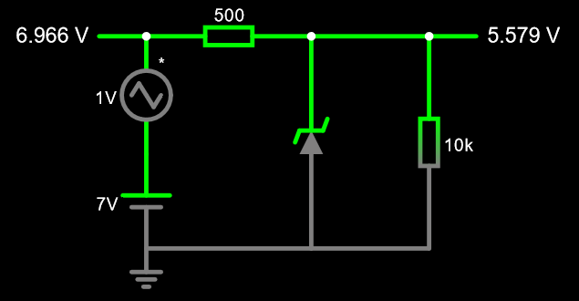

:Date: 19/12/2023
:Author: Carlos Félix Pardo Martín
:License: Creative Commons Attribution-ShareAlike 4.0 International

.. _electronic-analog-index:

Electrónica analógica
=====================

Teoría y ejercicios de electrónica analógica con
`simulador online de circuitos
<https://www.picuino.com/circuits/?startCircuit=empty.txt>`__
integrado.

.. toctree::
   :numbered: 1
   :maxdepth: 1
   :titlesonly:

   electronic-diodo.rst
   electronic-diodo-rectificador.rst
   electronic-diodo-limitador.rst
   electronic-diodo-zener.rst
   electronic-diodo-led.rst

   electronic-bjt.rst
   electronic-bjt-common-e.rst
   electronic-bjt-common-c.rst
   electronic-bjt-common-b.rst

   electronic-bjt-darlington.rst
   electronic-bjt-pushpull.rst
   electronic-bjt-diferencial.rst
   electronic-bjt-current.rst

   electronic-mosfet.rst

   electronic-operational.rst

   electronic-operational-follower.rst
   electronic-operational-inverting.rst
   electronic-operational-adder.rst
   electronic-operational-noninverting.rst
   electronic-operational-differential.rst

   electronic-operational-peakdetector.rst
   electronic-operational-comparator.rst
   electronic-operational-hysteresis.rst

.. TO DO

   electronic-bjt-colpitts.rst
   electronic-operational-phaseshift.rst

   electronic-mosfet-buck.rst
   electronic-mosfet-boost.rst
