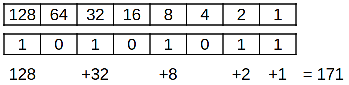

:Date: 26/10/2024
:Author: Carlos Félix Pardo Martín
:License: Creative Commons Attribution-ShareAlike 4.0 International
:tocdepth: 1

.. _electronic-binary:

El sistema binario
==================
La electrónica digital funciona con dos valores válidos, encendido y
apagado.
El `sistema binario <https://es.wikipedia.org/wiki/Sistema_binario>`__
es un sistema de numeración que solo utiliza dos cifras, el cero (0) y el
uno (1), por lo que se adapta muy bien a representar los dos estados
de la electrónica digital.

Casi todas las computadoras modernas están basadas en electrónica digital
y su sistema de numeración y de representación de la información es el
sistema binario.

Contar en binario
-----------------
En la siguiente tabla se presentan los 16 primeros números en decimal y
en binario, comenzando por el cero y terminando en el valor quince:

Como se puede observar, hay ciertas normas en los números binarios que
nos pueden ayudar a construir la tabla con la cuenta en binario:

   1. En binario solo utilizan los dígitos cero y uno.

   #. El cero decimal corresponde con todos los dígitos binarios a cero.

   #. El dígito binario más a la derecha, que es el de menos valor,
      cambia constantemente de cero a uno a medida que contamos un número
      más. 0 1 0 1 0 1 0 1 ...

   #. El segundo dígito binario comenzando a la derecha
      cambia cada **dos** números desde cero hasta uno.
      0 0 1 1 0 0 1 1 ...

   #. El tercer dígito binario comenzando a la derecha
      cambia cada **cuatro** números desde cero hasta uno.
      0 0 0 0 1 1 1 1 ...

   #. El cuarto dígito binario comenzando a la derecha,
      que es el de más valor, cambia cada **ocho** números
      desde cero hasta uno.
      0 0 0 0 0 0 0 0 1 1 1 1 1 1 1 1.

Conversión de decimal a binario
-------------------------------
Los humanos estamos acostumbrados a contar y ver números en notación
decimal, por lo que es conveniente saber convertir cualquier número
decimal a notación binaria.

Para convertir un número decimal a binario dividiremos el número entre
dos consecutivamente hasta que no quede ningún valor que dividir.
El número binario saldrá de los restos de las divisiones consecutivas,
de manera que el primer resto obtenido será el dígito binario de menos
peso y el último resto obtenido será el dígito binario de mayor peso:

   Proceso para convertir un número decimal a binario dividiendo
   consecutivamente por dos.

Otro ejemplo de conversión del número decimal 146 a binario:

   Proceso para convertir un número decimal a binario dividiendo
   consecutivamente por dos.

Conversión de binario a decimal
-------------------------------
Una forma sencilla de convertir un número binario en número decimal
consiste en crear una tabla con el valor de cada dígito binario.

El primer dígito binario a la derecha, el de menor valor, tiene un valor
de uno (1).
El segundo dígito binario por la derecha tiene un valor de dos (2).
Los valores van aumentando así, multiplicándose por dos.
En la octava posición, el valor del dígito binario es de 128.

Una vez construida la tabla de los valores de cada dígito binario,
solo es necesario sumar aquellos valores que corresponden a un uno en
el número binario:

   Conversión de binario a decimal.

Ejercicios
----------

#. Haz una tabla con los números binarios desde el cero hasta el 31
   utilizando las normas que se han descrito en el apartado de
   'Contar en binario'.

#. Convierte los siguientes números de decimal a binario:

   97

   137

   156

   229

   245

#. Convierte los siguientes números de binario a decimal:

   1  0  0  0  1  1  1  1

   1  0  1  0  0  1  1  0

   1  1  0  0  0  1  1  1

   1  1  1  0  1  1  0  0

   1  1  1  1  1  1  0  1

