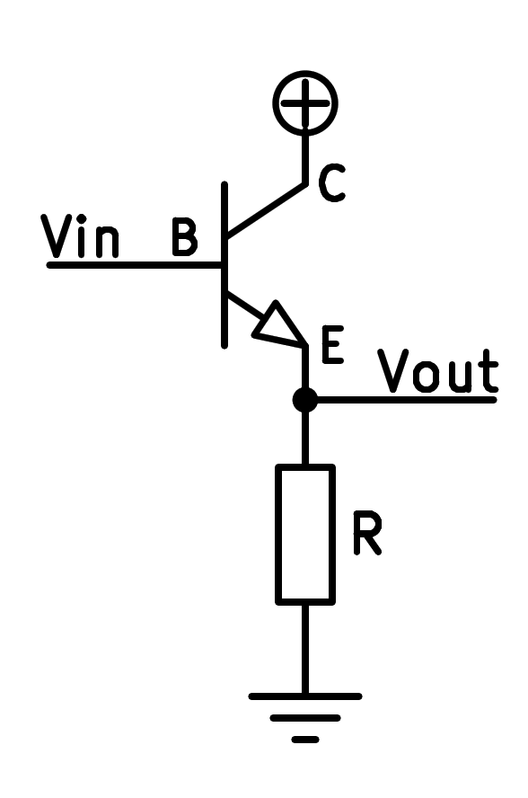

:Date: 07/10/2023
:Author: Carlos Félix Pardo Martín
:License: Creative Commons Attribution-ShareAlike 4.0 International
:tocdepth: 1

.. _electronic-bjt-common-c:

El transistor en colector común
===============================
Al transistor en colector común también se le llama habitualmente
**seguidor de emisor**.

En esta configuración el transistor tiene el colector conectado a la
tensión positiva. La señal de entrada llega por la base del transistor
y la señal amplificada sale por el emisor del transistor.

   Esquema simplificado de un transistor NPN en colector común o
   también conocido como "seguidor de emisor".

Esta configuración permite amplificar la corriente de entrada
manteniendo la tensión sin cambios.
La tensión de salida, por lo tanto, será prácticamente la misma que
la tensión de entrada, menos la tensión del diodo de base a emisor
que se mantiene en un valor alrededor de 0.65 voltios.

Este funcionamiento es útil en las etapas de salida de los circuitos,
donde es necesaria una corriente alta, por ejemplo, para mover un altavoz.

A continuación puede verse una simulación de un transistor NPN en
configuración de colector común. El transistor amplifica una señal que
entra por la base generando una señal con mucha mayor corriente por el
emisor.

.. raw:: html

   

   <iframe src="/circuits/index.html?startCircuit=bjt-common-c.txt"></iframe>
   

La función de cada uno de los componentes es la siguiente:

* El **generador de señal alterna** genera una señal de entrada (V_in)
  de 2 voltios de pico.

* Un generador de tensión continua añade 4 Voltios a la tensión alterna.
  Hay que tener en cuenta que el transistor solo puede amplificar
  corrientes positivas, por lo que es necesario sumar una tensión
  positiva alterna para evitar las tensiones negativas.

* El **transistor NPN** recibe una señal de tensión por la base con poca
  corriente y mantiene en el emisor esa misma tensión, menos una pequeña
  tensión de 0,65 voltios que siempre hay entre base y emisor.

  La corriente que llega por la base se amplifica para que circule,
  multiplicada, por el colector y por el emisor.

* La **resistencia R2** recibe la corriente del emisor y la convierte
  en tensión de salida.

Ejercicios
----------

#. Dibuja un esquema simplificado de un transistor NPN trabajando en
   configuración de colector común, mostrando por dónde llega
   la señal de entrada y por dónde sale la señal amplificada.

#. Dibuja un esquema realista de un transistor NPN trabajando en
   configuración de colector común.

#. ¿Cuál es la función principal de un transistor funcionando en
   configuración de colector común?

#. Dibuja una gráfica con la tensión del generador y la tensión de
   salida.
   ¿Qué diferencia puedes observar entre las gráficas?

#. Modifica el valor de la resistencia R1 para que valga 20kOhm.
   Dibuja la gráfica de la tensión de salida.

   ¿Qué le ocurre a la tensión de salida cuando la resistencia R1
   aumenta?

#. Aumenta en el simulador el valor de la resistencia de salida R2
   a 1000 Ohmios.

   ¿Qué le ocurre a la tensión de salida?
   ¿Qué le ocurre a la corriente de salida?

