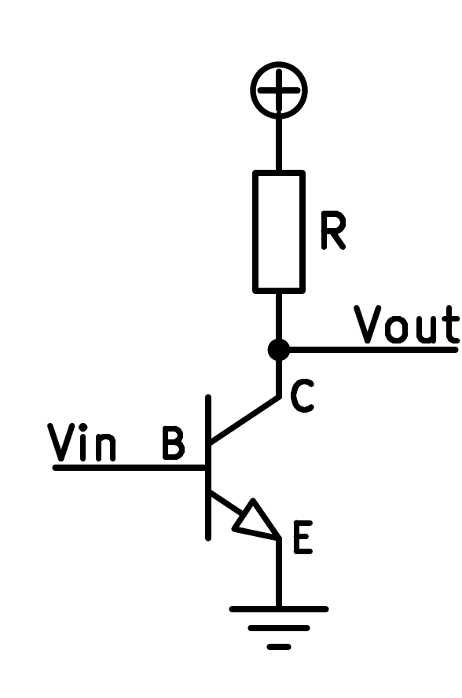

:Date: 07/10/2023
:Author: Carlos Félix Pardo Martín
:License: Creative Commons Attribution-ShareAlike 4.0 International
:tocdepth: 1

.. _electronic-bjt-common-e:

El transistor en emisor común
=============================
En esta configuración el transistor tiene el emisor conectado a masa.
La señal de entrada llega por la base del transistor y la señal
amplificada sale por el colector del transistor.

   Esquema simplificado de un transistor NPN en emisor común.

Esta configuración permite amplificar tanto la tensión de entrada
como la corriente de entrada. Esto es útil en etapas amplificadoras
de entrada e intermedias, donde es necesario elevar tanto la tensión
como la corriente de la señal de entrada.

A continuación puede verse una simulación de un transistor NPN en
configuración de emisor común. El transistor amplifica una pequeña
señal que entra por la base generando una señal mucho mayor que sale
por el colector.

.. raw:: html

   

   <iframe src="/circuits/index.html?startCircuit=bjt-common-e.txt"></iframe>
   

La función de cada uno de los componentes es la siguiente:

* El **generador de señal alterna** genera una pequeña señal de entrada
  de 0.25 voltios de pico.

* La **resistencia R1** tiene como función limitar la corriente de entrada
  a un valor pequeño, que en este caso varía entre 40 y 80 microamperios.

* La **resistencia R2** añade a la base una pequeña corriente
  continua para que el transistor pueda funcionar.
  Esta corriente positiva que se suma en la base se denomina
  **corriente de polarización**.

  Hay que tener en cuenta que el transistor solo puede amplificar
  corrientes positivas, por lo que es necesario sumar una pequeña
  corriente positiva a la corriente alterna de entrada
  (positiva y negativa) para que el transistor funcione correctamente.

* El **transistor NPN** recibe una pequeña corriente por la base y
  amplifica esa corriente para que circule, multiplicada, por el colector.

* La **resistencia R3** recibe la corriente de colector y la convierte
  en tensión de salida.

  Por esta resistencia circulará unas 100 veces la corriente que circula
  por la base del transistor.

Ejercicios
----------

#. Dibuja un esquema simplificado de un transistor NPN trabajando en
   configuración de emisor común, mostrando por dónde llega
   la señal de entrada y por dónde sale la señal amplificada.

#. Dibuja un esquema realista de un transistor NPN trabajando en
   configuración de emisor común.

#. ¿Cuál es la función principal de un transistor funcionando en
   configuración de emisor común?

#. Modifica la resistencia de polarización R2 para que valga 40k.
   Dibuja la gráfica de la tensión de salida.

   ¿Qué le ocurre a la tensión de salida al reducir R2?

#. Modifica la resistencia de polarización R2 para que valga 80k.
   Dibuja la gráfica de la tensión de salida.

   ¿Qué le ocurre a la tensión de salida al aumentar R2?

#. Modifica el diseño del amplificador en emisor común en el simulador
   para que pueda amplificar una señal de entrada senoidal de 1 voltio
   hasta una señal de salida de, al menos, 4 voltios.

   Primero será necesario cambiar el generador de señal senoidal con el
   valor de un voltio.

   Después se debe modificar la resistencia de salida R3 por otra menor
   para que la señal de salida varíe solo 4 voltios.

   Finalmente se debe modificar la resistencia de polarización R2 para
   que la señal de salida no esté recortada.

   Aprovecha las señales del osciloscopio derecho para guiarte
   a la hora de modificar los valores de las resistencias.

#. Explica para qué sirve la resistencia R3.
   ¿Qué ocurre si la resistencia aumenta?
   ¿Qué ocurre si la resistencia disminuye?

