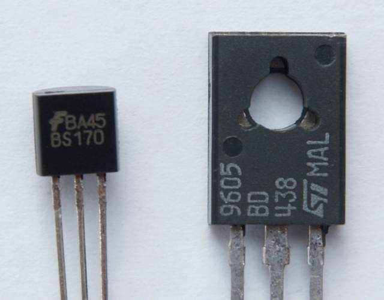

:date: 2023-10-28
:modified: 2026-06-13
:author: Carlos Félix Pardo Martín
:license: Creative Commons Attribution-ShareAlike 4.0 International
:license_url: https://creativecommons.org/licenses/by-sa/4.0/

.. _electronic-components-index:

***************************
 Componentes electrónicos
***************************

Componentes electrónicos.

.. toctree::
   :numbered: 1
   :maxdepth: 1
   :titlesonly:

   electronic-codigo-colores.rst
   electronic-semiconductores.rst
   electronic-microscope.rst
