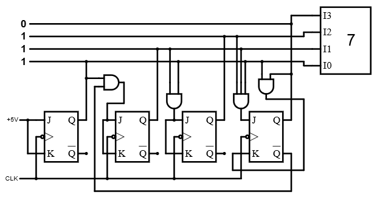

:Date: 23/01/2024
:Author: Carlos Félix Pardo Martín
:License: Creative Commons Attribution-ShareAlike 4.0 International

.. _electronic-digital-index:

Electrónica digital
=====================

Teoría y ejercicios de electrónica digital con
`simulador online de circuitos
<../circuits/?startCircuit=empty.txt>`__
integrado.

.. toctree::
   :numbered: 1
   :maxdepth: 1
   :titlesonly:

   electronic-digital-signals.rst
   electronic-error-detection.rst
   electronic-error-correction.rst
   electronic-binary.rst
   electronic-gate-not.rst
   electronic-gate-or.rst
   electronic-gate-and.rst
   electronic-gate-xor.rst
   electronic-morgan-laws.rst
   electronic-truth-table.rst
   electronic-gray-code.rst
   electronic-karnaugh.rst

.. TO DO

   electronic-minterms.rst
   electronic-combinational.rst

   electronic-ttl.rst
   electronic-cmos.rst

   electronic-schmitt-trigger.rst
   electronic-buffer-tristate.rst

   electronic-decoder.rst
   electronic-encoder.rst
   electronic-multiplexer.rst
   electronic-demultiplexer.rst
   electronic-comparator.rst

   electronic-adder.rst
   electronic-rom.rst

   electronic-sequential.rst
   electronic-bistable-rs.rst
   electronic-bistable-d.rst
   electronic-bistable-jk.rst
   electronic-bistable-d.rst
   electronic-counters.rst
   electronic-register-piso.rst
   electronic-register-sipo.rst
   electronic-register-pipo.rst
   electronic-register-fcsr.rst
   electronic-ram.rst

   electronic-pwm.rst
   electronic-anti-bounce.rst
   electronic-555-monostable.rst
   electronic-555-bistable.rst
   electronic-555-pwm.rst
