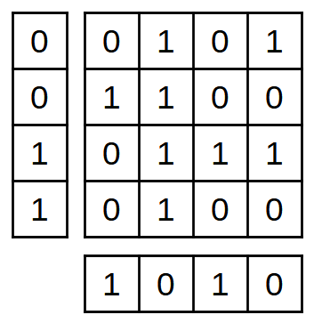
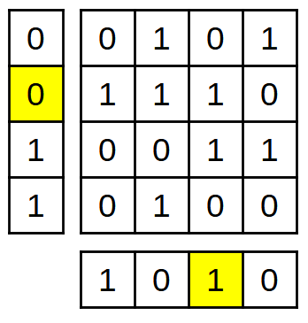
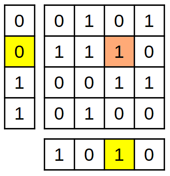

:Date: 24/10/2024
:Author: Carlos Félix Pardo Martín
:License: Creative Commons Attribution-ShareAlike 4.0 International
:tocdepth: 1

.. _electronic-error-correction:

Corrección de de errores
========================
Los bits extra de redundancia no solo pueden detectar errores de
transmisión, también son capaces de corregir los errores detectados.

Hay muchos sistemas que solo pueden transmitir la información una vez,
no permiten volver a pedir los datos correctos al emisor
(televisión digital terrestre, televisión por satélite, etc.).
Los medios físicos tales como el CD-ROM, las memorias USB o los Discos SSD
tienen el mismo problema, una vez que se corrompe la información no se
puede volver a solicitar al emisor.

En todos estos casos no es suficiente con detectar los errores, también
es necesario poder corregirlos a partir de la información recibida.

Corrección de errores con bits de paridad
-----------------------------------------
El ejemplo más sencillo de un código que corrige errores es un sistema
con doble paridad, horizontal y vertical.
Este ejemplo no se utiliza en la práctica para corregir errores,
pero es mucho más sencillo de visualizar que otros códigos más capaces
y mucho más complejos.

Comenzamos por una tabla con 16 bits de información (4x4):

   16 bits de datos.

A esta tabla le añadimos 4 bits de paridad en horizontal y otros 4 bits
de paridad en vertical:

   16 bits de datos rodeados de 8 bits de paridad, sin errores.

Una vez formada la tabla la podemos transmitir y con la información
redundante podremos detectar y corregir cualquier error de 1 solo bit.

Si se produce un error en un bit de los datos, la información de paridad
no será correcta en un bit de paridad de fila y tampoco será correcta en
un bit de paridad de columna:

   16 bits de datos con un error en un bit,
   rodeados de 8 bits de paridad
   de los cuales 2 no concuerdan con los datos.

Eso indica que el bit correspondiente a esa fila y a esa columna ha
cambiado:

   Bits de paridad indicando error en amarillo, bit erróneo en naranja.

Con esa información podemos corregir el bit erróneo para volver a
la tabla original.

Por otro lado, si lo que cambia por error es un bit de paridad, solo ese
bit será el que no concuerda con la tabla. Todos los demás bits de paridad
van a ser correctos, lo cual indica que es el bit solitario el que ha
cambiado:

         concuerda con los demás.

   Bit de paridad erróneo en amarillo. Es el único bit que no
   concuerda con los demás.

Con esa información podemos corregir el bit de paridad erróneo para volver
a la tabla original:

   16 bits de datos rodeados de 8 bits de paridad, sin errores.

Códigos de corrección de errores
--------------------------------
Los `códigos de corrección de errores
<https://es.wikipedia.org/wiki/FEC>`__
utilizados en la práctica son capaces de corregir ráfagas de varios
bits erróneos en un mismo bloque de información.

Los códigos correctores más populares son los siguientes:

#. `Códigos Reed-Solomon. <https://es.wikipedia.org/wiki/Reed-Solomon>`__

   Son los más sencillos de implementar y los más antiguos.
   Se han empleado en CD, DVD, TV digital, ADSL, etc.

#. `Códigos Convolucionales. <https://es.wikipedia.org/wiki/C%C3%B3digo_convolucional>`__

   Empleados en redes de telefonía móvil GSM, redes WiFi antiguas o
   en sondas espaciales.

#. `Turbo Códigos. <https://es.wikipedia.org/wiki/Turbo_c%C3%B3digos>`__

   Empleados en comunicaciones por satélite y en redes de telefonía
   móvil 3G. Tienen la desventaja de estar patentados.

#. `Códigos LDPC o Gallager. <https://es.wikipedia.org/wiki/LDPC>`__

   Son los más recientes. Se utilizan en las redes WiFi más modernas,
   en telefonía móvil 5G, en las redes Ethernet cableadas de mayor
   velocidad y en las últimas versiones de TV Digital.

Ejercicios
----------

#. Escribe tu nombre en una hoja de papel.

   En la hoja, dibuja y rellena la siguiente tabla de 4x4 bits con
   datos binarios (cero o uno) aleatorios, dejando un hueco en uno de
   los cuadrados.

   Rellena a continuación los bits de paridad de cada fila y de
   cada columna teniendo en cuenta que en el hueco dejado libre
   debería haber un uno (1).

   Escribe ahora un cero (0) en el hueco dejado antes. Este será el
   error de transmisión.

   Intercambia la tabla con un compañero de clase para que cada uno
   indique con un círculo dónde está el error en la tabla del otro.

   .. figure:: electronic/_images/electronic-error-correction-05.png
      :width: 180px
      :align: center
      :alt: Tabla con 16 huecos de bits de datos y 8 huecos de paridad.

#. Dibuja y rellena la siguiente tabla de 4x4 bits con datos binarios
   aleatorios.

   Rellena a continuación los bits de paridad de cada fila y de
   cada columna teniendo en cuenta que debes escribir uno al revés de
   lo que vale en realidad (error en un bit de paridad).

   Intercambia la tabla con un compañero de clase para que cada uno
   indique con un círculo dónde está el error en la tabla del otro.

   .. figure:: electronic/_images/electronic-error-correction-05.png
      :width: 180px
      :align: center
      :alt: Tabla con 16 huecos de bits de datos y 8 huecos de paridad.

#. Los códigos de corrección de errores usados en aplicaciones reales
   ¿cuántos bits erróneos pueden corregir en cada bloque de datos?
   Investiga en Internet y explica la respuesta.

#. Escribe el nombre de tres códigos de corrección de errores usados
   en sistemas reales y escribe dos aplicaciones de cada uno de ellos.

