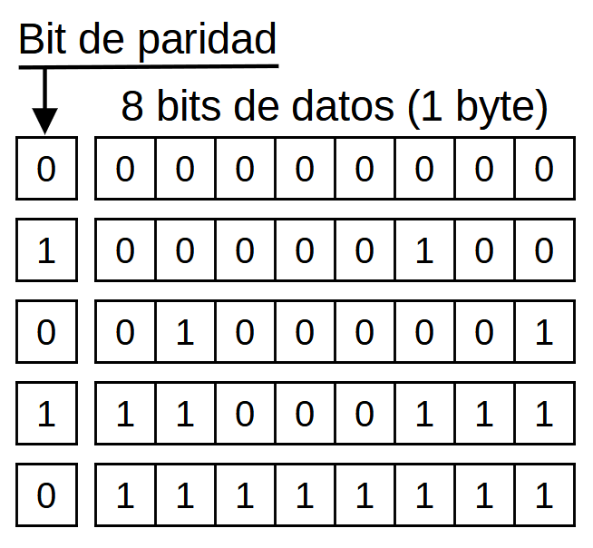

:Date: 20/10/2024
:Author: Carlos Félix Pardo Martín
:License: Creative Commons Attribution-ShareAlike 4.0 International
:tocdepth: 1

.. _electronic-error-detection:

Detección de errores
====================
En electrónica digital se pueden añadir datos extra a la información
enviada por un canal con ruido, para detectar si la transmisión de
información ha sido correcta o si se ha producido algún error.

La `detección de errores 
<https://es.wikipedia.org/wiki/Detecci%C3%B3n_y_correcci%C3%B3n_de_errores>`__
añade una pequeña sobrecarga de información con bits extra denominados
redundancia.

En la transmisión de datos por internet o en la red de datos móviles,
si se produce un error y se detecta, el ordenador volverá a pedir que 
se reenvíe la información, hasta que llegue la versión correcta sin
errores.

Bits de paridad
---------------
El sistema más sencillo de añadir redundancia para detectar errores es
el `bit de paridad <https://es.wikipedia.org/wiki/Bit_de_paridad>`__.
Este bit tiene un valor que hace que el número de bits a uno totales
sea siempre par.

Por ejemplo, si los datos enviados tienen 3 bits a uno, el bit de paridad
también valdrá uno para que el número total de bits a uno sea 4 
(número par).

En la siguiente figura se pueden ver varios ejemplos de bits de paridad
correctos, enviados junto con su byte de información.

   Bit de paridad para varios bytes de datos.

Si la paridad final es impar, eso significa que alguno de los bits de
información ha cambiado durante su transmisión y por lo tanto se ha
producido un error.

Este sistema reconoce el cambio de un solo bit de información.
Si se producen cambios en dos bit a la vez, el sistema de control de 
paridad no será capaz de reconocer el error.

Suma de verificación
--------------------
La `suma de verificación 
<https://es.wikipedia.org/wiki/Suma_de_verificaci%C3%B3n>`__,
también llamada checksum, es un dato añadido a los datos enviados que
tiene como objetivo detectar errores de transmisión con mayor exactitud
que el simple bit de paridad.

Existen varias versiones, desde una simple que se genera sumando el valor
de todos los bytes de datos transmitidos,
pasando por los `códigos de redundancia cíclica o CRC
<https://es.wikipedia.org/wiki/Verificaci%C3%B3n_de_redundancia_c%C3%ADclica>`__,
hasta las funciones hash más avanzadas como la `SHA
<https://es.wikipedia.org/wiki/Secure_Hash_Algorithm>`__, 
que pueden detectar no solo errores aleatorios de transmisión,
sino errores provocados a propósito por los ciberdelincuentes para añadir
virus a un archivo informático.

Estas sumas de verificación son muy utilizadas en telecomunicaciones y 
en soportes digitales tales como el CD-ROM o las memorias flash.

Ejercicios
----------

#. ¿Para qué sirve la detección de errores?

#. ¿Cómo se denomina la información extra añadida para detectar errores
   de transmisión de datos?
   
#. De los siguientes datos recibidos ¿cuáles tienen errores y por qué?

   .. figure:: electronic/_images/electronic-error-detection-02.png
      :width: 340px
      :align: center
      :alt: Datos con bits de paridad y con errores.

#. ¿Qué es un código checksum?

   Enumera tres tipos de checksum.

   Escribe dos ejemplos de sistemas que utilicen el código checksum.
