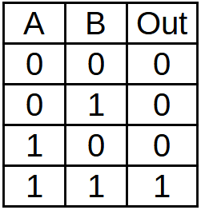
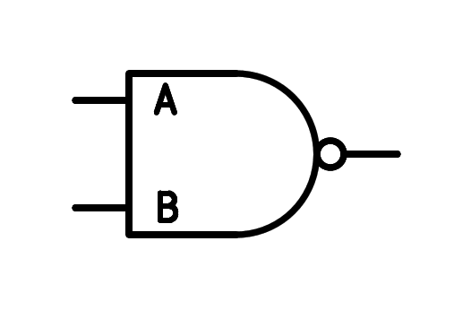
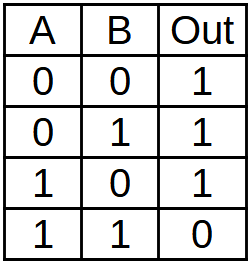

:Date: 31/10/2024
:Author: Carlos Félix Pardo Martín
:License: Creative Commons Attribution-ShareAlike 4.0 International
:tocdepth: 1

.. _electronic-gate-and:

La puerta lógica AND
====================
La puerta lógica AND tiene dos o más entradas y una salida.

La salida tiene un valor lógico alto (1) si todas sus entradas
tiene un valor lógico alto (1).

Es decir, si la entrada A **y** la entrada B están a nivel alto,
la salida estará a nivel alto. De ahí el nombre **AND** en inglés.

El **símbolo de la puerta AND** es el siguiente:

.. figure:: electronic/_images/electronic-simbolo-puerta-and.png
   :width: 180px
   :align: center
   :alt: Puerta lógica AND de dos entradas.
   
   Símbolo de la puerta lógica AND de dos entradas.

La **función lógica de la puerta AND** se representa mediante una multiplicación,
de manera que la salida de la puerta será la multiplicación lógica de las entradas:

.. math::

   Out = A \cdot B

La **tabla de verdad de la puerta AND** es la siguiente:

   
   Tabla de verdad de la puerta lógica AND de dos entradas.

Si las dos entradas valen uno, la salida valdrá uno, pero
si alguna entrada vale cero, la salida valdrá cero.

La puerta lógica NAND
---------------------
La puerta lógica NAND tiene dos o más entradas y una salida.

La salida será la misma que la de una puerta AND, pero invertida.
Es decir que la salida solo valdrá cero cuando todas las entradas
valgan uno.

El **símbolo de la puerta NAND** es el siguiente:

   
   Símbolo de la puerta lógica NAND de dos entradas.

La **función lógica de la puerta NAND** se representa mediante una
multiplicación negada, de manera que la salida de la puerta será la
multiplicación lógica de las entradas que finalmente se invierte:

.. math::

   Out = \overline{ A \cdot B }

La **tabla de verdad de la puerta NAND** es la siguiente:

   
   Tabla de verdad de la puerta lógica NAND de dos entradas.

Simulación
----------
En la siguiente simulación podemos ver el
funcionamiento de la puerta lógica AND y, debajo, 
el funcionamiento de la puerta lógica NAND.

.. raw:: html

   

   <iframe src="/circuits/index.html?startCircuit=digital-puerta-and.txt"></iframe>
   

Ejercicios
----------
#. Explica con tus palabras el funcionamiento de la puerta lógica AND.

#. Dibuja el símbolo de la puerta lógica AND de dos entradas,
   su función lógica y su tabla de verdad.

#. Explica con tus palabras el funcionamiento de la puerta lógica NAND.

#. Dibuja el símbolo de la puerta lógica NAND de dos entradas,
   su función lógica y su tabla de verdad.

#. En el simulador añade una puerta inversora a la salida de la puerta
   AND y comprueba que su respuesta es igual a la de la puerta NAND.

#. Dibuja una puerta lógica AND de tres entradas,
   su función lógica y su tabla de verdad.
