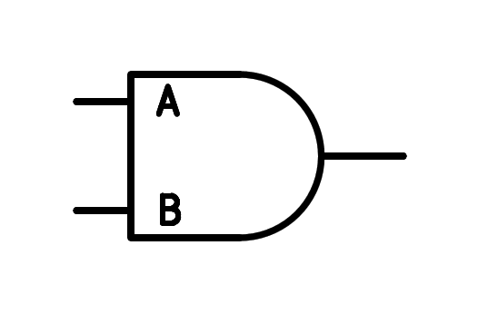

:Date: 29/01/2024
:Author: Carlos Félix Pardo Martín
:License: Creative Commons Attribution-ShareAlike 4.0 International
:tocdepth: 1

.. _electronic-gate-and:

La puerta lógica AND
====================

   
   Puerta lógica AND.

   
   Tabla de verdad de la puerta lógica AND.

La puerta lógica NAND
---------------------

   
   Puerta lógica NAND.

.. figure:: electronic/_images/electronic-puerta-nand-02.png
   :width: 190px
   :align: center
   :alt: Tabla de verdad de la puerta lógica NAND.
   
   Tabla de verdad de la puerta lógica NAND.

Simulación
----------

.. raw:: html

   

   <iframe src="/circuits/index.html?startCircuit=digital-puerta-and.txt"></iframe>
   

Ejercicios
----------

#. Dibuja el símbolo de la puerta lógica AND y su tabla de verdad.

#. Dibuja el símbolo de la puerta lógica NAND y su tabla de verdad.