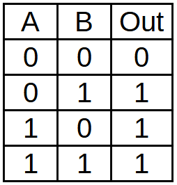
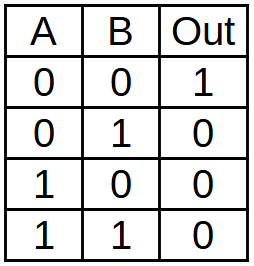

:Date: 29/10/2024
:Author: Carlos Félix Pardo Martín
:License: Creative Commons Attribution-ShareAlike 4.0 International
:tocdepth: 1

.. _electronic-gate-or:

La puerta lógica OR
===================
La puerta lógica OR tiene dos o más entradas y una salida.
Su símbolo es el siguiente:

   
   Símbolo de la puerta lógica OR de dos entradas.

La salida tiene un valor lógico alto (1) si alguna de sus entradas
tiene un valor lógico alto (1).
Es decir, si la entrada A **o** la entrada B están a nivel alto, la salida
estará a nivel alto. De ahí el nombre **OR** en inglés.

La función lógica OR se representa mediante una suma, de manera que
la salida de la puerta será la suma lógica de las entradas:

.. math::

   Out = A + B

Si las dos entradas valen cero, la salida valdrá cero, pero
si alguna entrada vale uno, la salida valdrá uno.

La tabla de verdad de la función lógica OR es la siguiente:

   
   Tabla de verdad de la puerta lógica OR de dos entradas.

La puerta lógica NOR
--------------------
La puerta lógica NOR tiene dos o más entradas y una salida.
Su símbolo es el siguiente:

.. figure:: electronic/_images/electronic-simbolo-puerta-nor.png
   :width: 180px
   :align: center
   :alt: Puerta lógica NOR de dos entradas.
   
   Símbolo de la puerta lógica NOR de dos entradas.

La salida será la misma que la de una puerta OR, pero invertida.
Es decir que la salida solo valdrá uno cuando todas las entradas valgan
cero.

La función lógica NOR se representa mediante una suma negada,
de manera que la salida de la puerta será la suma lógica de las entradas
que finalmente se invierte:

.. math::

   Out = \overline{ A + B }

La tabla de verdad de la función lógica NOR es la siguiente:

   
   Tabla de verdad de la puerta lógica NOR de dos entradas.

Simulación
----------
En la siguiente simulación podemos ver el
funcionamiento de la puerta lógica OR y, debajo, 
el funcionamiento de la puerta lógica NOR.

.. raw:: html

   

   <iframe src="/circuits/index.html?startCircuit=digital-puerta-or.txt"></iframe>
   

Ejercicios
----------

#. Dibuja el símbolo de la puerta lógica OR,
   su función lógica y su tabla de verdad.

#. Dibuja el símbolo de la puerta lógica NOR,
   su función lógica y su tabla de verdad.

#. Comprueba gracias al simulador que
   la tabla de verdad de la función OR
   y que la tabla de verdad de la función NOR son correctas.
   
#. En el simulador añade una puerta inversora a la salida de la puerta
   OR y comprueba que su respuesta es igual a la de la puerta NOR.

#. Dibuja una puerta lógica OR de tres entradas y su tabla de verdad.
