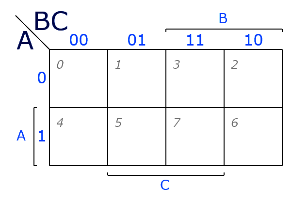
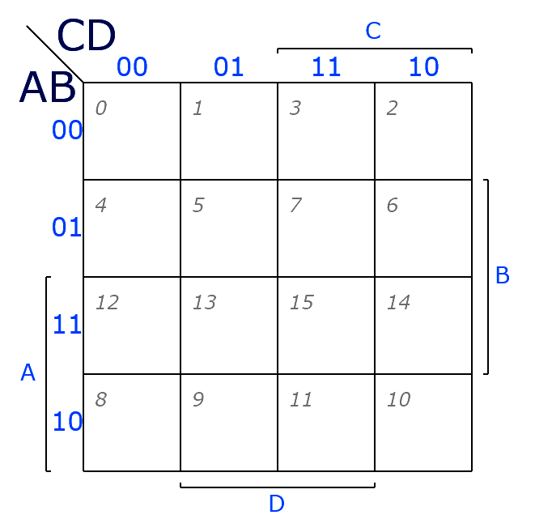

:Date: 21/02/2025
:Author: Carlos Félix Pardo Martín
:License: Creative Commons Attribution-ShareAlike 4.0 International
:tocdepth: 1

.. _electronic-karnaugh:

Mapa de Karnaugh
================
Un `mapa de Karnaugh <https://es.wikipedia.org/wiki/Mapa_de_Karnaugh>`__
es un diagrama que se utiliza para simplificar funciones lógicas de 
manera gráfica.

Se aplica normalmente a funciones con un número entre 2 y 4 variables.
Para funciones de más variables se utilizan métodos más avanzados,
como el `algoritmo Quine–McCluskey
<https://es.wikipedia.org/wiki/Algoritmo_Quine%E2%80%93McCluskey>`__.

Mapa de Karnaugh de tres variables
----------------------------------

Mapa de Karnaugh de cuatro variables
------------------------------------

Ejercicios
----------

#. Dibuja un mapa de Karnaugh con la tabla de verdad que aparece
   a continuación. Escribe la función lógica simplificada.
    
   .. image:: electronic/_images/electronic-truth-table-04b.png
      :width: 125px
      :align: center
      :alt: Tabla de verdad.

#. Dibuja un mapa de Karnaugh con la tabla de verdad que aparece
   a continuación. Escribe la función lógica simplificada.
    
   .. image:: electronic/_images/electronic-truth-table-05b.png
      :width: 125px
      :align: center
      :alt: Tabla de verdad.

#. Dibuja un mapa de Karnaugh con la tabla de verdad que aparece
   a continuación. Escribe la función lógica simplificada.
    
   .. image:: electronic/_images/electronic-truth-table-06b.png
      :width: 125px
      :align: center
      :alt: Tabla de verdad.

#. Dibuja un mapa de Karnaugh con la tabla de verdad que aparece
   a continuación. Escribe la función lógica simplificada.
    
   .. image:: electronic/_images/electronic-truth-table-07b.png
      :width: 125px
      :align: center
      :alt: Tabla de verdad.

#. Dibuja un mapa de Karnaugh con la tabla de verdad que aparece
   a continuación. Escribe la función lógica simplificada.
    
   .. image:: electronic/_images/electronic-truth-table-08b.png
      :width: 148px
      :align: center
      :alt: Tabla de verdad.

Recursos
--------

* `Mapa de Karnaugh en línea.
  <https://sublime.tools/es/mapa-de-karnaugh>`__

* `Calculadora de mapa de Karnaugh.
  <https://calculadorasonline.com/calculadora-mapa-karnaugh-online/>`__