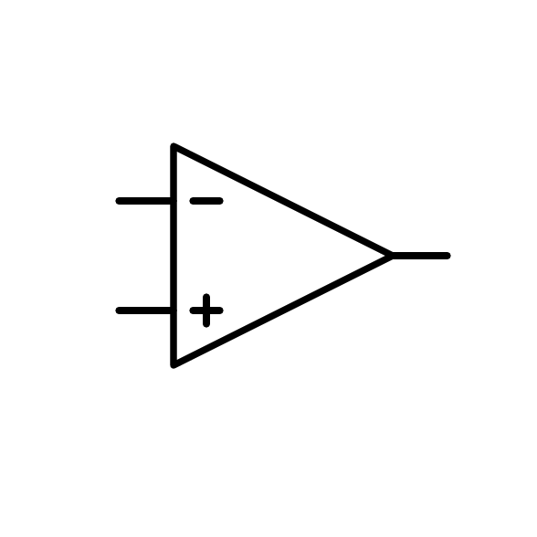

:Date: 18/11/2023
:Author: Carlos Félix Pardo Martín
:License: Creative Commons Attribution-ShareAlike 4.0 International
:tocdepth: 1

.. _electronic-operational-comparator:

El comparador
=============
El comparador es un circuito electrónico semejante al amplificador
operacional, con la diferencia de estar especializado en dar una salida
digital, que se conecta a la tensión positiva o a la tensión negativa
de alimentación, sin entregar tensiones intermedias.

   Símbolo del comparador.

Los terminales del comparador son los mismos terminales que tiene un
amplificador operacional. La diferencia entre ambos consiste en su
funcionamiento interno, mucho más rápido y especializado en dar salidas
todo-nada.

Terminales del comparador real:
   * Terminal de entrada negativo.
   * Terminal de entrada positivo.
   * Terminal de salida.
   * Terminal de alimentación positiva.
   * Terminal de alimentación negativa.

Funcionamiento
--------------
Un comparador es un componente electrónico semejante al amplificador
operacional. Tiene dos terminales de entrada de tensión que se comparan
entre sí y un terminal de salida que entrega una tensión que depende de
la tensión de entrada que sea mayor.
Si la entrada positiva tiene una tensión mayor que la entrada negativa,
la tensión de salida será positiva.
Al revés, si la entrada negativa tiene una tensión mayor que la entrada
positiva, la tensión de salida será negativa.

La **diferencia** del comparador con respecto al amplificador operacional
consiste en que su salida está preparada para entregar valores
extremos. La salida se conectará a la tensión de alimentación positiva o
a la tensión de alimentación negativa.
Este circuito no está preparado para dar valores de tensión intermedios.

Una ventaja del comparador consiste en que su respuesta es mucho más
rápida que la respuesta de un amplificador operacional equivalente.

Simulación
----------
En el siguiente circuito podemos ver un comparador funcionando como
detector de luminosidad. El circuito enciende una lámpara cuando
el detector de luz detecta poca luminosidad en el exterior de la casa.

Este comparador tiene una salida que se denomina en "colector abierto"
y eso significa que solo es capaz de conectar la salida a tensión
negativa. Por lo tanto el circuito necesita que se añada la resistencia
R4 para conseguir una tensión positiva a la salida.

Esta resistencia R4 se denomina resistencia de
`pull-up <https://en.wikipedia.org/wiki/Pull-up_resistor>`__ porque
'levanta' la tensión de salida hacia valores positivos.

.. raw:: html

   

   <iframe src="/circuits/index.html?startCircuit=oa-comparator-1.txt"></iframe>
   

Ejercicios
----------

#. Dibuja el símbolo de un comparador.

#. Explica con tus palabras el funcionamiento de un comparador.

#. ¿Cuántos terminales tiene un comparador real?
   ¿Para que sirve cada uno?

#. ¿Qué diferencias tiene un comparador respecto a un amplificador
   operacional?

#. ¿Qué es una resistencia de pull-up y para qué sirve?

   ¿Por qué es necesaria una resistencia de pull-up en algunos
   comparadores?

#. ¿Qué tipo de realimentación crees que tiene el circuito de la
   simulación? Razona tu respuesta.

#. Dibuja un circuito que utilice un comparador para detectar la
   luminosidad ambiente y que encienda una lámpara cuando el ambiente
   sea oscuro.

#. Modifica la simulación anterior para que la lámpara se encienda cuando
   haya mucha luz en el sensor y que se apague cuando haya poca luz.
