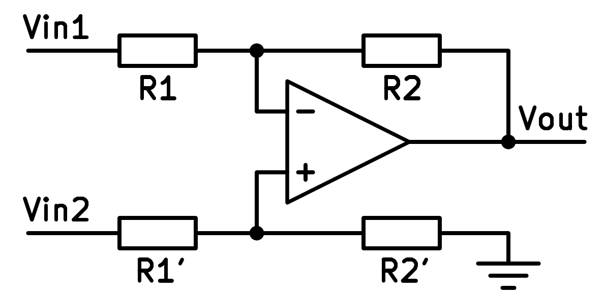

:Date: 25/10/2023
:Author: Carlos Félix Pardo Martín
:License: Creative Commons Attribution-ShareAlike 4.0 International
:tocdepth: 1

.. _electronic-operational-differential:

El amplificador diferencial
===========================
Este circuito amplificador cuenta con dos entradas simétricas.
La diferencia de tensión entre estas dos entradas se amplifica
para producir una salida con la diferencia amplificada.
De ahí el nombre de amplificador diferencial.

La realimentación del circuito es negativa y proviene de la resistencia
R2.

   Esquema del amplificador diferencial.

Cálculo de ganancia
-------------------
La fórmula de la ganancia de este amplificador es la siguiente:

.. math::

   V_{out} = ( V_{in2} - V_{in1} ) \cdot \left( \cfrac{R_2}{R_1} \right)

Teniendo en cuenta que la resistencia R1' = R1 y que la resistencia R2' = R2.

En la práctica es importante que las resistencias R1 y R1' así como
R2 y R2' tengan un valor lo más parecido posible entre sí,
para evitar que se amplifiquen las tensiones comunes de las entradas
y que solo se amplifique la diferencia entre las tensiones de entrada.

Resistencia de entrada y de salida
----------------------------------
La resistencia de entrada a la tensión común de entrada vale:

.. math::

   R_{in} = R1 + R2

Y la resistencia de entrada a las diferencias de tensión de entrada vale:

.. math::

   R_{in} = 2 \cdot R1

La resistencia de salida será muy baja, idealmente cero, porque la salida
está directamente conectada a la salida del amplificador operacional.

Simulación
----------
En la siguiente simulación podemos ver un amplificador diferencial al que
le llegan dos tensiones de entrada. Una tensión senoidal, V1, de entrada,
es común a ambas entradas y no se amplifica su tensión.
La otra tensión triangular, V2, representa la diferencia entre las dos
tensiones de entrada y sí que se amplifica en la salida.

.. raw:: html

   

   <iframe src="/circuits/index.html?startCircuit=oa-differential.txt"></iframe>
   

Ejercicios
----------

#. Dibuja el esquema de un amplificador diferencial ideal.
   Añade debajo del dibujo la fórmula de la ganancia diferencial.

#. ¿Qué tipo de realimentación tiene el amplificador diferencial?
   ¿Qué resistencia lo determina?

#. ¿Qué función realiza un amplificador diferencial?
   ¿Qué es lo que no amplifica un amplificador diferencial?

#. Con la fórmula de la ganancia calcula la ganancia que debe tener
   el amplificador diferencial simulado.

#. Modifica la simulación del amplificador diferencial de manera que
   la resistencia R1 tenga un valor ligeramente inferior, 9k.
   ¿Qué le ocurre a la tensión de salida del circuito?

#. Con ayuda del
   `simulador de circuitos
   <../circuits/?startCircuit=empty.txt>`__
   dibuja un amplificador diferencial basado en un amplificador operacional
   ideal. La resistencia de entrada diferencial debe valer 100k ohmios.
   La ganancia diferencial debe valer 10.

   Añade un generador de tensión senoidal de 0.1 voltio de pico entre
   las entradas. Comprueba que la salida de tensión vale 1 voltio de pico.

