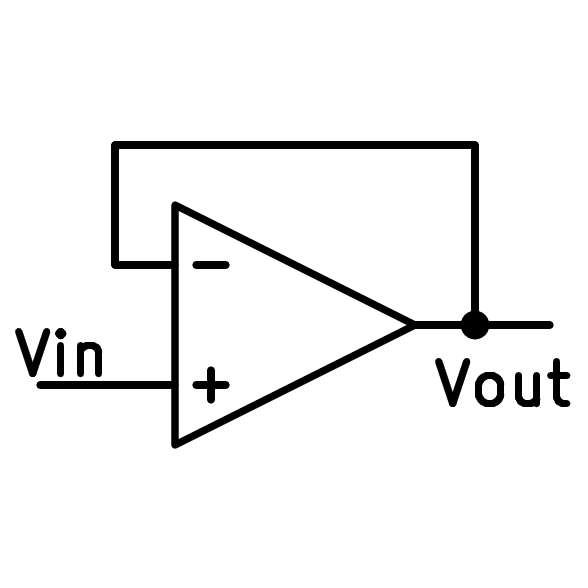
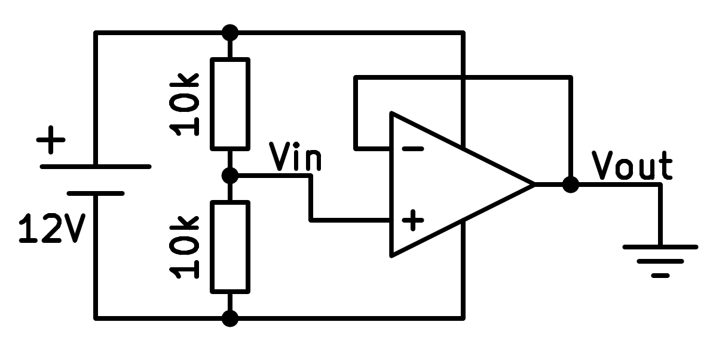

:Date: 21/10/2023
:Author: Carlos Félix Pardo Martín
:License: Creative Commons Attribution-ShareAlike 4.0 International
:tocdepth: 1

.. _electronic-operational-follower:

El amplificador seguidor
========================
Este es el esquema más simple que se puede conectar con un amplificador
operacional. Este esquema sirve para obtener a la salida del amplificador
la misma tensión que tenga su entrada positiva.

   Esquema del amplificador operacional seguidor.

Este esquema es útil cuando queremos obtener una tensión estable y con
baja resistencia de salida a partir de una fuente de tensión con
alta resistencia, que cambiaría mucho su tensión si le conectamos
corriente.

Un ejemplo práctico de uso de un amplificador seguidor es el siguiente
circuito que genera una tensión de tierra virtual a partir de un divisor
de tensión resistivo:

         tierra virtual.

   Amplificador seguidor utilizado para generar una tensión de
   tierra virtual.

Realimentación negativa
-----------------------
Para que un amplificador operacional sea estable debe tener
**realimentación negativa**. Esto significa que la tensión de salida
debe llegar hasta el terminal negativo de la entrada.

Si la tensión de salida aumenta, la tensión de la entrada negativa
aumentará y eso producirá una disminución de la tensión de salida.

Si por el contrario la tensión de salida disminuye, la tensión de la
entrada negativa disminuirá y eso producirá un aumento de la tensión
de salida.

Como los cambios de tensión de la salida tienden a compensarse, el
resultado será que la salida tendrá la misma tensión que la entrada.

**Con realimentación negativa los dos terminales de entrada tendrán
la misma tensión**.

Simulación
----------
En la siguiente simulación podemos ver un amplificador seguidor utilizado
para copiar la tensión de un diodo zener. Esto permite alimentar un
circuito con corriente relativamente elevada, que cambiaría la tensión
del zener si conectásemos directamente una carga.

.. raw:: html

   

   <iframe src="/circuits/index.html?startCircuit=oa-follower.txt"></iframe>
   

Ejercicios
----------

#. Dibuja el esquema simplificado de un amplificador operacional seguidor.

#. Dibuja un esquema real de un amplificador operacional seguidor que
   sirva para generar una tierra virtual.

#. Dibuja un esquema real de un amplificador operacional seguidor que
   sirva para generar una tensión estable de salida a partir de un
   diodo zener.

#. En la simulación anterior, cambia el valor de la resistencia R1 con
   la barra de control de la derecha. ¿Qué le pasa a la tensión de la
   resistencia? ¿Por qué crees que pasa esto?

#. En la simulación anterior, cambia el valor de la resistencia R2 con
   la barra de control de la derecha. ¿Qué le pasa a la tensión de la
   resistencia? ¿Por qué crees que pasa esto?

#. En la simulación anterior, si hacemos que el valor de la resistencia R2
   sea muy bajo llegará un momento en el que el amplificador operacional
   no podrá entregar suficiente corriente y la tensión bajará.
   ¿Qué corriente máxima puede entregar el amplificador operacional?

   Con la ley de Ohm calcula la resistencia mínima que podemos conectar
   para que la tensión de salida se mantenga en 5 voltios.

