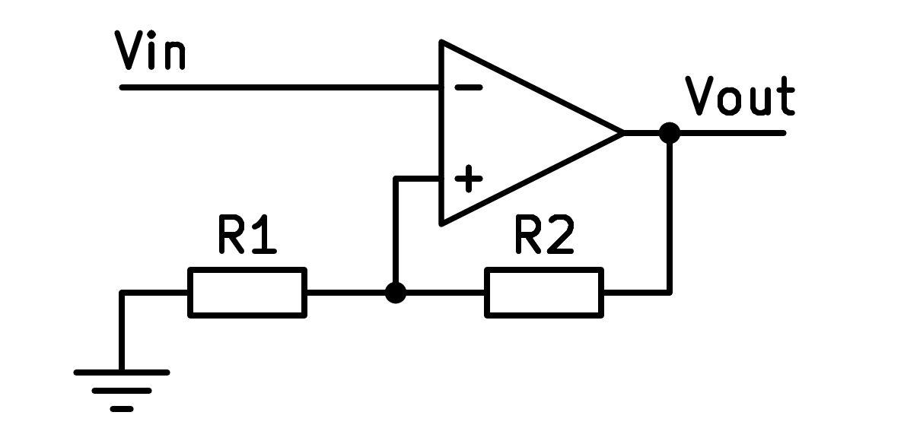

:Date: 18/11/2023
:Author: Carlos Félix Pardo Martín
:License: Creative Commons Attribution-ShareAlike 4.0 International
:tocdepth: 1

.. _electronic-operational-hysteresis:

El comparador con histéresis
============================

   Esquema de un comparador con histéresis.

Funcionamiento
--------------

Simulación
----------

.. raw:: html

   

   <iframe src="/circuits/index.html?startCircuit=oa-hysteresis.txt"></iframe>
   

Ejercicios
----------

#.
