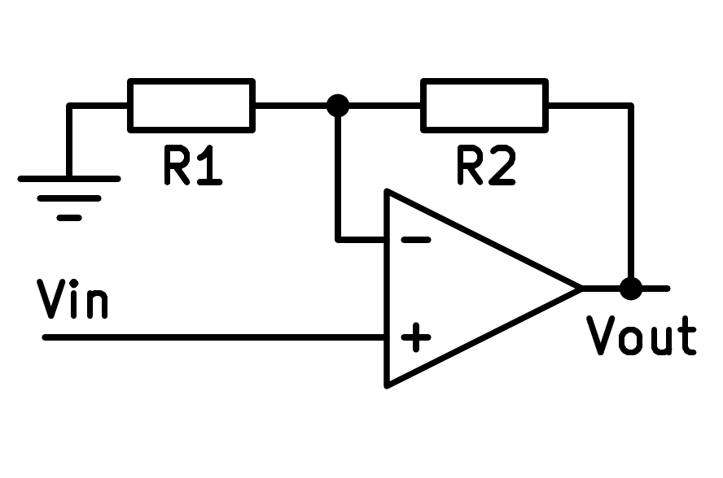

:Date: 21/10/2023
:Author: Carlos Félix Pardo Martín
:License: Creative Commons Attribution-ShareAlike 4.0 International
:tocdepth: 1

.. _electronic-operational-noninverting:

El amplificador no inversor
===========================
En este circuito el amplificador operacional amplifica la señal de entrada
y se obtiene una salida de señal sin invertir.

El amplificador no inversor tiene realimentación negativa porque la tensión
de salida produce una corriente que llega al terminal de entrada negativo
a través de la resistencia R2.

   Esquema del amplificador operacional no inversor.

Cálculo de ganancia
-------------------
La fórmula de la ganancia de este amplificador es la siguiente:

.. math::

   Ganancia = \cfrac{V_{out}}{V_{in}} = 1 + \cfrac{R_2}{R_1}

Como mínimo la ganancia valdrá la unidad. Esto se da en el caso de que
la resistencia R1 sea muy grande y la resistencia R2 muy pequeña.
En el límite nos encontramos con la ganancia unidad del seguidor de
tensión, que tiene una resistencia R1 infinita y R2 igual a cero.

Resistencia de entrada y de salida
----------------------------------
La resistencia de entrada será igual a la resistencia de entrada ``+`` del
amplificador operacional, que idealmente es infinita. En la práctica
tiene valores mayores de 100 millones de ohmios.
Esta gran resistencia de entrada es una ventaja en comparación con el
esquema inversor, que tiene una resistencia de entrada relativamente baja
que absorbe corriente de la señal de entrada.

La resistencia de salida será muy baja, idealmente cero, porque la salida
está directamente conectada a la salida del amplificador operacional.

Simulación
----------
En la siguiente simulación podemos ver un amplificador inversor de
ganancia 3 que amplifica una señal senoidal de entrada.

.. raw:: html

   

   <iframe src="/circuits/index.html?startCircuit=oa-noninverter.txt"></iframe>
   

Ejercicios
----------

#. Dibuja el esquema simplificado de un amplificador operacional no
   inversor.

#. Escribe la fórmula de la ganancia del amplificador operacional
   no inversor anterior.

#. ¿Qué tipo de realimentación tiene este circuito?
   ¿Qué les ocurre a las tensiones de entrada con ese tipo de
   realimentación?

#. Dibuja dos gráficas que representen la tensión de entrada y la tensión
   de salida del amplificador no inversor simulado.

   ¿Qué tensiones de pico tienen cada una de las dos gráficas
   representadas?
   Puedes parar la simulación y ampliar a pantalla completa para
   medir con más precisión.

#. Calcula las resistencias necesarias para hacer que un amplificador
   operacional no inversor tenga una ganancia de tensión igual a 9.

   Dibuja un esquema realista de este amplificador, con una alimentación
   de +-15 voltios y una entrada de tensión triangular de 1 voltio de pico.

#. Con ayuda del
   `simulador de circuitos
   <../circuits/?startCircuit=empty.txt>`__
   dibuja el esquema de un amplificador operacional no inversor
   basado en un amplificador operacional ideal que amplifique la señal
   de un generador de tensión de onda cuadrada con una tensión de pico
   de 1 voltio. La ganancia de tensión debe valer 2.

   Grafica en el mismo osciloscopio la señal de tensión del generador y
   la señal de tensión de salida del amplificador operacional.

