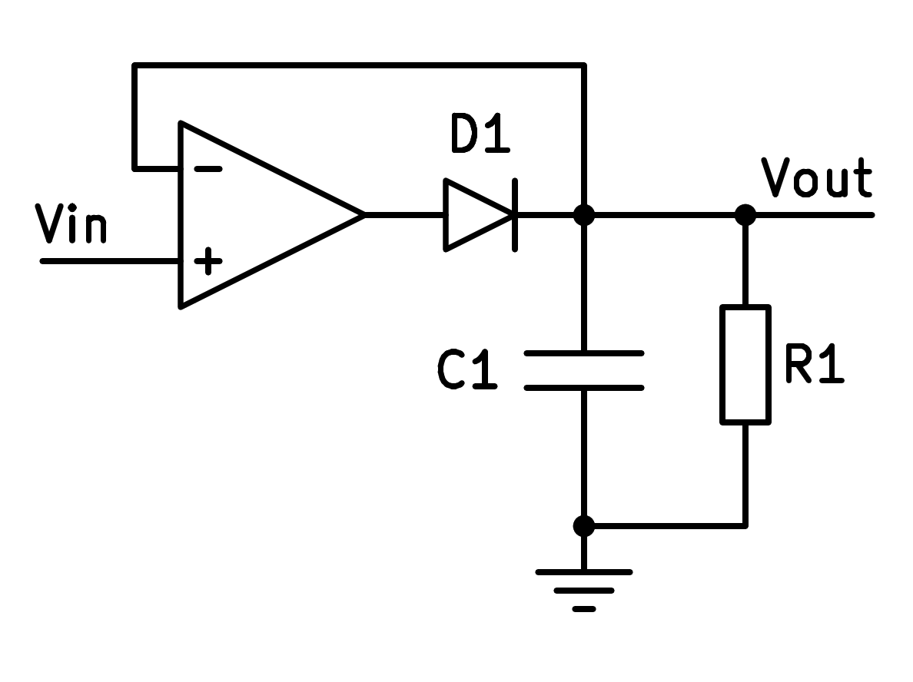

:Date: 18/11/2023
:Author: Carlos Félix Pardo Martín
:License: Creative Commons Attribution-ShareAlike 4.0 International
:tocdepth: 1

.. _electronic-operational-peakdetector:

El detector de pico
===================
El detector de pico es un circuito que mantiene en su salida el valor de
pico de tensión que se encuentra en la entrada.
Está compuesto por un rectificador de precisión de media onda y por un
filtro RC a la salida, que memoriza el mayor nivel de tensión de la salida
del rectificador.

   Esquema del detector de pico.

Funcionamiento
--------------
El diodo a la salida del amplificador operacional impide que este pueda
entregar corriente negativa. Como el operacional solo podrá entregar
tensión y corriente positivas, el condensador de salida subirá de tensión
hasta igualar la máxima tensión de entrada y mantendrá esta tensión.

La resistencia de 10k hará que el condensador se descargue poco a poco y
que su tensión tienda a valer cero voltios.

De esta manera la tensión máxima de entrada, o valor de pico, se almacenará
por un tiempo en el condensador, que poco a poco va a perder esa tensión
máxima para adaptarse a otros picos de menor tensión que lleguen más tarde.

Simulación
----------
En la siguiente simulación podemos ver un **detector de pico** al que le
llega una tensión alterna de amplitud modulada.
La tensión máxima de entrada se refleja en el valor de salida del circuito.

.. raw:: html

   

   <iframe src="/circuits/index.html?startCircuit=oa-peakdetector.txt"></iframe>
   

Ejercicios
----------

#. Dibuja el esquema de un detector de pico.

#. ¿Qué tipo de realimentación tiene el detector de pico y por qué?

#. ¿Qué función realiza un circuito detector de pico?

#. ¿Qué ganancia de tensión tendrá un detector de pico y por qué?

#. Modifica la simulación anterior del detector de pico para hacer un
   circuito demodulador:

   * Aumenta la frecuencia de la señal portadora de Amplitud Modulada
     hasta 1000 Hz.

   * Disminuye el valor del condensador hasta que la señal de salida
     sea igual a la envolvente de la señal de entrada.

   * Dibuja un gráfico de la tensión de entrada y otro gráfico con la
     tensión de salida.

#. ¿Qué ocurre si cambiamos el sentido del diodo? Simula el cambio para
   comprobar el nuevo funcionamiento.

   ¿Cómo podríamos denominar a este nuevo circuito?
