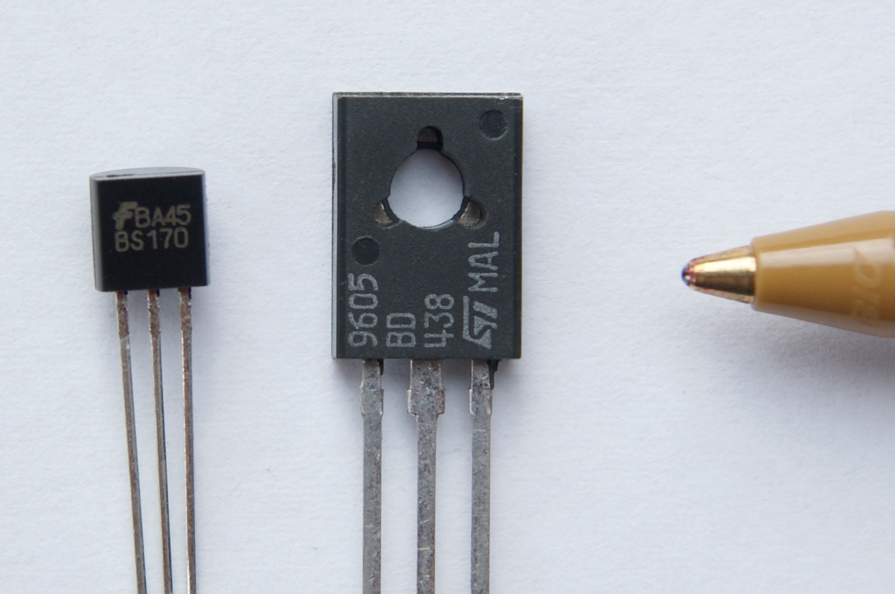
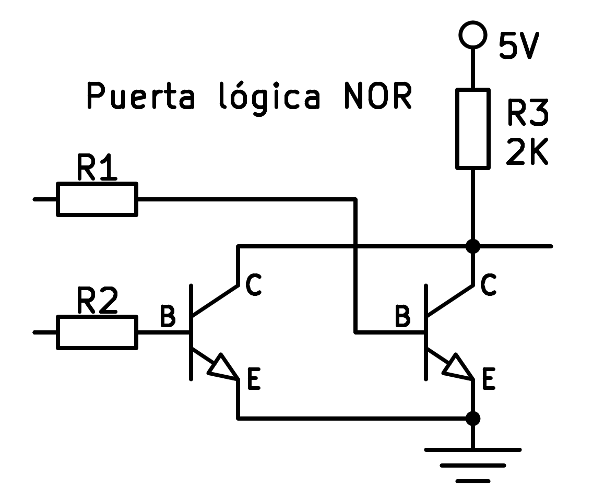
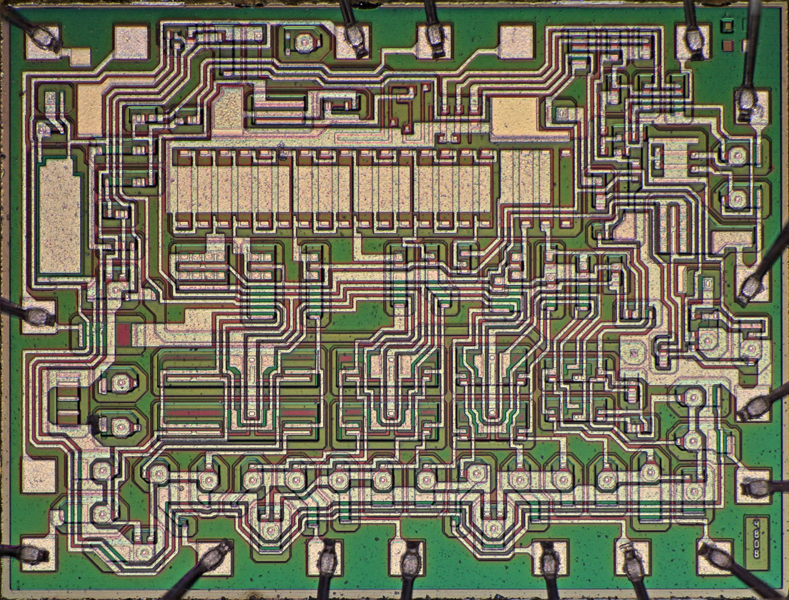

:Date: 22/05/2021
:Author: Carlos Félix Pardo Martín
:License: Creative Commons Attribution-ShareAlike 4.0 International

.. _electronic-semiconductores:

Los componentes semiconductores
===============================
Los semiconductores como los diodos o los transistores son los componentes
basados en el silicio que han desarrollado la electrónica moderna hasta
llegar a transformar toda nuestra sociedad.

En esta unidad estudiaremos los fundamentos de los componentes
electrónicos, su funcionamiento y esquemas eléctricos típicos.

|  :download:`Los componentes semiconductores. Formato PDF.
   <electronic/componentes-semiconductores/electronic-semiconductores.pdf>`
|
|  :download:`Los componentes semiconductores. Formato editable DOC.
   <electronic/componentes-semiconductores/electronic-semiconductores.doc>`

Los semiconductores
-------------------
Los materiales **aislantes** como el plástico o la madera no permiten
el paso de la corriente eléctrica.
Los materiales **conductores** como el cobre o el aluminio permiten el paso
de la corriente eléctrica con mucha facilidad.
Por otro lado los materiales **semiconductores** como el **silicio** o el
**germanio** pueden comportarse como aislantes o como conductores
dependiendo de la tensión que reciban.
Este comportamiento se puede aprovechar para fabricar circuitos que tengan
interruptores semiconductores muy rápidos y controlados electrónicamente.

Para que los semiconductores puedan conducir corriente es necesario
alearles con trazas de elementos que aporten cargas positivas
(Boro, Indio, etc.). o cargas negativas (Fósforo, Arsénico, etc.)
De forma que un semiconductor ya aleado se puede denominar de
**tipo P** (positivo) o de **tipo N** (negativo).

El diodo
--------
Es el componente electrónico más sencillo que se puede fabricar con
materiales semiconductores y tiene dos terminales.
Internamente está formado por la unión de un bloque de silicio de
**tipo P** con un bloque de silicio de **tipo N**.
Esta unión permite que la corriente fluya en un sentido, pero no
permite que fluya en el sentido contrario.

En la imagen anterior puede verse el símbolo del diodo, una flecha en la
dirección en la que permite el paso de la corriente y el nombre de sus
dos terminales.
El diodo solo conduce cuando el ánodo tiene tensión positiva y el cátodo
tensión negativa.

La siguiente imagen es una fotografía con varios tipos de diodos.

Los diodos tienen múltiples aplicaciones.
Por ejemplo, rectificar la corriente alterna, regular tensiones o
emitir luz (diodos LED).

Esquema de un diodo LED polarizado con una resistencia que reduce la
corriente para que no se queme.

Esquema de un diodo rectificador que convierte la tensión alterna de
la red eléctrica en tensión continua.

El transistor
-------------
El transistor es un componente electrónico de tres terminales que
permite el paso de la corriente eléctrica entre dos terminales según
la tensión que reciba el tercer terminal.
Es como un interruptor controlado por tensión.
El primer transistor de silicio se comercializó en 1954.

.. figure:: electronic/componentes-semiconductores/electronic-transistores-02.jpg
   :width: 240px
   :align: center
   :alt: Transistor de potencia.

   Transistor de potencia

   Transistor de señal.

Estados del transistor
^^^^^^^^^^^^^^^^^^^^^^

Dependiendo de la tensión de control que recibe el transistor por la
base o por la puerta, puede encontrarse en tres estados distintos.

**Corte:** el transistor no conduce corriente, se comporta como un
interruptor abierto.

**Saturación:** el transistor conduce toda la corriente posible y se
comporta como un interruptor cerrado.

Los dos estados anteriores se utilizan en los circuitos digitales como
un ordenador, TV, smartphone, etc.

**Zona lineal:** el transistor solo conduce parte de la corriente y se
comporta como una resistencia.

Este comportamiento se utiliza en los circuitos analógicos tales como
los amplificadores de sonido.

Circuitos típicos
^^^^^^^^^^^^^^^^^
Transistor amplificador. Este circuito funciona como un amplificador de
luz. Cuando se ilumina a la resistencia LDR, aumenta la corriente que la
atraviesa. Esa corriente llega a la base del transistor y el transistor
la amplifica a través del colector, encendiendo la lámpara conectada.
Este es un circuito analógico porque el transistor trabaja en zona lineal
comportándose como una resistencia controlada por la corriente de base.

   Transistor amplificador.

Transistor digital. Este circuito es una puerta lógica NOR formada a
partir de transistores. Gracias al paralelo de los dos colectores,
la salida solo tiene tensión alta cuando las dos entradas están a
tensión baja. Estas puertas lógicas son la base de los circuitos
digitales y de los ordenadores.

   Transistor digital.

Las resistencias LDR
--------------------
Las LDR (Resistencias Dependientes de la Luz) son,
como su nombre indica, sensores que detectan luz.
Su resistencia se reduce cuando la iluminación es mayor, aumentando
la corriente que conducen cuanta más luz reciben.

Símbolo y fotografía de una resistencia LDR.

Los circuitos integrados
------------------------
Un circuito integrado es una pequeña pastilla de silicio, también llamada
chip, que contiene multitud de componentes electrónicos en su interior.

   Circuito integrado LM555.

.. figure:: electronic/componentes-semiconductores/electronic-lm555-die.jpg
   :width: 480px
   :align: center
   :alt: Fotografía de una resistencia LDR.

   Circuito integrado DAC08.

Con el desarrollo de la tecnología, cada año se reduce más el tamaño
de los componentes, pudiendo agrupar cada vez más transistores en un
solo circuito integrado.
A comienzos de los años 1960 la industria aeroespacial comenzó a comprar
circuitos que integraban hasta 100 transistores en una sola pastilla.
Esto hizo que bajaran los precios de producción y fomentó el desarrollo
de la tecnología. A comienzos de 1980 ya se podían comprar chips con
100 mil transistores, en 2000 100 millones de transistores y en 2020
100 mil millones de transistores en un solo chip.
Este crecimiento exponencial del número de transistores integrados en
un chip que se duplican cada año y medio se conoce como ley de Moore y ha
permitido el desarrollo de la sociedad digital que todos conocemos,
con multitud de dispositivos inteligentes, memorias, cámaras, drones,
etc. basados en estos potentes circuitos integrados.

-----

Ejercicios
----------

#. ¿Qué tipos de materiales hay dependiendo de cómo conducen
   la electricidad? Escribe dos ejemplos de cada uno.
#. ¿Por qué son tan útiles los semiconductores?
#. ¿Qué hace falta hacer para que un semiconductor conduzca
   corriente eléctrica?
#. ¿Cómo está construido un diodo semiconductor?
#. Dibuja el símbolo de un diodo semiconductor y
   nombra sus terminales.
#. ¿Cuándo conduce corriente un diodo?
#. Dibuja dos esquemas eléctricos con diodos.
#. ¿Qué aplicaciones tienen los diodos?
#. ¿Qué es un transistor? ¿Cuántos terminales tiene?
#. ¿Qué estados puede tener un transistor?
#. ¿Qué estados del transistor se utilizan en los
   circuitos analógicos? ¿Y en los digitales?
#. Dibuja el símbolo de un transistor bipolar y de
   un MOSFET con el nombre de sus patillas.
#. Dibuja un circuito con un transistor funcionando
   como amplificador de luz.
#. Dibuja una puerta lógica NOR con transistores.
#. ¿Qué es una LDR y qué significan esas siglas?
#. ¿Qué es un circuito integrado o chip?
#. ¿Cuándo comenzaron a fabricarse los circuitos
   integrados y cuántos transistores tenían?
#. Dibuja una gráfica con el número de transistores
   que contiene un chip. En el eje X coloca los años
   y en el eje Y el número de transistores en escala
   exponencial (10, 100, 1000, 10mil, etc.)
#. ¿Qué es la ley de Moore?
